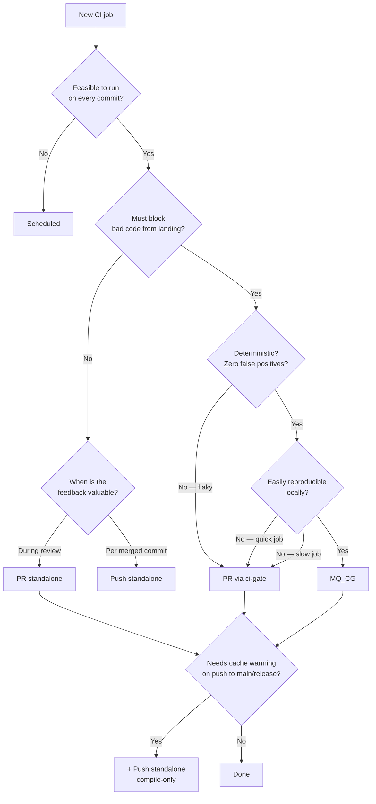

# CI Guidelines

## Decision tree: where does a job go?



Jobs in ci-gate that must survive cancellation (e.g. long external calls) should use the standalone variant for that trigger instead.

---

## Where to place a job

`push` triggers below assume the protected branches: `main`, `release/**`, `performance`, and `performance-stable`.

| CI gate | Trigger | Typical duration | When to use |
|---|---|---|---|
| yes | `pull_request` | < 15 min | Default for most PR checks. Lint, cross-platform builds. |
| yes | `merge_group` | 15–30 min | Default correctness gate. Full test suite, race tests. Must be deterministic — no flaky tests. |
| yes | `push` | N/A | CI gate workflow is required for PR and merge queue. It should not run on push. |
| no | `pull_request` | < 1h | Non-blocking feedback useful during review — e.g. deployment previews, flaky tests for author visibility, or jobs that must not be restarted on every push. If it's very long, make it dispatch instead. |
| no | `push` | varies | Cache warming for PRs and merge queues. Actions that occur only on the finalized commit, like deploying docs, publishing artifacts, triggering downstream pipelines. |
| no | `schedule` | 1–4+ hours | Very long-running suites, flaky test discovery by repetition, QA regression runs. Not feasible on every commit. |
| no | `workflow_dispatch` | > 1h | Rare, or long-running jobs triggered manually for specific cases. |

When a workflow appears in both ci-gate rows and standalone rows, the ci-gate path handles `pull_request`/`merge_group` via `workflow_call`. Standalone triggers such as `push`/`schedule` may live either in that workflow's own file or in a separate top-level workflow that calls the reusable workflow (for example, centralized cache warming) — both patterns share one job definition.

## CI gate

CI gate (`ci-gate`) is the workflow required to pass for merging PRs. It is required for passing pull requests and merge groups.

### Draft PRs

If a job uses `if: ${{ !github.event.pull_request.draft }}` to skip on draft PRs, the
workflow **must** include `ready_for_review` in its `pull_request` event types:

```yaml
on:
  pull_request:
    types:
      - opened
      - reopened
      - synchronize
      - ready_for_review
```

Without `ready_for_review`, converting a draft PR to ready-for-review fires an event
the workflow doesn't subscribe to, so the job never runs — the PR appears to have
skipped CI until the next push.

## Merge queue

Merge queue checks are the correctness gate. Their contract is strict:

- **A failure means the code is wrong.** If something fails in the merge queue, merging
  it would break the target branch. There are no false positives.
- **A pass means the code is correct.** Code that passes the merge queue must not then
  fail on `main` or a release branch. There are no false negatives.

This means only deterministic, reproducible checks belong here. A flaky test does not
belong in the merge queue — by definition it cannot provide a reliable signal.

**Belongs here:**
- The full unit and integration test suite (things developers can reproduce with
  `make test-all` or equivalent)
- Race detector tests (`-race`), which are expensive but deterministic
- Any check where a failure must block the merge

**Does not belong here:**
- Flaky tests — they produce false positives and erode trust in the gate
- Checks that are not locally reproducible (those belong in the PR bucket)

GitHub's merge queue supports running jobs multiple times before deciding on a result.
This can mask flakiness in the short term but is not a long-term solution — it increases
queue latency and still occasionally lets flaky failures block the queue. The right fix
is to move flaky tests to the PR bucket and fix them there.

**Merge queue batching** — multiple PRs can be grouped into a single merge-group run,
reducing CI cost proportional to batch size. This works well when the merge queue gate
is fast and reliable; a flaky gate undermines batching by causing entire batches to be
re-queued.

## Cache warming

Due to GitHub Actions cache scoping by branch, caches for use in PR and merge queue jobs should be made available from the base branch. This means running parts of jobs that allow caches to be generated on a push trigger to those branches.

## Scheduled

Scheduled jobs cover work that is too long-running or too expensive to attach to every
commit, or that is specifically designed to discover problems through repetition.

**Belongs here:**
- Very long-running test suites (multi-hour jobs) where per-commit triggering is not
  feasible
- Repeated runs of the test suite to surface flaky tests by statistical observation
- QA and regression detection workflows that aggregate results over time

## Go test caching

Go's test cache keys each package result by the compiled test binary hash **plus** the
`mtime`/size of every file the test opens at runtime. A single file with a wrong mtime
invalidates the cache for the entire package.

### Fixture mtimes

**Main repo fixtures** — run `git restore-mtime` over testdata paths so each file's
mtime equals the commit that last modified it. This is deterministic and
content-sensitive.

**Submodule fixtures** — shallow clones (`--depth 1`) don't have enough history for
`git restore-mtime`. Instead, set every file's mtime to the submodule's HEAD commit
timestamp. All files in a submodule share the same mtime, which is stable as long as
the pinned commit doesn't change.

**Directory mtimes** — normalize all directories to a fixed epoch (e.g.
`200902132331.30`). Git doesn't track directory mtimes, so without this step they
reflect checkout time, which varies between runs.

### Keeping packages small

Go caches test results at the package level. A package with hundreds of test cases
that reads many fixture files will miss the cache if *any* fixture changes. Splitting
it into sub-packages (one per fixture set) means unrelated fixtures don't cause
unnecessary re-runs.

This is also why the `execution/tests/` package is broken into focused sub-packages
rather than one monolithic package.

## Memory- and disk-intensive tests

Some test packages allocate large databases or hold many files open simultaneously.
Running too many of them in parallel can exhaust RAM or IOPS and cause OOM kills or
spurious timeouts.

Use `-p` to limit the number of packages tested in parallel (default: `GOMAXPROCS`),
and `-parallel` to limit concurrency *within* a single package (default: `GOMAXPROCS`):

```bash
# At most 2 packages at a time, at most 4 subtests in parallel within each
go test -p 2 -parallel 4 ./...
```

These flags can be passed via `GO_FLAGS` in the Makefile:

```bash
make test-all GO_FLAGS="-p 2 -parallel 4"
```

---

## Checking benchmarks

The purpose of `make test-bench` in CI is to verify that benchmarks compile and
execute at least one iteration — not to produce meaningful performance numbers.

Benchmarks sized for profiling work can take minutes per iteration. Use
`testing.Short()` to trim parameter sweeps in CI:

```go
if testing.Short() {
    totalSteps = 10        // instead of 200+
    keyCount = 10_000      // instead of 1_000_000
}
```

`make test-bench` passes `-short` so these guards are active in CI.

`go test` forces benchmark packages to run **serially** regardless of the `-p` flag —
the serialization is enforced at the action-graph level when `-bench` is set. Reducing
per-iteration work (via `testing.Short()`) is the only effective way to reduce wall time.

---

## Local reproducibility

Every CI job should have a local equivalent. If you're changing code in `execution/`,
you should be able to run the corresponding test group locally
(`make test-group TEST_GROUP=execution-tests`) and get the same result as CI.

CI workflows should use the same Makefile targets that developers use locally rather
than inline shell commands. This keeps CI and local runs as similar as possible.

---

## Debugging

Re-run with debug logging:

```bash
gh run rerun <run-id> --debug
```

Or in the UI: "Re-run jobs" → enable "Debug logging".

Raw logs include per-line timestamps useful for profiling slow steps:

```bash
gh run view <run-id> --log
```
