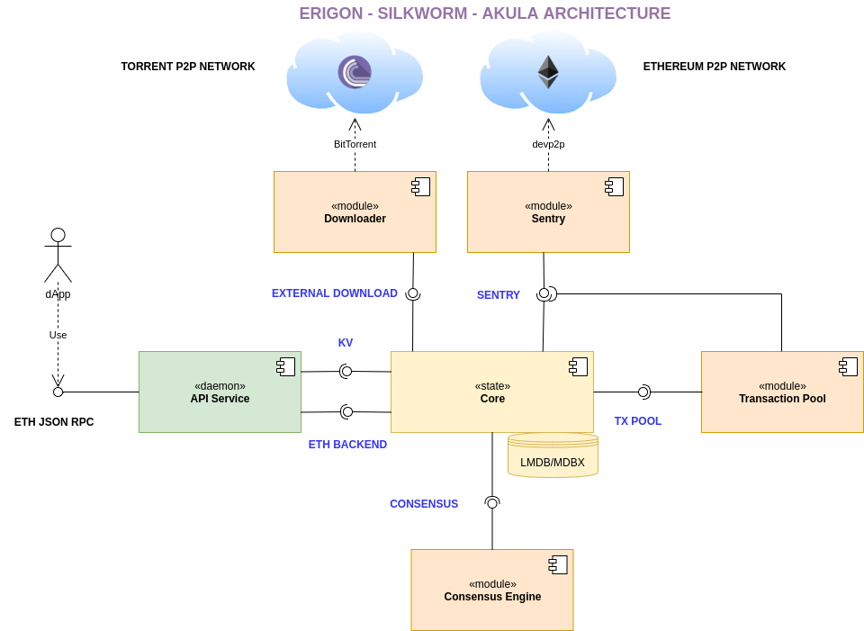

# Erigon Architecture

The architectural diagram

# Loosely Coupled Architecture

The node consists of loosely coupled components with well defined "edges" -- protocols that are used between these components.

Its a reminiscence of [microservices architecture](https://en.wikipedia.org/wiki/Microservices), where each component has clearly defined reponsibilities and interface. Implementation might vary. In case of Erigon, we use gRPC/protobuf definitions, that allows the components to be written in different languages.

In our experience, each p2p blockchain node has more or less these components, even when those aren't explicitly set up. In that case we have a highly coupled system of the same components but with more resistance to changes.
## Advantages of loosely coupled architecture

* Less dependencies between components -- less side-effects of chaging one component is on another.

* Team scalability -- with well specified components, its easy to make sub-teams that work on each component with less coordination overhead. Most cross-team communication is around the interface definition and interpretation.

* Learning curve reduction -- it is not that easy to find a full-fledged blockchain node developer, but narrowing down the area of responsiblities, makes it easier to both find candidates and coach/mentor the right skillset for them.

* Innovation and improvements of each layer independently -- for specialized teams for each sub-component, its easier to find some more improvements or optimizations or innovative approaches than in a team that has to keep everything about the node in the head.

## Designing for upgradeabilty

One important part of the design of a node is to make sure that we leave ourselves a room to upgrade it in a simple way.

That means a couple of things:
- protocols for each components should be versioned, to make sure that we can't run inconsistent versions together. [semver](https://semver.org) is a better approach there because it allows to parse even future versions and figure out how compatible they are based on a simple convention;

- trying to keep compatiblity as much as possible, unless there is a very good reason to break it, we will try to keep it. In practice that means:
    - adding new APIs is safe;
    - adding new parameters is safe, taking into account that we can always support them missing and revert to the old behaviour;
    - renaming parameters and methods considered harmful;
    - removing paramters and methods considered harmful;
    - radically changing the behaviour of the method w/o any changes to the protocol considered harmful;

Tools for automatic checks about compabilitity are available for Protobuf: https://github.com/bufbuild/buf
## Implementation variants

### Microservices

Erigon uses gRPC-powered variant; each component implements gRPC interface, defined in the protobuf files. No language dependency across components.

**Advantages**
- it is possible to run a single node spread on multiple machines (and specialize each machine to its job, like GPU/CPU for hash/proof calculations, memory-heavy TX pool, etc)
- it is possible to plug & play multiple variants of each component
- it is possible to write each component in its own language and use the power of each language to the most (perf-critical in Rust or C++, Go for networking, some parts in Python and JS for fast prototyping, etc)
- it is possible to replace components as better version in another language is written

**Challenges**
- deployment process for average users could be clumsy
- managing multiple sub-projects
- testing interfaces, extensive integration testing is needed

### Single binary

That's when each module is in the same language and compiles to the same binary either as a static library or a dynamic library or just a subfolder in the code.

**Advantages**
- simpler deployment process
- simpler component compatibility

**Challenges**
- have to settle on a single language/framework for the whole project
- less flexibility with upgrades

# Components
## 1. API Service (RPCDaemon, SilkRPC, etc)

Each node exposes an API to plug it into other components. For Ethereum nodes, the example is JSON-RPC APIs or GraphQL APIs. It is an interface between DApps and the nodes.

The API Service's responsibilities are to expose these APIs.

The API design is not limited to JSON-RPC/http with `eth_call`s, it could be something completely else: gRPC, GraphQL or even some REST to power some webUIs.

The API Service connects to the [Core].

In Erigon, there are with two interfaces:
- [ETH Backend, proto](../remote/ethbackend.proto) -- blockchain events and core technical information (versions, etc)
- [KV, proto](../remote/kv.proto) -- database access

## 2. Sentry

Sentry is the component, connecting the node to the p2p network of the blockchain. In case of Erigon and Ethereum, it implements [`eth/65`, `eth/66`, etc](https://github.com/ethereum/devp2p/blob/master/caps/eth.md#change-log) protocols via [devp2p](https://github.com/ethereum/devp2p).

Sentry accepts connections from [Core] and [Transaction Pool] components.

Erigon has the following interface for sentry:
- [P2Psentry, proto](../p2psentry/sentry.proto) -- sending/receiving messages, and peer penalization mechanism.

Both the [transaction pool] and the [core] use the same interface.

## 3. Transaction Pool

Transaction pool contains valid transactions that are gossiped around the network but aren't mined yet. Transaction pool validates transactions that it gets from [Sentry] and, in case, the transaction is valid, adds it to its on in-memory storage. Please note that at the time of writing, Transaction Pool component
has not been split yet, but this should happen relatively soon.

Miners use this component to get candidate transactions for the block.

Separating tx pool in a separate components, makes forks like [mev-geth](https://github.com/flashbots/mev-geth) unnecessary, because it could be just a separate tx pool implementation.

Transaction Pool connects to both Sentry and Core. Sentry provides new transactions to the tx pool, and Core either sends events to remove txs when a block with them is discovered, either from peers or through mining. Also, Core can re-add txs into the transaction pool in cases of chain splits.

Erigon has the following interfaces for the transaction pool
- [txpool, proto](../txpool/txpool.proto)
- [txpool_control, proto](../txpool/txpool_control.proto)
- [mining, proto](../txpool/mining.proto)

See more about the architecture: https://github.com/ledgerwatch/erigon/wiki/Transaction-Pool-Design

## 4. Core

Core is the passive part of the replicating state machine that is a blockchain. Core maintains its state and reacts to the protocol messages from the
outside, with the goal of synchronizing its state with other nodes in the network. This synchronization is achieved by applying or reverting state
transitions.

Currently, Core is the largest and the most complex component, and it has its own internal structure. State transitions are split into stages,
and that gives rise to "[Staged Sync](./staged-sync.md)". In the staged sync, we consider two forward state transitions and reverts of previous state transitions
(also called "Unwind"). Forward state transitions are split into the invocation of functions in certain order. At the time of writing, there are
18 such functions, representing "stages". Reverts of previous state transitions are performed by invocation of another array of functions, also
in the specific order. See [Staged Sync Architecture](./staged-sync.md) for more information on Staged Sync.

Core connects to [Sentry] and [Consensus Engine], and accepts connections from [Transaction Pool] and [API Service].

## 5. Consensus Engine

Consensus Engine is the component that abstracts away consensus mechanism like EtHash Proof Of Work, ProgPOW Proof of Work, Clique Proof Of Authority,
and in the future also AuRa Proof Of Authority and Proof Of Stake mechanism. Note that at the time of writing, Consensus Engine split has not been
done yet, but some [work has been done on the interface](https://github.com/ledgerwatch/erigon/wiki/Consensus-Engine-separation).

Erigon has the following interface for the consensus engine:
- [consensus_engine, proto](../consensus_engine/consensus.proto)

## 6. Downloader

Downloader component abstracts away the functionality of deliverying some parts of the database using "out of band" protocols like BitTorrent,
IPFS, Swarm and others.
