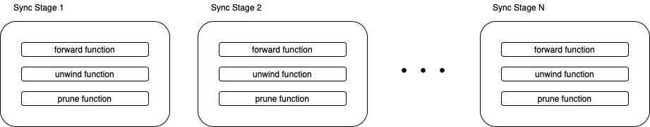
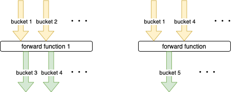
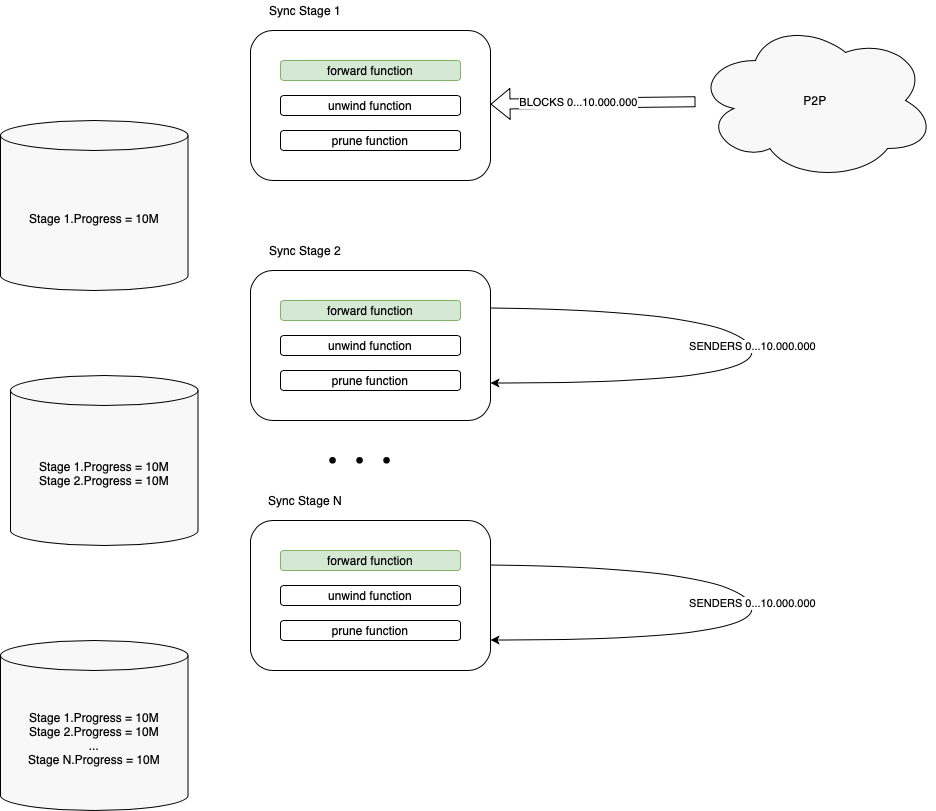
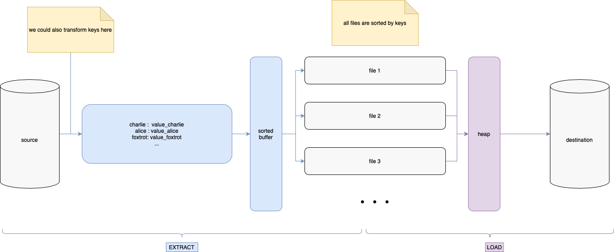
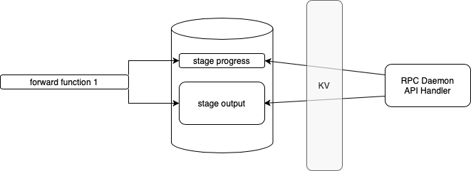
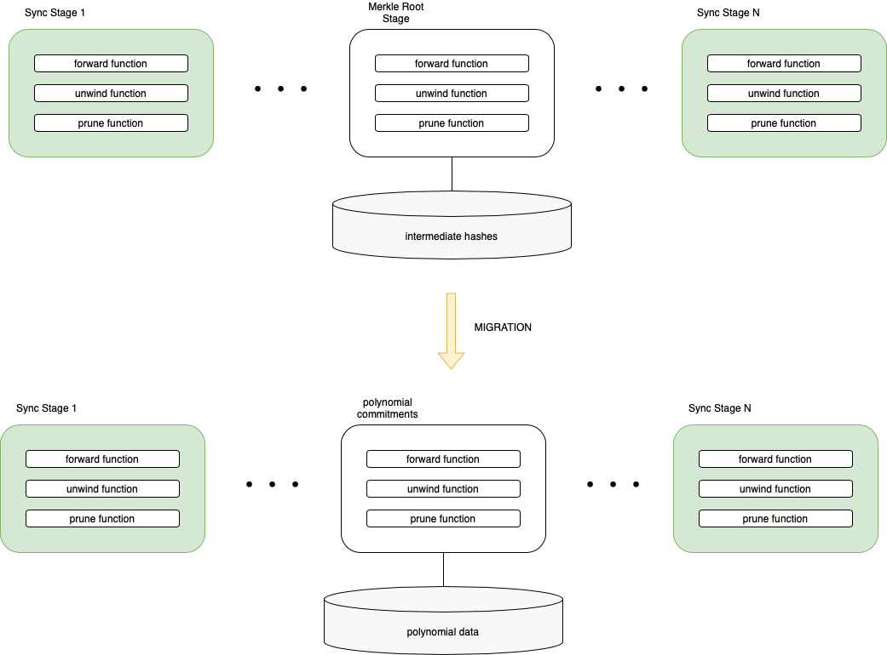

Staged Sync (Erigon)
---

Staged Sync is a version of [Go-Ethereum](https://github.com/ethereum/go-ethereum)'s [[Full Sync]] that was rearchitected for better performance.

## How The Sync Works

Staged sync consists of independent stages, that are launched in special order one after another. This architecture allows for batch processing of data.

After the last stage is finished, the process starts from the beginning, by looking for the new headers to download.

If the app is restarted in between stages, it restarts from the first stage.

### Stage

A Stage consists of: 
* stage ID;
* progress function;
* unwind function;
* prune function;

Only ID and progress functions are required.

Both progress and unwind functions can have side-effects. In practice, usually only progress do (downloader interaction).

Each function (progress, unwind, prune) have **input** DB buckets and **output** DB buckets. That allows to build a dependency graph and run them in order.

That is important because unwinds not always follow the reverse order of progress. A good example of that is tx pool update, that is always the final stage.

Each stage saves its own progress. In Ethereum, at least a couple of stages' progress is "special", so we accord to that. Say, progress of the _execution stage_ is basis of many index-building stages.

### Batch Processing

Each stage can work on a range of blocks. That is a huge performance improvement over sequential processing. 

In Erigon genesis sync: 
- first stage downloads all headers
- then we download all bodies
- then we execute all blocks
- then we add a Merkle commitment (either from scratch or incremental)
- then we build all indices
- then we update the tx pool

That allows to group similar operations together and optimize each stage for throughput. Also, some stages, like the commitment stage, require way less hashes computation on genesis sync.

That also allows DB inserts optimisations, see next part.

### ETL and optimial DB inserts

B-tree based DBs (lmdb, mdbx, etc) usually store data using pages. During random inserts, those pages get fragmented (remember Windows 98?) and often data needs to be moved between them to free up space in a certain page.

That all is called **write amplification**. The more random stuff you insert into a DB, the more expensive it is to insert it.

Luckily, if we insert keys in a sorted order, this effect is not there, we fill pages one by one.

That is where our ETL framework comes to the rescue. When batch processing data, instead of wrting it directly to a database, we first extract it to a temp folder (could be in ram if fits). When extraction happens, we generate the keys for insertion. Then, we load data from these data files in a sorted manner using a heap. That way, the keys are always inserted sorted.

This approach also allows us to avoid overwrites in certain scenarios, because we can specify the right strategy on loading data: do we want to keep only the latest data, convert it into a list or anything else.

### RPC calls and indices

Some stages are building indices that serve the RPC API calls later on. That is why often we can introduce a new sync stage together with an API call that uses it. API module can always request state of any stage it needs to plan the execution accordingly.

### Commitment As A Stage

One more benefit of this approach, that the Merkle commitment (hex tries) in Erigon is its own stage with it own couple of buckets. Other stages are independent enough to either not be changed at all when/if the commitment mechanism changes or be changes minimaly.

### What About Parallel Execution?

Some parallel execution could be possible, in case stages aren't dependent on each other in any way. 
However, in practice, most stages are bound by their I/O performance, so making those parallel won't bring any performance benefits.

There could be benefits in having parallelism **inside** stages. For Erigon, there is **senders recovery** stage that is very CPU intensive and could benefit from multicore execution. So it launches as many worker threads as there are CPU cores.

### Adding/Removing stages

Adding stages is usually a simple task. On the first launch the stage will launch like it was launched from genesis even though the node might be in a synced state.

Removing or altering a sync stage could be more tricky because then the dependent stages should be considered.

### Offline Capabilities

Not every stage needs network to work. Therefore, it could be possible to run some stages, especially during genesis sync, no matter if the node has a connection or not. An example of that is indices building.

### Risks & Tradeoffs

* Malicious unwinds on genesis sync. Since we are checking commitments once per batch, that could be used to slow down the genesis sync significantly, if we sync/execute everything but get a wrong root hash in the end. After genesis sync is done, this is not an issue because even though we do batch processing, but in practice at the tip this architecture becomes block-by-block processor and is not worse than anything else. 

* Batch processing doesn't allow most of the API calls on partial data during genesis sync. Basically, regular geth at 1/2 of the sync will respond to the RPC requests but Erigon requires the commitment stage to complete to allow these requests.

Those tradeoffs are related to genesis sync, so in Erigon we are focusing on reducing the need for genesis sync (such as off-chain snapshot distribution) to minimize those issues.
