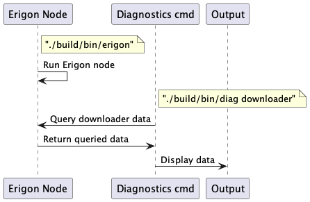
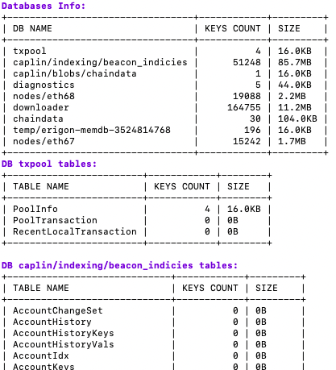
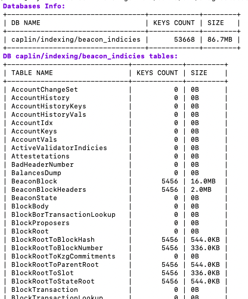
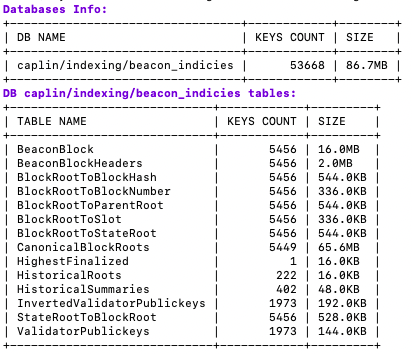
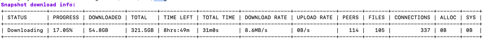
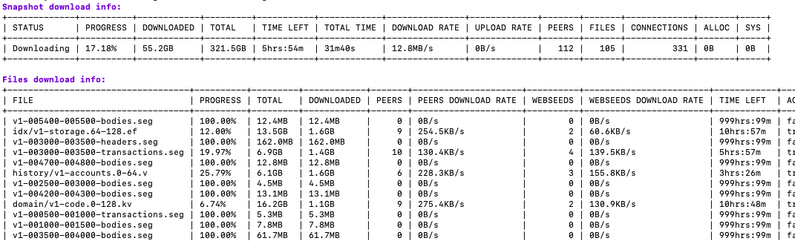
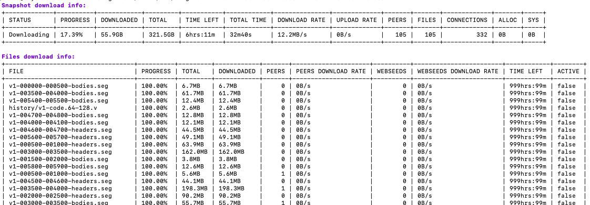
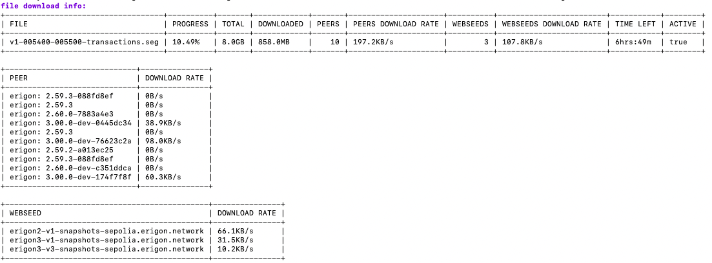
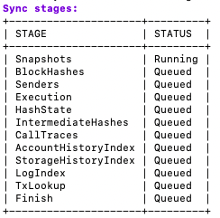

# Diagnostics commands 

## Diagnostics command architecture
Diagnostics command is implemented to retrieve information from the Erigon node on a headless machine. It makes it easier to run and get information from the node as it runs on the same machine and doesn't require a PIN-secured remote connection. This is done to make the diagnostics process quicker to set up and make the entire process less resistant.

### Diagnostics command local connection diagram

[Compare with remote connection](https://github.com/erigontech/diagnostics?tab=readme-ov-file#diagnostics-architecture-diagram)

## Available commands
| | |
|--|--|
|databases|Displays information about databases. [Details](#databases)|
|downloader|Displays info about the snapshot download process|
|stages|Displays the current status of node synchronization|
|ui|Serves local UI interface to browse through all info collected by diagnostics|
|||

### Global flags
|||||
|--|--|--|--|
|Flag|Default Value|Allowed Values|Description|
|debug.addr|"localhost:6060"|string|Address of diagnostics endpoint in Erigon node. This endpoint must match the values of `diagnostics.endpoint.addr:diagnostics.endpoint.port`. By default, it is `localhost:6060`.|
|output|`text`|`text`, `json`|Defines the output format for diagnostics data. It can be either `text` or `json`. `text` means that the output will be prettified, `json` means that the output will be in JSON format. By default, the output is in `text` format.|
|help|||Shows details about the command|
|||||

### Databases
`./build/bin/diag databases`
#### Available flags:
|||||
|--|--|--|--|
|Flag|Default Value|Allowed Values|Description|
|db.appearance.populated|false|boolean|Print only for populated tables content.|
|db.name|""|string|DB name to print info about. If not set, all DBs will be printed.|
||||

Examples:
- `./build/bin/diag databases`

- `./build/bin/diag databases --db.name=caplin/indexing/beacon_indicies`

- `./build/bin/diag databases --db.name=caplin/indexing/beacon_indicies --db.appearance.populated`

### Downloader
`./build/bin/diag downloader`
Display Snapshot download status

#### Available subcommands:
|||
|--|--|
|files|Displays status for each file along with overall download status|
|||

#### Available flags:
|||||
|--|--|--|--|
|Flag|Default Value|Allowed Values|Description|
|downloader.file.filter|`all`|`all`, `active`, `inactive`, `downloaded`, `queued`|Filter files to display.|
|downloader.file.name|""|string|File name to print details about.|
||||

Examples:
- `./build/bin/diag downloader`

- `./build/bin/diag downloader files`

- `./build/bin/diag downloader files --downloader.file.filter=downloaded`

- `./build/bin/diag downloader files --downloader.file.name=v1.0-005400-005500-transactions.seg`

### Stages
`./build/bin/diag stages current`
Display node synchronization status

Example output:

### UI
`./build/bin/diag ui`
Serve diagnostics ui locally

#### Available flags:
|||||
|--|--|--|--|
|Flag|Default Value|Allowed Values|Description|
|ui.addr|`127.0.0.1:6060`|string|URL to serve UI web application.|
||||

After running this command, it enables you to navigate through all available diagnostics data using a web application. You can see what is currently  [available](https://github.com/erigontech/diagnostics?tab=readme-ov-file#currently-implemented-diagnostics). This command allows you to skip the session setup to connect to your node as it automatically connects to a running node.