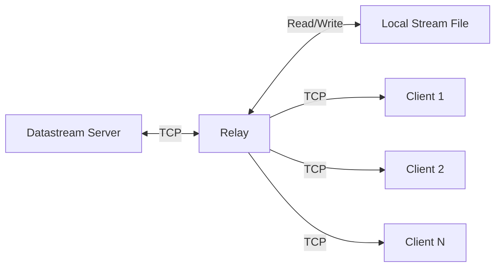

# ZkEVM Data Stream Relay

A lightweight service that connects to a data stream server, receives data, and forwards it to multiple clients.

## Overview

The datastream relay acts as a client towards the main data stream server and as a server towards connected clients. This architecture allows scaling the number of connected clients by distributing the load across multiple relay instances.

This implementation directly uses the `datastreamer.NewRelay` function from the [gateway-fm/zkevm-data-streamer](https://github.com/gateway-fm/zkevm-data-streamer) package.

## Features

- Connects to a zkEVM datastream server and receives entries in real-time
- Serves multiple clients with the same data
- Maintains a local stream file for persistence
- Forwards all entry types (batches, L2 blocks, transactions, etc.)
- Preserves bookmarks for efficient client synchronization

## Usage

```
./relay [flags]
```

### Command Line Flags

```
--server string           Datastream server address to connect to (default "127.0.0.1:6900")
--port uint               Port to expose for clients to connect (default 7900)
--datafile string         Relay data file name (default "$HOME/Library/Erigon/datarelay.bin")
--write-timeout duration  Timeout for write operations on client connections (default 5s)
--inactivity-timeout duration  Timeout to kill an inactive client connection (default 30s)
--check-interval duration  Time interval to check for inactive clients (default 5s)
```

### Example Docker Compose

```bash
# Start a relay using Docker Compose connecting to a local datastream
RELAY_DSHOST=host.docker.internal:6900 docker-compose up relay
```

## Architecture



The relay:
1. Connects to the main datastream server
2. Receives streamed entries
3. Writes entries to its local stream file
4. Serves connected clients from this file

## Implementation Details

This relay is a thin wrapper around the official zkEVM datastream relay implementation, providing a simple configuration interface through command-line flags. 