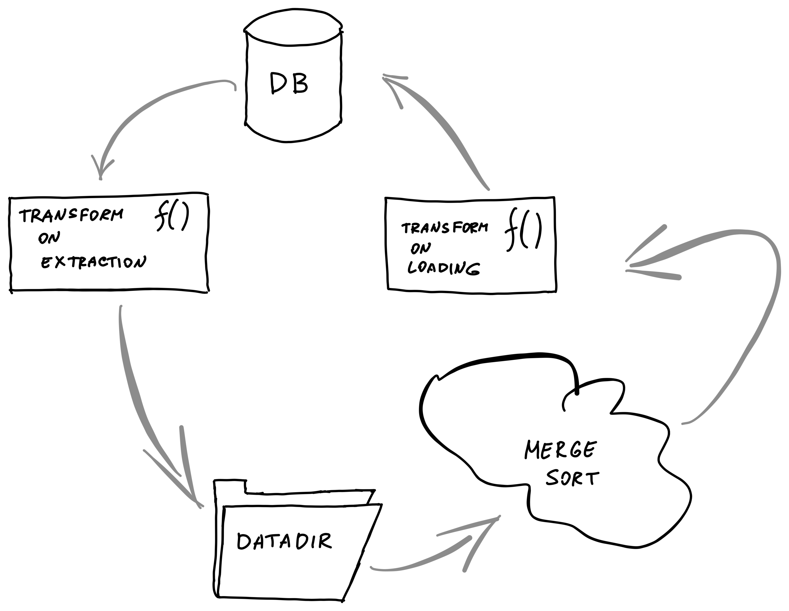
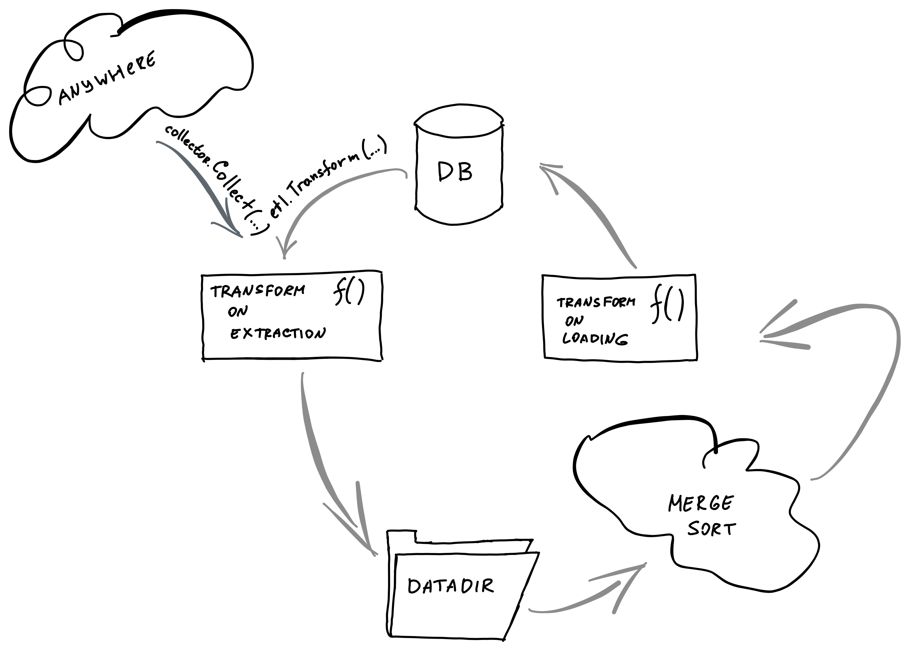

# ETL

ETL framework is most commonly used
in [staged sync](https://github.com/erigontech/erigon/blob/main/execution/stagedsync/README.md).

It implements a pattern where we extract some data from a database, transform it,
then put it into temp files and insert back to the database in sorted order.

Inserting entries into our KV storage sorted by keys helps to minimize write
amplification, hence it is much faster, even considering additional I/O that
is generated by storing files.

It behaves similarly to enterprise [Extract, Transform, Load](https://en.wikipedia.org/wiki/Extract,_transform,_load) frameworks, hence the name.
We use temporary files because that helps keep RAM usage predictable and allows
using ETL on large amounts of data.

### Example

```
func keyTransformExtractFunc(transformKey func([]byte) ([]byte, error)) etl.ExtractFunc {
	return func(k, v []byte, next etl.ExtractNextFunc) error {
		newK, err := transformKey(k)
		if err != nil {
			return err
		}
		return next(k, newK, v)
	}
}

err := etl.Transform(
		db,                                              // database 
		dbutils.PlainStateBucket,                        // "from" bucket
		dbutils.CurrentStateBucket,                      // "to" bucket
		datadir,                                         // where to store temp files
		keyTransformExtractFunc(transformPlainStateKey), // transformFunc on extraction
		etl.IdentityLoadFunc,                            // transform on load
		etl.TransformArgs{                               // additional arguments
			Quit: quit,
		},
	)
	if err != nil {
		return err
	}

```

## Data Transformation

The whole flow is shown in the image 



Data could be transformed in two places along the pipeline:

* transform on extraction

* transform on loading

### Transform On Extraction

`type ExtractFunc func(k []byte, v []byte, next ExtractNextFunc) error`

Transform on extraction function receives the current key and value from the
source bucket.

### Transform On Loading

`type LoadFunc func(k []byte, value []byte, state State, next LoadNextFunc) error`

As well as the current key and value, the transform on loading function
receives the `State` object that can receive data from the destination bucket.

That is used in index generation where we want to extend index entries with new
data instead of just adding new ones.

### `<...>NextFunc` pattern

Sometimes we need to produce multiple entries from a single entry when
transforming.

To do that, each of the transform function receives a next function that should
be called to move data further. That means that each transformation can produce
any number of outputs for a single input.

It can be one output, like in `IdentityLoadFunc`:

```
func IdentityLoadFunc(k []byte, value []byte, _ State, next LoadNextFunc) error {
	return next(k, k, value) // go to the next step
}
```

It can be multiple outputs like when each entry is a `ChangeSet`:

```
func(dbKey, dbValue []byte, next etl.ExtractNextFunc) error {
		blockNum, _ := dbutils.DecodeTimestamp(dbKey)
		return bytes2walker(dbValue).Walk(func(changesetKey, changesetValue []byte) error {
			key := common.CopyBytes(changesetKey)
			v := make([]byte, 9)
			binary.BigEndian.PutUint64(v, blockNum)
			if len(changesetValue) == 0 {
				v[8] = 1
			}
			return next(dbKey, key, v)                      // go to the next step
		})
	}
```

### Buffer Types

Before the data is being flushed into temp files, it is getting collected into
a buffer until if overflows (`etl.ExtractArgs.BufferSize`).

There are different types of buffers available with different behaviour.

* `SortableSliceBuffer` -- just append `(k, v1)`, `(k, v2)` onto a slice. Duplicate keys
    will lead to duplicate entries: `[(k, v1) (k, v2)]`.

* `SortableAppendBuffer` -- on duplicate keys: merge. `(k, v1)`, `(k, v2)`
    will lead to `k: [v1 v2]`

* `SortableOldestAppearedBuffer` -- on duplicate keys: keep the oldest. `(k,
    v1)`, `(k v2)` will lead to `k: v1`

### Transforming Structs 

Both transform functions and next functions allow only byte arrays.
If you need to pass a struct, you will need to marshal it.

### Loading Into Database

We load data from the temp files into a database in batches, limited by
`IdealBatchSize()` of an `ethdb.Mutation`.

(for tests we can also override it)

### Handling Interruptions

ETL processes are long, so we need to be able to handle interruptions.

#### Handing `Ctrl+C`

You can pass your quit channel into `Quit` parameter into `etl.TransformArgs`.

When this channel is closed, ETL will be interrupted.

#### Saving & Restoring State

Interrupting in the middle of loading can lead to inconsistent state in the
database.

To avoid that, the ETL framework allows storing progress by setting `OnLoadCommit` in `etl.TransformArgs`.

Then we can use this data to know the progress the ETL transformation made.

You can also specify `ExtractStartKey` and `ExtractEndKey` to limit the number
of items transformed.

## Ways to work with ETL framework

There might be 2 scenarios on how you want to work with the ETL framework.



### `etl.Transform` function

The vast majority of use-cases is when we extract data from one bucket and in
the end, load it into another bucket. That is the use-case for `etl.Transform`
function.

### `etl.Collector` struct

If you want a more modular behaviour instead of just reading from the DB (like
generating intermediate hashes in `../../core/chain_makers.go`, you can use
`etl.Collector` struct directly.

It has a `.Collect()` method that you can provide your data to.


## Optimizations

* if all data fits into a single file, we don't write anything to disk and just
    use in-memory storage.
