We are going to now start looking into the way to store data in
order to answer questions about blocks and transactions. This is where I might be a little bit vague, because there are
quite a lot of things that happened since the first prototype of Erigon 3. So I have to be honest to you that I have not been
working on Erigon 3 intensively for a long time. I know how things were in the prototype, and I will be telling you
things that may need to be corrected by other people.
To start with, we will be looking at the difference between B-tree, as a data structure, and the LSM (Log Structured Merge).
Perhaps now I am going to introduce that, this is where we are going a little bit into the "synthesis" approach, because
we are going to be using these two things to discuss how to store the data.
Traditionally, all Ethereum implementations and, if fact, most of other blockchain implementation, use embeddable databases,
or embedded databases. Embedded database is different from a networked database. If you worked with things like Oracle and
Microsoft SQL Server, most of the time they are networked databases. 
There is a process running the application, and another process running DBMS (DataBase Management System), which runs on the
same computer, or on a different computer, and there is usually network connectivity between them.
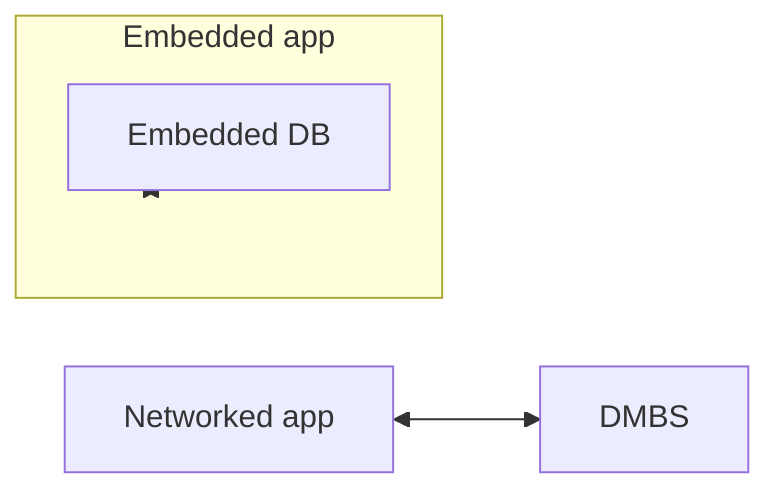
Embedded database is where you have the process of the application, and inside this process runs the database. It does not
actually run there, it is just a library. In some cases, it does actually have certain threads to do the background work.
A lot of embedded databases do that, they run their own thread to perform compaction, merge of data files, and so on.
That is why you may see that even if the application itself is not really doing anything, there is some activity, the CPU
fans are blowing etc.
There are some blockchain implementations that use the networked database approach, but most of them use embedded
databases. And in Ethereum, for example, go-ethereum used to use an embedded databases called LevelDB, but then they
switched to Pebble, also an embedded database. Nethermind use RocksDB. Erigon and reth are both using MDBX. There is a
difference between MDBX and the others, and the difference is that we can call them two different types of databases.
One we call B+tree databases, and another type - LSM (Log Structured Merge) databases. MDBX is a B+tree database, and
LevelDB, Pebble, and RocksDB are LSM databases.
Erigon 1 only used MDBX database, which is B+tree. As we started to move into Erigon 2, and now into Erigon 3, it looks
more and more like LSM. But we are not taking LevelDB or RocksDB, we are effectively creating our own LSM. Why?
I am not going to answer this question now, because the answer requires a lot of things to be said first. But if we
remember, we come back to that question.
A B+tree database is a database, which has a file, usually a very large file. In our case, you can look at the `mdbx.dat`
in the `chaindata` directory, and it could go up to gigabytes, sometimes terabytes (but not in Erigon 3, where it got
smaller). This file is split into pages of fixed size. Current default page size of 8 kilobytes, but it can be changed,
there is a command-line option to do so. Each page has a page ID, which starts with 0, 1, 2, 3, and so forth. The
database grows by adding more pages at the end of the file.
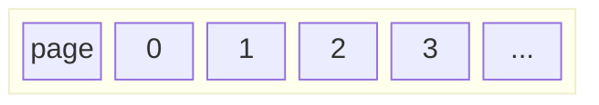

Logically, the pages form a kind of tree. You have a root page, which is 8 kilobytes in size. It contains some information,
and one part of this information are the page IDs that link this page to other pages, the pages of the lower levels.
Those pages of the lower levels also have page IDs, which link them to the pages of even lower levels. Of course, physically,
those pages could be anywhere in the file. They do not have to be specifically sorted. And because the new pages are allocated
at the end, or there are some free pages inside, those will be allocated too. If you think about any memory allocation
algorithm, memory allocation that runs in every operating system, we very much like tree structures in our programs, but
the memory is linear, that is why the order of pages in the tree is generally unpredictable. And the similar thing happens
in MDBX, and perhaps other B+tree databases. Some people even say that MDBX is not even a database, but a memory allocation
library, with the option of persistence.

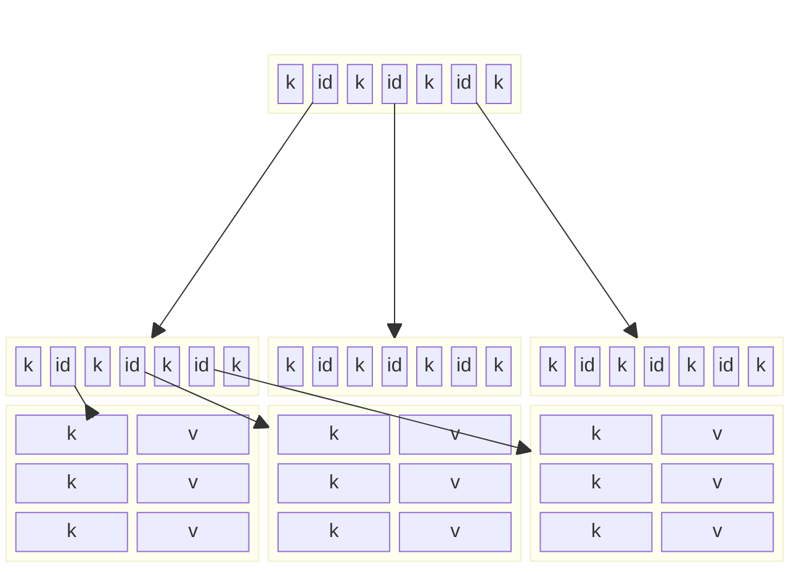

We have the entire file of the database memory-mapped as virtual memory, then we do something with the virtual memory,
and when we "commit", we synchronise this virtual memory with the content on the disk. But most of the stuff we are doing
are memory allocation, and forming the B+tree. B+tree is a good structure to store sorted collections of keys and values.
In MBDX, in fact, there is another feature, which allows you not just to store sorted collections, but it goes a little
bit further, enabling nested B+trees, but we are not going into this right now.
Now quickly what is LSM. Before the 21st century, most of the databases were based on B+trees. But then it was Google,
who wanted to do some data mining and machine learning, so they introduced the concept of LSM. It stands for Log
Structured Merge. In such system, you have a MemTable. Usually MemTable is some kind of in-memory structure, so here you
have the flexibility of how you store it. Typically, implementations use SkipList, or Concurrent Skip List, which allows
you to have a sorted structure with concurrent updates. And here is where all the updates are coming in. But as the
MemTable gets filled up, some data gets offloaded into Level 1 (MemTable is Level 0). When it is deleted from the
MemTable, it is sorted and written into a file. Inside this file, the keys and values are sorted. In some systems, keys
are stored in one file, and values - in another, but it does not really matter conceptually (there are lots of performance
tweaks). When Level 1 fills up, the data is moved to Level 2, and so forth. Usually, each higher level is 10 times bigger
than the corresponding lower level. So, each level has a finite capacity. For example, if Level 0 is 10 gigabytes,
because we have that much RAM, then Level 1 would be 100 gigabytes. When our data is more than 100 gigabytes, then we will
need to have Level 2, which is 1 terabyte. Just an example. There is always this background process of taking the
data from one level to another, sorting it, merging it. This process is called compaction.
Querying B+tree and LSM databases is also different.

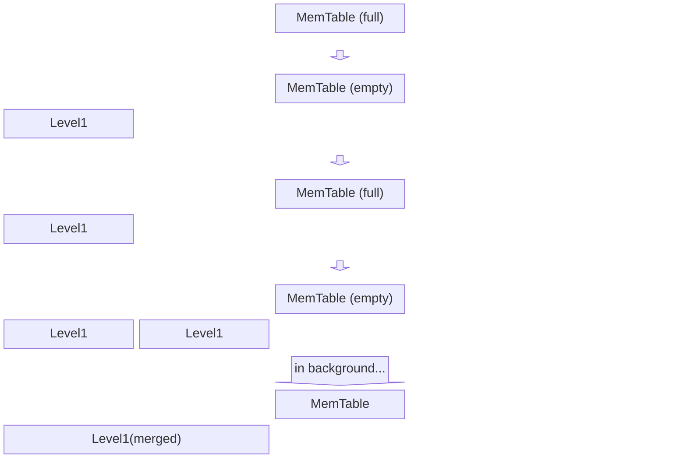

In Erigon 1, we started off with all of our data, including blocks, transactions, historical states, events, and everything,
stored in MBDX, which is B+tree database. We are evolving, from Erigon 1, to Erigon 2, to Erigon 3, to put more and more data
into LSM form, but not in the form of any off-the-shelf LSM databases. We are putting it into our own implementation of LSM,
and I will explain you later why we are rolling out own implementation, and what we are missing in the off-the-shelf products.

If we were to store blocks and transactions without any LSM, in B+tree database. In MDBX terminology, each file that I was
talking about earlier, inside the code of MDBX itself is mostly called "environment", or `env`. In the same process you can
open multiple environments. In fact, if you ever looked at the diagnostics tool, there is a function, which allows you to
see all the open MDBX environments within the process, which is quite useful. You would see that Erigon does not just use
one environment, but multiple of them. So, one environment corresponds to one file, with the `.dat` extension. There is
another file associated with the environment, with the extension `.lck`, it is used to provide concurrent read access to
the environment from multiple processes running on the same computer (via shared memory).
Inside an environment, there are things that are basically collections of sorted keys and values. We used different names
for these things throughout the code. Sometimes they are called buckets, sometimes they are called tables, and MDBX code
might be using the term `databases` for them. MDBX code also uses term `subDB` to refer to the structures necessary to store
nested B+trees inside the values. We have nothing else there. In Oracle or MS SQL Server, you may use `CREATE TABLE` to create
something like this, but in that case, a table has multiple columns, with one of them being the primary key. In general,
there can be arbitrary number of columns in such tables. In MDBX, we are limited to 2 column - primary key, and everything
else has to be somehow packed into the value. Also, unlike in Oracle or MS SQL Server, in MDBX there is not ability
to create indices, meaning there is no analog to `CREATE INDEX` instruction. We have to do it ourselves - we we want an
index, we have to create it using the same mechanism - sorted collection of keys and values.

Now we finally talk about blocks and transactions. The most important attribute of a block is the block number, they are
all counter by these numbers. Block hash, and perhaps number of transactions in the block are other important attributes.
When we talk about block numbers, perhaps for better understanding of log files, each block, for historical reasons, has
block number, but also it has slot number, which is usually less than block number. This is something to do with the fact
that Ethereum went through the process of "Merge". Two different projects merged into one. Slot numbers are the numberings from
one system, and block numbers are numbering from another system, but they point to the same block. Hash is a 32-byte
identifier, which is produced by applying some cryptographic hash function to the content of the block header, which is
part of the block. Headers are of relatively fixed size. Then we have a variable number of transactions in the block.
For convinience, we logically separate blocks into headers and bodies. Headers are not of fixed size, but they are of almost
fixed size, approximately 500 bytes. It does not go much further than that, but for some system the headers could be much
longer, because of this "extra data" thing. Header is relatively small, and the body is supposed to contain all the transactions
that are attached to the block, and this could be quite large, kilobytes, and sometimes megabytes, depending on how much
transactions are there. Most of the queries that issued about the blocks are related to either headers or bodies. For example,
to give the header for given block number, to give the body for given block number, to give the block number given the block
hash, to give the header given block hash, and so forth. This tells us that we have to have some kind of indices based on
block number and block hash, and perhaps both. During its evolution, Erigon through the stages of data normalisation,
currently we store these things in multiple entities. We have a separate entity for block headers, and also separate
entities for block bodies and for transactions.
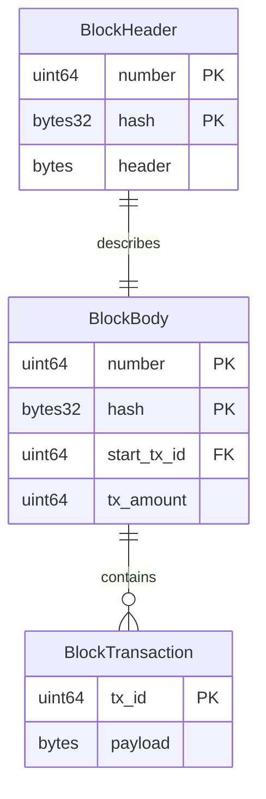
Before the data normalisation, transaction payloads used to be stored inside the `BlockBody` entities, making the records there potentially
quite large. All transactions from a block were bunched up together, encoded as a single byte string, and served as a value in the block
body table. Now we store transaction payloads separately.
Since there is a requirement to look blocks and transactions up by their hashes, we needed to introduce two additional entities.
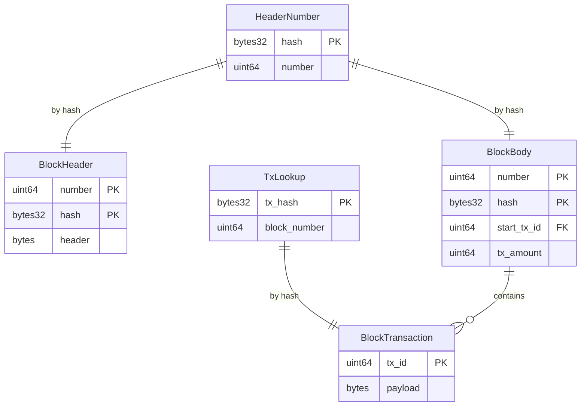
Table `TxLookup` has transaction hash as the primary key, and block number as the value. It would be logical to have transaction Id
there, but for historical reasons we might not be doing it yet. So, instead of going directly to the transaction of interest,
we use block number to first go to the block, but then go through all the transactions in that block, iterate over them,
to find the one with the transaction hash we require. This is less efficient, specifically if there are many transactions in the block.
This might be an optimisation worth doing, to put direct reference to transaction inside the `TxLookup` table.
Inside the tables `BlockHeader` and `BlockBody`, the primary key is the concatenation of block number and block hash. Even though it
contains block hash, it does not allow looking a block up by its block hash, if we do not also know the block number. To achieve
this, the table `HeaderNumber` effectively maps block hash to block number. Now if we need to find the block by its block hash,
we first go to the `HeaderNumber`, find the block number, and then, using both block number and block hash, we search in either
`BlockHeader` or `BlockBody` (or both) using their concatenation.
Then there are queries about specific transaction in specific block. This can be done using `BlockBody` table. First, we determine
the transaction id of the first transaction in the block, and then calculate the transaction id of any transaction in that
block. Using that `tx_id`, we extract transaction payload from the `BlockTransaction` table.
Sometimes it is required to go "the other way", meaning to find block number given any transaction id that belongs to that block.
This can be achieved by using binary search on `BlockBody` table, but Erigon 3 instead uses more convinient table, `MaxTxNum`.
For each block number, this table specifies the largest transaction id inside that block.

What has been described so far would be the situation if we stored everything in MDBX. We had some primary entities, and some
entities created specifically to provide some indexing. If tomorrow someone requires a query, which is not satisfied by any
of these primary keys or indices, we will have to create another entity, which somehow indexes by what is required. We would
have to insert the maintenance of such index and so forth, perhaps pruning of this index.

In Erigon 2, we decided not to store all the blocks and transactions in MDBX. One thing about MDBX, and it is very difficult to
avoid, is that as the B+tree becomes larger, it also becomes deeper, and the commits become slower. The whole management of
the database becomes slower. It is beneficial to reduce the size of MDBX databases. Essentially, it works much better if the
database is smaller. The observation we can make is that most of the blocks and transactions that happened in the past, they
are permanently like that and are never going to change. Instead of keeping them in the database, being "in the way", when the
data are shuffled around, let us move it out. But moving it requires certain care. Where are we going to put it? How are we going
to organise it? This is where this whole Erigon 3 ideas starts. What is the best way to store these things, which data structures
to use?

Now I will introduce to you the trilemma of a database, and how we solve it. It can be drawn as a triangle, but given
the diagram tools, I will draw it as a flow chart:
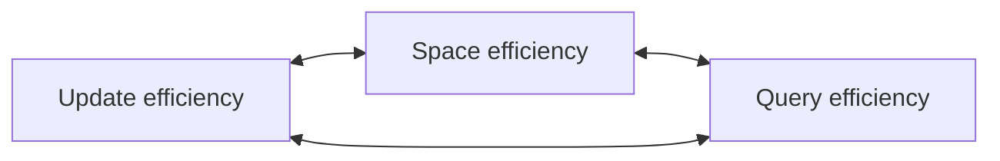
In something like MDBX, but in fact in most of the non-LSM databases, you have a trade-off between 3 things: update efficiency,
query efficiency, and space efficiency. For example, you can make your system more update efficient, but it will suffer
from lower space efficiency and/or query efficiency, and so on. Generally, we would like our system to be somewhere in the
middle. However, when we do not need to update anything, in other words, our data is constant, then instead it becomes a
dilemma:
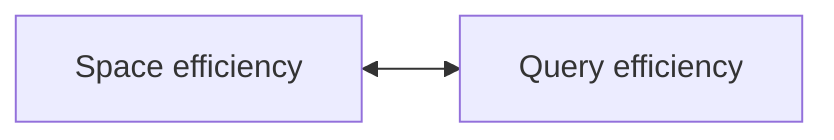
If you follow this concept, then there must be a way (if you know that the data is not going to change) to organise the data
is such a way, that it will be both more query and space efficient than in the case of trilemma. And in fact, we think it is
the case. We can take that data about blocks and transactions, and pack them into certain things, essentially flat files,
and we pack them in such a way that you can still query them efficiently, but we also try to get them to occupy as little
space as possible. One of the examples of the trade-off here is that we really need to be careful about is the compression.
We do use compression for certain type of data. We do not use compression in the MDBX database (in trilemma), but we do
use compression inside the flat files (in dilemma). The trade-off here is that sometimes compression gives you a boost in
terms of space efficiency, but it always makes query efficiency lower. If some data is not very well compressible, you
might not want to do it, because you would hurt your query efficiency without too much of help with space efficiency.
That is why for certain types of data, we do not do compression at all, because trade-off is not good.

What type of files we use with blocks and transactions, from those entities we talked about before? If you ever looked at
the snapshots directory in Erigon, you would notice bunch of files. We will be talking about the files with their names
ending with the following suffixes:
```
-headers.seg
-headers.idx
-bodies.seg
-bodies.idx
-transactions.seg
-transactions.idx
-transactions-to-block.idx
```
Let us talk about what we put in those files. They are obviously related to those entities that we had before. If you look
inside `-headers.seg` file, and try to decode it, you will see that this file is a sequence of values, order of which
corresponds to the sorted order of keys. However, the keys are not explicitely stored in `.seg` files, they are instead
implied via `.idx` files.
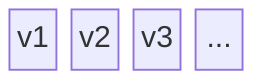
What are the values? For `-headers.seg`, the values are the block headers, serialised in a special encoding format, called
RLP (Recursive Length Prefix). We will not go into what RLP is here, we will only mention that it is specified by
Ethereum specification. Strictly speaking, there was not need for us to use RLP encoding here, because the content of `.seg`
files is of internal design of Erigon. However, for historical and convinence reasons, this encoding is used.
Headers have many fields, and in order to access them, RLP decoding has to be applied to the values.
In similar way, `-bodies.seg` files contain sequences of RLP encoded pairs of integers, `start_tx_num` (not `start_tx_id` as before,
this will be explained a little bit later) and `tx_amount`,
and the files `-transactions.seg` files contain sequences of transaction payloads, which are also form of RLP encoding.

Before we proceed, we need to explain the different between two related concepts that you may see in the code: `TxID` and
`TxNum`. If we take all the transactions from the beginning, they come within the blocks, and we enumerate them throughout,
adding two extra numbers: one at the beginning of the block, and another - at the end of the block, we will get something
that looks like the following:
```mermaid
block-beta
    columns 21
    block_number<["block_number"]>(right)
        b1["1"]:2
        b2["2"]:4
        b3["3"]:2
        b4["4"]:6
        b5["5"]:6
    tx_index<["tx_index"]>(right)
        space:3
        t0["0"] t1["1"]
        space:4
        t2["0"] t3["1"] t4["2"] t5["3"]
        space:2
        t6["0"] t7["1"] t8["2"] t9["3"]
        space:1
    tx_id<["tx_id"]>(right)
        id0["0"] id1["1"]
        id2["2"] id3["3"] id4["4"] id5["5"]
        id6["6"] id7["7"]
        id8["8"] id9["9"] id10["10"] id11["11"] id12["12"] id13["13"]
        id14["14"] id15["15"] id16["16"] id17["17"] id18["18"] id19["19"]
``` 
In the diagram above, the blocks with numbers 1 and 3 are empty, block 2 has 2 transactions, and blocks 4 and 5 have 2
transactions each. Within each block, we use `tx_index` to enumerate transactions within the block, but we use
`tx_id` to enumerate transactions across all the blocks, including special slots in the beginning and at the end of
each blocks. These special slots are used to refer to effects of the blocks that do not belong to any transactions,
but still need to be tracked in the history of state modifications.
Enumeration of transactions accross all the blocks could result in either `tx_num` or `tx_id`. While a transaction
is recorded in MDBX, it is `tx_id`. When a transaction has been moved into the files, we use the term `tx_num`. The
idea is that `tx_num` of a certain transaction will never change, it becomes canonical. It is also guaranteed to be
the same across all Erigon instances. So if a specific transaction gets assigned its `tx_num`, on our computer, in the
snapshot files, then we assume that it gets the same `tx_num` on all the other computers running Erigon on the same
network (blockchain). However, if in our MDBX one of the transactions has a certain `tx_id` it is not necessarily true
that it will have the same `tx_id` on every node. This is something to do with rolling blockchain back. Sometimes
blockchain does not just go forward, but it goes backwards a bit, and wipes away the blocks that were produced before,
so it retracts them and follows a different "direction". Such phenomenon is called "reorg" (reorganisation), or
"unwind", there may be other names. This situation does not happen very often. In this case, when we backtrack,
we do not start wiping out the old data, we simply "jump over" it. Then we have a gap in `tx_id`s. Lets us say that
if there were 100 transactions that were unwound, then we just carry on, assigning bigger `tx_id`s. But when the process
of packing of these transactions into the files goes on, we through away those `tx_id`s that we jumped over (they
belong to the thrown away, unwound, blocks) and so remove the gaps. Therefore, `tx_num`s, which are used in the files,
do not have gaps. Nodes that synchronise all this at later time, will never experience reorgs (as though the reorgs
never happened), so for them even `tx_id`s will not have any gaps. Only the nodes that are operating on the
"tip of the chain" and follow the chain forwards (and sometimes backwards) will have gaps in `tx_id`s, but these
will not lead to any gaps in `tx_num`s, because the process of moving transactions from MDBX to files specifically
eliminates those gaps.
For example, let us image we have two blocks, and block 2 initially has 2 transactions. So far `tx_id`s are
identical to `tx_num`s:
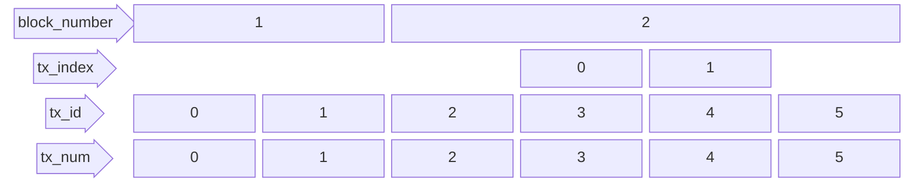
Then, the blockchain experiences reorg, and block 2 gets unwound. Instead, a new, empty block 2 is added, and a new block 3 with 2 transaction.
While these blocks and transactions are in MDBX only, Erigon will allocate integers 6, 7, etc. for sucessive `tx_id` (it never reused old `tx_id`s).
there will be a gap in `tx_id`s of integers 2-5, this gap corresponds to the `tx_id`s that were in the block that ended up getting removed.
When these blocks and transactions are placed into the files, `tx_num`s will have no gaps:
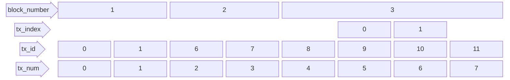

If we look at the relative sizes of the `-headers.seg`, `-bodies.seg`, and `-transactions.seg`, we will see that
`-bodies.seg` files are very small, because for each block they contain only a pair of numbers. `-headers.seg` files
are larger, because for each block they contain approximately 500 bytes (encoded block header). The `-transactions.seg`
files are the biggest by far, because they are many more transactions than blocks, and the size of a transaction
payload is variable. Those `.seg` files are being distributed across Erigon nodes either by Bittorrent or
Cloudflare R2.

In order to answer various queries for the blocks and transactions that have been moved into the files, we would need
indices. In MDBX, indices are additional entities that are represented by MDBX tables. With the files, the situation
is more complicated, and perhaps more interesting. Let us start with transactions. There two index files for each
`-transactions.seg` file. The first one, `-transactions.idx` contains two indices in the same file. The first one
is the sequence of offsets for every value inside the corresponding `-transactions.seg`. In the code, we refer to this
sequence as `Enum` (enumeration). This `Enum` sequence is necessarily a non-decreasing (this property will be important
later) sequence of offsets, such that one can efficiently access any transaction payload given its `tx_num` relative
to the beginning of the file. In order to access transaction given absolute (not relative) `tx_num`,
`-transaction.idx` also contains the first `tx_num` corresponding to the file.
The second index contained in the `-transactions.idx` file allows efficiently finding transaction payload by transaction
hash. It is a mapping (implemented by something we call Minimal Perfect Hash Table, or MPHT) from transaction hash to
the offset of the transaction's payload inside the `-transaction.seg` file.
The second index file, `-transactions-to-block.idx` contains the mapping (also implement by MPHT) from transaction hash to
the block number. As we discussed earlier, it would be an improvement to change this mapping to also containing `tx_num`,
so that one does not need to scan the entire block to find the required transaction.

Once the data about blocks and transactions have been in MDBX for a while, Erigon starts a background process of collecting
the data from the MDBX into temporary files. Then, compression is performed when necessary, indices are created, data in
the files becomes efficiently accessible. After that, the original data in MDBX is marked as "pruneable", and then it gets
eventually removed from the database. And this is how we intend to keep the size of MDBX database smaller. It is kind of
archiving. For some time, there might be overlap (meaning that the same data is accessible from both files and from MDBX),
but eventually it permanently migrates out of MDBX. After that, if someone would like to query a very old block, they
query it directly from the files, and the access should be faster than from the MDBX, due to the efficiency trade-offs.
One can think about MDBX/files divide as a divide between hot storage (where data can still be modified) and cold storage
(where data is not modified). The current cut-off (threshold) for moving data from MDBX to files used to be 90 thousand
blocks, but it might have been changed recently to be more agressively.

Now we shall return to other `.seg` files. In our "vanilla" case, there are 3 types of segment files, for block headers,
block bodies, and transactions correspondingly. For polygon, there are more types. The naming convention of the `.seg`
files (or segment files), which we came up with a long time ago, for Erigon 2, is still used. Apart from extensions
`.seg` and `.idx`, and file types, this naming convention also includes block number ranges. For example, the
name `v1-015500-016000-headers.seg` is for the headers segment file, for block number ranges from 15.5m (m stands
for million) to 16m. In this case, 15.5m is inclusive (i.e. this segment file contains the header for the block
number `15500000`), and 16m is exclusive (i.e. it does not contain the header for the block nymber `16000000`, but it
does contain one for the block number `15999999`).
We have already described above what is inside the `.seg` files - the sequences of byte strings with the meaning depending
on the file type. These strings are of variable size. Now we shall talk about the content of `.idx` files. Such files
internally contain one or two data structures each. Example of files containing only one data structure are
`-transaction-to-block.idx` - these files contain one structure we call Minimal Perfect Hash Table (MPHT) to enable
an efficient mapping from transaction hashes to block numbers to which these transactions belong. Other `.idx` files
each contain two data structures, one is MPHT, another is Elias Fano (EF), to enable efficient representation of
offsets of each value in `.seg` file given its ordinal place in the file. Above we already referred to this
as `Enum` sequence. For example, if we have a `.seg` file with
5 values in each, with corresponding lengths of 12, 15, 10, 11, and 17 bytes, then the EF would be representing the
sequence of offsets: `0, 12, 27, 37, 48`. If it is possible to access such sequence like this:
```
0 => 0
1 => 12
2 => 27
3 => 37
4 => 48
```
then it would quite easy to access any value efficiently using its ordinal place in the file, and hence, answer the
queries of types:
```
block number => block header
block number => block body
tx_num => transaction payload
```
In order to asnwer such queries, apart from `Enum` sequence, contained in the `.idx` file, one would also need the
information about the smallest block number or the smallest `tx_num` inside this `.idx` file. This information is
also contained in such `.idx` file.

Now we will explain what Elias Fano encoding of non-descreasing sequence of integers is. It is based on a general
idea which is used in other encodings. We will use the example sequence above (`0, 12, 27, 37, 48`) to illustrate.
First, we convert all integers to binary form: `0, 1100, 11011, 100101, 110000`. It is important to note that
when we perform such encoding, we know the entire sequence upfront - there is no requirement to be able to
add items dynamically. Given the numbers in the sequence, we determine an optimal way to split their binary
representations into 2 parts - low and high parts. Low parts will have fixed number of bits, whereas high parts will
have variable number of significant bits. An approximate rule for determining how many bits will be allocated to the
low part is to take the average value of the sequence and see how many significant bits it has, and subtract 1 from
that number of significant bits. In our case, the average is 24 (it is 24.8, but we take the integer part),
which has 5 significant bits. Subtracting 1 gives us 4, and this is how many bits we will be using for the low
parts in our example. It is possible to derive the exact formula for the optimal number of bits in the low parts, and
it can be found in the paper on Elias Fano encoding. So, for our example sequence, the low parts will be
`0000, 1100, 1011, 0101, 0000`, and the high parts will be `0, 0, 1, 10, 11`. Notice that the low parts do not form
a non-descreasing sequence anymore, but the high parts still do. To encode, we first encode low parts by simply
concatenate them. Since each part has fixed number of bits, it is very easy to access any low part knowing which
item you need. To encode high parts, we will first compute the differences of each item from the previous one
(except for the first item, which stays as it is), in our case: `0, 0, 1, 1, 1`. Since the sequence of high parts
is non-descreasing, the differences are non-negative. Then, we encode all differences using so-called unary encoding:
```
0 => 1
1 => 01
2 => 001
3 => 0001
...
```
In our case, the unary encodings of the differences of high parts will be `1, 1, 01, 01, 01`. These unary encodings
are then concatenated to form `11101010`. The final encoding (low parts + high parts) is `0000110010110101000011010101`.
While it is clear how to access items from the encoding of the low parts, how is this done from the encoding of the
high parts? If we look again at the unary encoding, we make 2 observations. Firstly, encoding of any integer always
contains exactly one bit `1`. This means that in order to find, say, n-th item in the encoding, one needs to find n-th
bit set to `1`. Secondly, number of `0` bits in the encoding of any integer is equal to that integer's magnitude.
But, since we are not encoding the high parts themselves, but differences from the previous values, the magnitute
of an item in the high parts encoding is equal to number of `0` bits from the beginning of the encoding of the
entire sequence, and not from the beginning of the encoding of the specific item. Given these 2 observations, if
we want to access high part of item n, we need to find n-th bit set to `1`, and count number of bits set to `0`s prior
to that. In order to do that, one needs 2 main tools: population count function, and bit select function.
Population count function takes, for example, 64-bit integer and returns number of bits `1` in the binary representation
of such number. Using such function, one can "scan" a very long sequence of 64-bit words, which is high parts
encoding, until the specific 64-bit word found that contains n-th bit set to `1`. Bit select function takes
a 64-bit word and an integer 0-63, say 3, and it returns the position inside the 64-bit word where, say 3rd bit
set to `1` is located. This function allows "closing" in on the n-th `1` inside the specific word.
This scanning approach would work, but it has a very substantial problem when the encoded sequence is very large.
Finding items in a large sequence would require repeated scanning of the high parts encoding from the beginning.
To solve this, some "memoisation" of the scanning results can be done, so that the actual scanning with population
count function to find n-th `1` bit is only performed for limited n. In our implementation, n < 256. To achieve
that, we pre-process the high parts encoding, to identify 256-th bit `1`, 512-th bit `1`, and so on, and remember
the number of bits that one has to skip to get there. This is recorded in the `jump` structure. There is one further
optimisation. Instead of keeping in the `jump` structure the number of bits requires to reach 256-th, 512-th,
768-th bit `1` and so on, this is split into 2 sections, which we can call absolute jump (because it stores absolute
bit positions), and relative jump (because it stores increments to absolute bit positions).
The absolute jump section is the 64-bit element array that keeps
number of bits to reach 16384 (2 to the power of 14), 2 * 16384, 3 * 16384 bit `1`, and so on. And the relative jump section
is the 32-bit element array that keys additional number of bits to reach the 0 + 256-th, 0 + 512th, 0 + 768-th, ...,
16384 + 256-th, 16384 + 512-th, 16384 + 768-th, ..., 2 * 16384 + 256-th, 2 * 16384 + 512-th, 2 * 16384 + 768-th, ...,
bit `1`, and so on. Such organisation assumes that never in the sequence the number of bit `0` is larger than
2 to the power of 32.
In the code of Erigon, there are two versions of Elias Fano implementation, one called `eliasfano32`, and another is
called `eliasfano16`. The difference is in how the `jump` structure is stored. In `eliasfano32`, the relative jump section
consists of 32-bit numbers, and in `eliasfano16`, the relative jump section consists of 16-bit numbers. In both cases,
these numbers are packed into array of 64-bit numbers using bitwise operations of shifting and masking (in case of
`eliasfano32`, one 64-bit number packs two 32-bit relative jumps, and in the case of `eliasfano16`, one 64-bit number
packs four 16-bit relative jumps). Consequently, the implementation `eliasfano16` assumes that never in the encoded sequence
the number of bit `0` is larger than 2 to the power of 16. In other words, the sequence should not be too "jumpy",
but increase relatively smoothly (close to linear function). As we will see later, this assumption holds in the situations
where `eliasfano16` is used in Erigon (namely in the encoding of substructures of MPHT - minimal perfect hash table).

Now we move on to the discussion of minimal perfect hash tables, which is one of the data structures contained in all
`.idx` files. This data structure provides a compact of way of storing a general mapping (hash table), given certain
constraints on the usage of such mapping. Its use is especially beneficial when the keys of the mapping are relatively
large (in our case usually a 32-byte hash). Statistically, the hash tables (if the parameters are chosen correctly) give
algorithmic complexity of access of the order O(1) - constant time, independent of the size of the hash table. In practice
it may only be true asymptotically. Minimal perfect hash tables, as we will see, probably have the algorithmic complexity
of access of the order O(log n), where n is the size of the table, albeit with a very small coefficient, and degree of
logarithm larger than 2.
One of the reasons a hash table may not have O(1) order access is the presence of collisions. Hash table comes with a
hash function, which is applied to a mapping key, and determines the slot in the table where this key and the corresponding
value will be stored. Collision happens when there are some keys for which the result of the hash function is the same,
in other words, they need to be stored in the same slot in the table.
The following diagram shows an example of hash table without collisions:
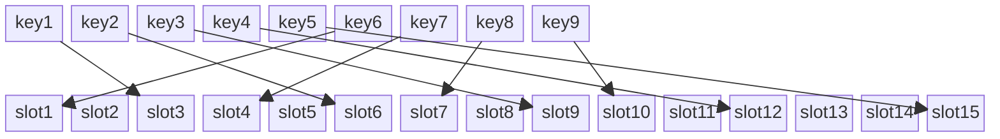
And now the diagram showing a hash table with some collisions. Collisions are present for the slots 6, 9, 12, and 15.
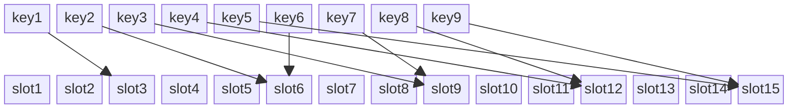
A usual way to store multiple keys and values in a slot is to organise them in a list.
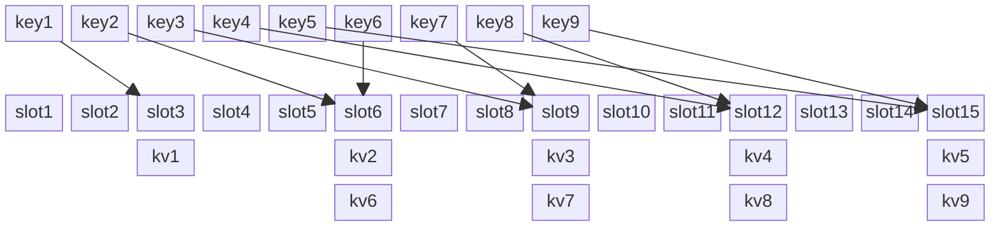
Now, if we are looking for the value corresponding to key8, for example, the hash function will point to slot 12.
Then, we would traverse the list, containing kv3 and kv8. It is important to note that in order to figure out that
we actually need kv8 and not kv3, the entries of the list must contain not just mapped values, but also the
corresponding keys. So we traverse the list and compare key8 to the keys corresponding to the entries.
If the number of slots is not much greater than the number of keys, and the hash function does not distribute
keys well across the slots, there may be situations where the lists for some slots are quite large, and accessing
any key for such slot would cause the traversal of a long list, which worsens the performance of the hash table.
Collisions need to be expected (even if they do not happen very often) for any dynamic hash tables, dynamic
meaning that the set of keys stored in such hash table is not known in advance. However, in situations when, for some
reason, the entire set of keys in the mapping is known in advance, there is a way to avoid collisions.
The way to do it is to come up with a hash function that, on the known set of keys, produces no collisions at all.
In other words, we can search for such function in some space of functions that have compact representation and
can be computed efficiently (we do not want a function, whose definition includes the full list of keys,
for example, since it is not compact or not efficient to compute). It may take a long time to
find one, but it is possible.
Let us look again at the hash table without collisions, now with values.
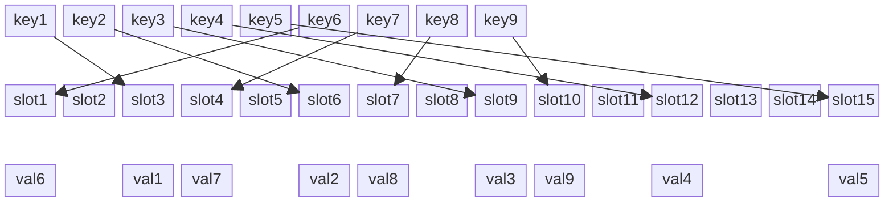
Now if we also assume that we will never need to access this hash table for the keys that are not in the known
set (the set with which the hash table was constructed), then it can be seen that such hash table does not need
to store keys inside the slots. If only access using known keys is allowed, there is no possibility to have
more than one possible value in a slot pointed by the hash function. What would happen if we did try to access
such hash table using an unknown key, for example, `key10`? The hash function could return any slot, including
a slot which already has a value in it. But because there are no keys inside the slots, we would not be able
to find out that there were not actually any associated value for `key10`. In other words, a hash table constructed
in such way, cannot be used to check membership of arbitrary keys in the set of known keys.
Such hash table, where there is no possibility of collision, is called a perfect hash table. If the number of
known keys is also equal to number of available slots, such hash table is called a minimal perfect hash table.
If could look like this:
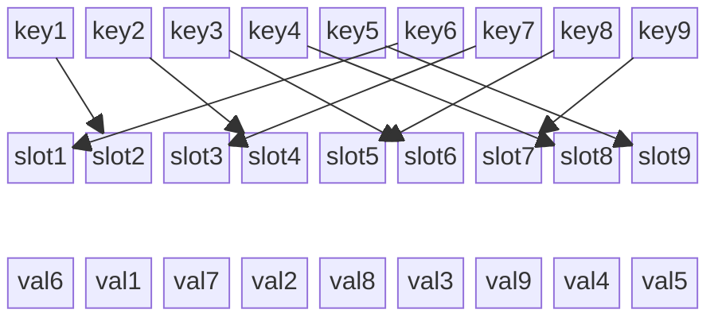
We now proceed to the question of finding such a hash function that can be used to build a minimal perfect hash table.
If the number of slots is small, then a very simple procedure can be used. We take one of the functions, which is
commonly used in hash tables, Murmur Hash. It is non-cryptographic hash function, which uses some non-linear
arithmetic operations (xor, and, bit shifts, etc.) to map a 64-bit number to another 64-bit number:
```
f(k): uint64 -> uint64
```
It also has a parameter `k`, which modifies the behaviour of Murmur Hash, such that it is really not a single function,
but a "family" of function, and we can select one particular function by choosing the value of `k`. Another way
of looking at it is as a function of two arguments, one is `k`, another is the key of the hash table.
So the idea of finding a hash function to build a minimal perfect hash table is to search for `k` such that
`f(k) mod n` (where `n` is the mumber of keys, and also the number of slots in the MPHT) gived unique results
for all known keys. In other words, it is bijection into the set of numbers 0..(n-1). This search works for small
number of keys, and in fact this is one of the building blocks of the algorithm we use for building very large
MPHTs. The maximum number of keys for which this search is conducted in our code is 24 (`MaxLeafSize`).
Incidentally, this limitation allows for using bitmap as an efficient means of checking that a function is a bijection
- you need at most 24 bits.
The algorithm we are using for finding an appropriate hash function for very large MPHT is called "RecSplit",
or Recursive Split. Initially, all the keys (in our case there may be hundreds of millions) are distributed into
relatively small buckets of similar size, 2000 keys. The way to accomplish it is to take function `f(k)` from before,
for some `k`, and for each `key` compute `f(k)(key) mod ((n+1999)/2000)`, where `n` is total number of keys and 2000 is
our specific bucket size. Obviously, `(n+1999)/2000` is the number of buckets, and for each `key` we will get a number
from 0 to number of buckets minus one, distributed roughly evenly accross all the keys. In the code it is done
a bit more elegantly (but less obviously), without `mod` operation, but by using the multiplication of two 64-bit
numbers (result of Murmur hash and the number of buckeys) and taking high 64 bits of the result. The result
is clearly between 0 and number of buckets minus one (it cannot be larger because `2^64-1 * number_of_buckets` is
the largest result of the multiplication, and its high 64 bit part is less than `number_of_buckets`).
It is also is distributed evenly (multiplication is a linear operation) provided that the results of Murmur hash
are distributed evenly in the region `0..2^64-1`. This procedure is used in other places and is encapsulated
in functions `remap` and `remap16` (16 stands for 16 bit numbers). We will refer to `remap` later when we
say that some 64 bit number needs to be transformed uniformly into a certain small range.

Some buckets may end up being larger than 2000 keys, therefore some allowance for that needs to be made in the
algorithm.
Now it is important to note that when we do such things as splitting keys into buckets, and so on, we need
to think of how this would work when we apply the constructed hash function. In the case of the bucket,
the same procedure for establishing which key belongs to which bucket, will be used when MPHT is used. This
procedure will be the first step. In fact, this first step begins with applying 128-bit Murmur Hash to
each key, forming two 64-bit numbers, `hi` and `lo` (as in the code). The `hi` part is used to establish
to which bucket the key will belong, and `lo` will be used instead of the key in any further calculations.
For performance reasons, it is much better to use fixed size 64-bit representation (fingerprint) instead
of variable size key what we have in the beginning. However, there is one caveat. As Murmur Hash is not a
cryptographic hash function (it is optimised for computation performance), it is not collision resistant.
In other words, sometimes there will be distinct keys `key1` and `key2` for which Murmur Hash will
produce the same `lo` part. We cannot use this as a fingerprint, because eventually `key1` and `key2` will
need to occupy distinct slots in the hash table, so their fingerprints have to be distinct. In our code
will make sure we detect such situation (albeit a bit late in the process of building MPHT, but collisions
are very rare), and when it occurs, we try another Murmur function (with different parameter `k`).

In further description, we will concentrate on working with a single bucket, which contains roughly
2000 keys. This roughly corresponds to the function `recsplit` in the `recsplit.go` file. It is a
recursive process. It starts with the entire bucket, then it splits the keys in the bucket into
parts, then calls itself for each part, and so on, until the part is small enough (8 keys or fewer,
parameter `leafSize`) to employ the simple function finding method described above.
Another important thing to note is one of the main objectives of this algorithm is not just to find
function that maps large number of keys bijectively (without collisions) into a range `0..n-1`, but
to find a function which has a short and efficient definition. For instance, the full definition of
such function would take 2-3 bits (not bytes) per key. And efficient definition means that accessing
MPHT is on the order of perhaps tens of milliseconds.
The way any bucket is split into parts is organised around 3 numerical thresholds:
1. Leaf Size, for example, 8
2. Primary Aggregation Bound, computed from Leaf Size, for Leaf Size = 8, Primary Aggregation Bound is 32
3. Secondary Aggregation Bound, computed from Leaf Size, for Leaf Size = 8, Secondary Aggregation Bound is 96

If the number of keys in the part is bigger than Secondary Aggregation Bound, then the split is done into 2
further sub-parts. The size of the first sub-part is determined as the lowest multiple of Secondary Aggregation
Bound, which is more or equal to the half of the keys. The size of the second sub-part is what is left.
For example, if Leaf Size is 8, and Secondary Aggregation Bound is 96, and the part being split has 2000 keys
(bucket), then it will be split into 2 sub-parts of sizes 1056 and 944

If the number of keys in the part is not bigger than Secondary Aggregation Bound, but bigger than
Primary Aggregation Bound, then the split is done into 2 or more further sub-parts. The number of sub-parts
is determined by the minimal number of Primary Aggregation Bounds one needs to put together to completely
cover all the keys. For example, if Leaf Size is 8, and the Primary Aggregation Bound is 32, and the part
being split has 90 keys, then number of sub-parts will be 3, because `3 * 32 = 96 >= 90 > 2 * 32`.
The sizes of all sub-parts except the last one are set to the Primary Aggregation Bound, and the size of
the last sub-part is what is left. In our example, there will be 2 sub-parts with the size of 32, and one
with the size of 26.

Similarly, if the number of keys in the part is not bigger than Primary Aggregation Bound, but bigger than
Leaf Size, the split is done into 2 or more further sub-parts. The number of sub-parts is determined by
the minimal number of Leaf Sizes one needs to put together to completely cover all the keys. For example,
if Leaf Size is 8, and the part being split has 30 keys, then number of sub-parts will be 4, because
`4 * 8 = 32 >= 30 > 3 * 8`. The sizes of all sub-parts except the last one are set to Leaf Size, and
the size of the the last sub-part is what is left. In our example, there will be 3 sub-parts with the
size of 8, and one with the size of 6.

If the number of keys in the part is not bigger than Leaf Size, then it is not split further, but
bijection finding procedure is performed.

Any time a split of a part into sub-parts needs to be performed, a function needs to be found that
assigns fingerprints of the keys of the part to the sub-parts . In our latest example of 30 keys in
the part, split into 4 sub-parts, a function needs to be found that for exactly 8 fingerprints
out of 30 (no matter which ones) returns 0, for exactly 8 other fingerprints returns 1, for
exactly 8 fingerprints returns 2, and for exactly 6 fingerprints returns 3. As already mentioned,
it does not matter which fingerprints are mapped into which sub-parts, what matters is how many
fingerprints out of 30 maps into each sub-part. The search for such function proceeds in a similar
way to the search of bijection, by trying `f(k)` for various values of `k` and each time
counting the sizes of sub-parts, until their sizes are exactly what is required. As a result of
a successful search like that is the value of parameter `k` which makes function `f(k)` a
correct split function. There may be multiple values of `k` that are suitable, the first one
found will be taken.

It can be seen that for each split, a value of parameter `k` (which in the code is called "salt",
meaning salt of the Murmur hash) is found. This can be represented as a tree, where the root is
the initial part, and each node represents a split. At the leaves of the tree are parts not
bigger than Leaf Size (thus the name of this parameter). For each node of such tree, the value
of parameter `k` is found, and this tree of values `k` is, in fact, the definition of the
hash function for the bucket of MPHT.

The next question is how to encode such a tree of integers (values of `k` are integers) compactly,
but also with the ability to navigate the encoding when the hash function is being utilised.
First, we transform the tree of integers into a sequence of integers, using Depth First Traversal.
That means, for each node of the tree, the corresponding sequence of integers will start with the
integer inside the node, followed by the sub-sequences corresponding to the sub-trees. That way,
any sub-tree with total number of nodes `X` corresponds to the sequences of length `X`. This is
important when navigating the sequence as if we were navigating the tree - because skipping a
sub-tree with `X` number of nodes is equivalent to skipping `X` items in the sequence.
Now it is important to note that due to the rules of splitting parts, described above, each part
with `Y` keys will always be recursively split into some sub-tree with number of nodes, which
is only dependent on `Y`, i.e. parts with the same number of keys will be split into trees of
the same number of nodes, and, consequently, will correspond to the sequences with the same number
of integers. We can pre-generate a table, lets call it skip table, where for each number of
keys in the part, we record the corresponding length of the sequence of integers.
Note that the skip table does not need to be part of the definition of the MPHT hash function,
since it is the same for all MPHTs with the same `Leaf Size` parameter, it can be created once
and used for all such MPHTs.

Now if for each bucket we have a corresponding sequence of integers (each integer is the "salt"
of Murmur Hash for the splitting function), lets us explain how navigating such sequence would
work if we had to look up the slot within the bucket for a certain `key`. We know the number of
keys in the bucket. Given this number of keys, we figure out (given the rules above) into
how many sub-parts of what size this number of keys needs to be split up. Then, we take the first
integer from the sequence. We use this integer as a salt for Murmur Hash, and apply Murmur Hash
to the fingerprint of `key`. We then map (using function `remap` or `remap16`) the result to the
range from 0 to number of sub-parts of the split minus 1. When we determined in which sub-part
given key belongs, we compute how many items in the sequence of integers we need to skip. If it
is sub-part 0, then nothing needs to be skipped, if it is sub-part 1, then we take the size of
the sub-part, and use the skip table, described above, to find the number of nodes in the
tree, and therefore number of items in the sub-sequence that we need to skip. If it is sub-part
2, then we skip twice as many items, and so on. Now it becomes clear why all sub-parts except
the last one had to be of the same size - it simplifies skipping. Once require number of items
in the sequence is skipped, the procedure of nagivation is applied recursively. At the end,
when we reach the leaf of the tree, the last integer we take is the salt for the Murmur Hash
which makes it a bijection, and that bijection tells us the offset of the slot within the group
slots of size Leaf Size.
As we nagivate along the sequence of salt integers, skipping sub-trees, we also in parallel
navigate over the bucket. Every time we skip a sub-tree in the sequence of salt integer,
we skip corresponding number of keys in the sub-part. Therefore, when we arrive at the leaf
of the tree, and perform bijection, we make a final move inside the bucket to identify the
required slot.
Let us look at an example. We take a small bucket of 200 keys to make the example tree
smaller, and Leaf Size 8, as before. The splits will be as follows:
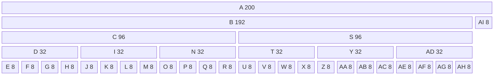
The diagram above shows the split tree of 5 levels. The lexicographical order of markings of the tree nodes
A..Z, AA..AI show the Depth First Traversal order. There are 35 nodes in the tree in total, therefore
the sequence of integer salts will also have 35 integers, we can denote them with symbols A..Z, AA..AI
as shown in the diagram. The numbers in the diagram show the sizes of sub-parts being split.
It is quite easy to build the split table, mapping sizes of the sub-parts used in our example, to the
number of nodes in subtrees. It is easier to build it from bottom up:
```
8 => 1
32 => 5
96 => 16
192 => 33
```
Now let us say that we are looking up a key, which we found belongs to this bucket. We take the first
number from the sequence of salts, `A`, and compute `f(A)` applied to the fingerprint of our key, and
map it to 0..1. Let us say it returned 0. We move to the level down, but we do not skip anything
in the salt sequence (now we are at the position 1), and we do not skip anything in the bucket
(we are at the position 0). Next, we take `B`, and compute `f(B)` applied to the fingerprint of our key,
and map it to 0..1. Let us say it returned 1. Therefore, when we need level down, we need to skip
in the salt sequence 1 multipled by `skip_table[96]`, which 1*16 = 16. We skip items from `C` to `R`
inclusive, which correctly positions us in front of `S` in the salt sequence. In the bucket, we
skip 1*96 = 96 items, so we are at the position 96 in the bucket. Next, we use `S` as salt and map
to 0..2. Let us say it returned 2. When we move to the level down, in the salt sequence we skip
2 multiplied by `skip_table(32)`, which is 2*5 = 10. So we skip items from `T` to `AC` inclusive,
which correctly positions us in front ot `AD`. In the bucket, we skip 2*32 = 64 items, so in the
bucket we are at the position 96 + 64 = 160. Next, we take `AD` as a salt, and map the result to
0..3 (there are 4 sub-parts), and let us say the result is again 2. In the salt sequence we skip
2 multiplied by `skip_table(8)`, which is 2*1 = 2. This skips `AE` and `AF`, and gets us in front
of `AG`. In the bucket, we skip 2*8 = 16, so in the bucket we are in the position 160 + 16 = 176.
Now are are at the leaf node of the tree, we take the salt `AG`, calculate Murmur Hash with it, and
map the result to 0..7 (leaf size 8). Lets say the result is 5. We do not need to skip anything
in the salt sequence, but in the bucket we skip 5 more items, and we are at the position 176+5 = 181.
So, slot number 181 (within the bucket, not within the entire MPHT) is the result of the navigation
within the bucket for that key.

The next quesion to discuss is how to encode the sequence of integer salts compactly but also
with the ability to efficiently access it. This is done by using Golobm Rice encoding. This
encoding is similar to Ellias Fano encoding described earlier, in that it encodes sequences
of integers, and in that it splits all integers into high and low parts. The difference is
that Elias Fano encodes non-decreasing sequences of integers, whereas Golomb Rice encodes
any sequences of integers. I will not decscribe the procedure of choosing the optimal
number of bits for the low parts, because it is more complex than in Elias Fano.
Once the number of bits is chosen, all numbers in the sequences are split into low and high
parts. Low parts are encoded using fixed number of bits, and this structure is very
easy to navigate. The high parts are encoded using unary encoding. Unlike in Elias Fano,
where unary encoding is used to encode differences between high parts, in Golomb Rice
the high parts themselves are encoded. The navigation in such encoded sequence of high
parts is still performed based on counting of `1` bits, as in Elias Fano. But once the
encoding of required part is found, the magnitude is determined simply by the number of
`0` bits preceeding the found `1` bit. In other words, one needs to find the positions of
adjacent `1` bits enclosing the unary encoding of the required part, and difference of
these positions determines the magnitude. When we described Elias Fano encoding, we
also talked about jump tables necessary to improve performance of dealing with very
large encodings. In the case of Golobm Rice, which is specifically used to encode
the sequence of salts, we do not expect sequences to be very large. For the bucket of
2000 keys, and the Leaf Size of 8, the sequence of salts will be on the order of
110 items. This scale does not require introducing secondary access structures like
jump tables.

We have described how the MPHT for one bucket is constructed, encoded, and accessed.
What is left to describe is how the entire MPHT is composed from the encodings of
each bucket. So for each bucket we have the size of the bucket, and the encoding
(which is the Golomb-Rice encoded sequence of salts corresponding to the nodes of
the split tree). These encodings have variable sizes, roughly in correlation with
the sizes of the buckets. We concatenate them together, and for each bucket we
remember the offset of where its encoding starts. The sequence of such offsets
is a non-decreasing sequence of integers that we can encode with Elias Fano encoding.
This Elias Fano encoded sequence of offsets allows us to look up the encoding
for any individual bucket once we establish to which bucket a key belongs.
Navigating in the bucket gives us the slot number inside the bucket. This slot number
is relative to the beginning of the bucket, but we need the slot number relative to
the beginning of the whole MPHT. Therefore, we need an extra table, where for
each bucket we record the offset slot number, which we can add with the bucket-relative
slot number to get the slot number within MPHT. This sequence of offset slot numbers
is again a non-decreasing sequence of integers, and is encoded as Elias Fano.
In conclusion, the MPHT build by Recursive Split algorithm consists of the
concatenated Golomb Rice encodings for each bucket, plus Elias Fano encoding of
the offsets of encoding for each bucket, plus Elias Fano encoding of the
offset slot numbers for each bucket. Additionally, parameter Bucket Size and
Leaf Size need to be recorded, as well as some other metadata.

Now that we understand how MPHT is constructed and how it may be used, it is important
to return back to the 4 types of `.idx` files mentioned above and recap what kind of
mapping they enable, and how this mapping is used, given the limitatin of MPHT, which is
the inability to provide set membership functions. In other words, it is not possible
to use MPHT to tell whether an arbitrary key has a mapping or not.
For `-headers.idx`, the mapping enabled by MPHT is the mapping from header hash to
the offset of the header encoding inside the corresponding `.seg` file. Since headers
in `-headers.seg` files are encoded using RLP (Recursive Length Prefix), it is not necessary
to also store the offset where a particular header ends, RLP already contains this information.
What if the MPHT is used with a header hash which does not map to any existing header?
In that case, MPHT will still return a valid slot, and the index will point to a correct
offset of some header (it will point to the middle of a header or beyond the `.seg` file).
This header can be decoded, and its hash re-calculated. One may say that the header hash
is implicitely contained in the header itself, it just take some effort to compute it.
If that hash matched to what we
were looking for, the result is success, if not - then not. If there are many `-headers.idx`
and `-header.seg` files, then in the worst case, one would need to check all of them
to conclude that the hash does not belong to any header. In order to alleviate such overhead,
we use the following trick. When we place headers into `.seg` file, we prepend any
header RLP with a single extra byte. This extra byte is the same as the first byte of the
header hash for that header. Computing header hash from header RLP is relatively
computationally heavy operation, so instead we read the byte ahead of RLP encoding
and comparing with the first byte of the hash. If there is a match, then the full
hashing of the header is done and full hashes are compared. However, if there is no
match, there is no need to check further. This technique is somewhat similar to
a Bloom filter, in that it can tell for certain that given hash does not belong to the
set, but cannot tell for certain that it does. For non-adversarial queries, statistically
it should reduce overhead of queries by the factor of 256.
The same technique is used for the index files `-transactions.idx`, which enable mapping
of transaction hashes into offsets of transaction payload inside the corresponding
`-transactions.seg` files. All transaction payloads (which are also RLP encoded) inside
`-transactions.seg` are prepended by a single extra byte, which is the the same as the first
byte of the transaction hash. As it is the case with the headers, the transaction hash
is implicitely contained within the transation payload, it just takes some effort to
compute it.
The index files `-bodies.idx` enable mapping of block numbers to the offsets of the block
bodies inside the `-bodies.seg` files. This mapping is superflous, because the same
information can be derived quicker by using the Elias Fano `Enums` structure contained
in the same `-bodies.idx` file.
The index files `-transactions-to-block.idx` enable mapping from transaction hashes
to block number where the corresponding transactions belong to. Once the mapping is used,
the corresponding block body needs to be read from the `-bodies.seg` file, and then
the transactions inside `-transactions.seg` need to be scanned to find which one has been
requested. Again, the technique using the first byte of the transaction hash is used to
reduce the amount of transaction hashing, which is relatively heavy operation.

To summarise, the usage of MPHT to enable mapping of transaction hashes to either transaction
payloads, or corresponding block numbers, has the benefit of compactness (there is no need
to keep transaction hashes for more than a billion of transactions anywhere). However, the
downside (the price to pay) is the extra performance overhead to compensate for the limitation
of the MPHT (no set membership).

There is one more table in the current data layout in MDBX, which contains substantively
the same information as the combination of tables and snapshots for block bodies. The table
is called `MaxTxNum`. For each block it has one record, with the key being block number,
and the value being the `tx_num` of the last transaction in that block.


This information can be derived from the block bodies.  One needs to iterate the block bodies
sequentially, skipping the ones that were abandoned as a result of the unwind. As the iteration
is ongoing, the `tx_num` is being maintained. It starts with zero, and for each block body,
it is incremented by `amount + 2`, where `amount` is the number of transaction in that block body.
There is "2" there to account for extra 2 transcation
number at the beginning and the end of each block, which is not recorded in the block bodies.
After such processing, the record is added to the `MaxTxNum` table of the form
`block_number => current value of tx_num`
The values of `tx_index` that are recorded inside the block bodies do not always match the values
in the `MaxTxNum`, because due to unwinds and reorgs, the `tx_index` may diverge. But we can rely
upon `MaxTxNum` table to always contain the values of `tx_num` that are the same accross all
Erigon nodes at the same tip of the chain. Also, these values will become `tx_num`s for the snapshots
if the blocks containing them do not get unwound. And, as it will be seen later, these values
correspond to the `tx_num` values used in the history of state.

