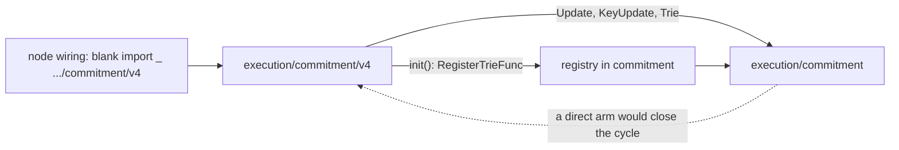
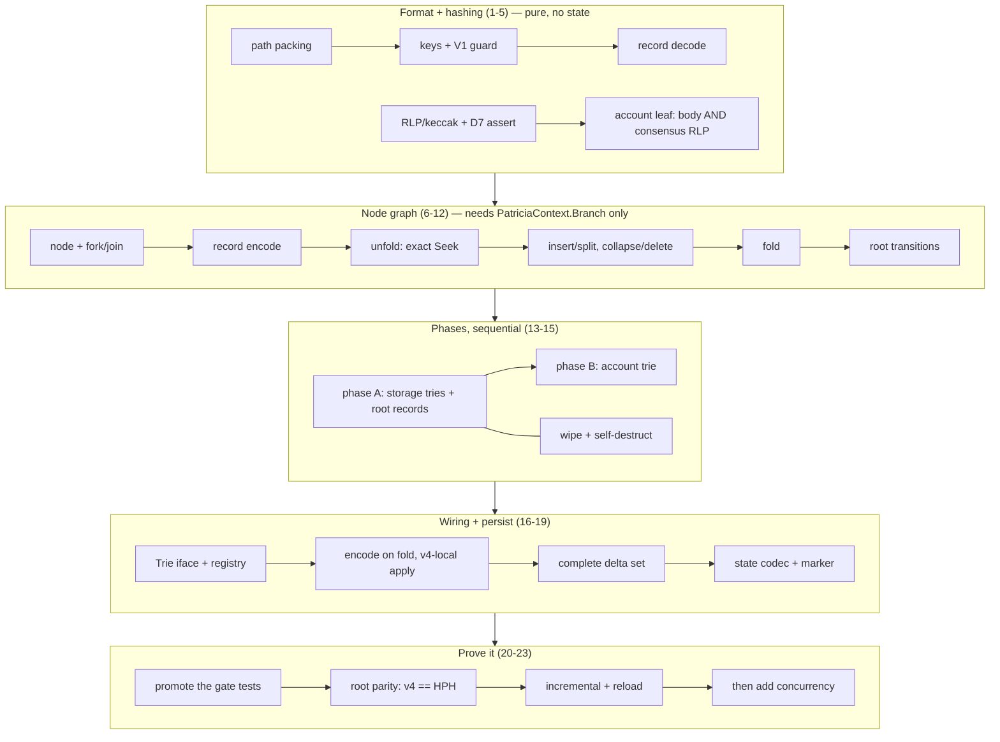

# Commitment v4 — contained implementation in `execution/commitment/v4`

Execution plan for `docs/plans/20260921-commitment-v4-trie-and-layout.md`. That document is the
specification; this one is the order of work. Where they disagree, the design wins and this file
gets updated — except at §"Corrections to the design" below, which records two places where the
design is wrong and this plan overrides it.

## Overview

Build the v4 commitment trie as a self-contained package that computes a state root from the same
updates as `HexPatriciaHashed` and persists its own record format.

**What v4 changes.** Today a leaf cell is `fieldBits + uvarint+plainKey + uvarint+stateHash(32)` —
87 B storage, 55 B account — and the fold resolves values through `PatriciaContext.Account` /
`Storage`. Under D2 a leaf entry is `[packed hashed suffix][valLen u8][value]` — ~41 B storage,
~46 B account — and the value sits in the record beside the suffix. The fold reads commitment
records and nothing else.

**Scope: §13 steps 1-3.** Format, node graph, two-phase fold, root parity against HPH, encode on
fold, deferred persist, v4 selectable as a variant. Out: the §9 compatibility surface (witness
capture, `BranchChildCount`, `branch_cache` decode), making v4 the default, deleting HPH.

**ModeUpdate only.** `TouchPlainKey`'s ModeUpdate arm keeps a `*Update` per key in a btree keyed on
hashed key (`commitment.go:1471-1483`), retouches merge into it in place (`:1509-1520`), and
`HashSort` hands `item.update` to the callback in ascending hashed-key order
(`keyUpdateLessFn:1925`). So the ModeUpdate stream carries **final** values, which is what makes
D2's read-free fold absolute rather than partial. ModeDirect cannot: it collects the first touch and
ignores `val` (`commitment.go:1484`), which is D5's open question.

**Acceptance.** Same updates through v4 and through HPH (and the parallel trie) produce byte-identical
roots, over single batches and over N ≥ 3 incremental batches.

**Package name.** `execution/commitment/v4`. A directory literally named `vN` is a known Go footgun
for *external* import resolution — the resolver tries `execution/commitment` at major 4 before
falling back to the enclosing module. Inside this module `go build ./...` resolves by directory and
it works. If it bites, rename to `execution/commitment/triev4`: mechanical, no format impact.

## Corrections to the design

Two design claims are false against the current tree. Both were confirmed by inspection, and this
plan overrides the design rather than following it.

### C1 — tags ≥ 0x40 do NOT give a disjoint namespace

D8 and §5 argue that every legacy commitment key starts in `0x00-0x3f`, because `HexToCompact`'s
first byte is `terminator<<5 | oddFlag<<4 | firstNibble`. That is true of V1 keys and false of V2.

`execution/commitment/nibbles/nibbles_v2.go:36` ships a second live key codec — `EncodeKeyV2` packs
two nibbles per byte and appends a trailing parity byte — and `db/state/commitment_convert.go:218-232`
converts a commitment domain between V1 and V2 keys in production code. A V2 key's first byte is the
first two nibbles packed, so it spans the whole `0x00-0xff` range.

Concrete collision: `EncodeKeyV2([4,0])` allocates `n/2+odd+1` = 2 bytes, packs `4` and `0` into
`out[0] = 0x40`, and sets `out[1] = 0x00`. That is **`40 00`** — byte-identical to the design's
account-root key. No one-byte tag can be disjoint from V2.

**Resolution for this plan:** v4 coexists with a **V1-keyed** commitment domain only. Task 2 asserts
that at construction and the disjointness test gets a V2 arm that proves the collision exists rather
than pretending it does not. Reconciling the tag scheme with V2 properly — a longer tag, a distinct
shape, or a separate domain — is a design question referred back, not invented here.

### C2 — `ApplyDeferredBranchUpdates` is not reusable unchanged

§9 lists `DeferredBranchUpdate` and `ApplyDeferredBranchUpdates` as unchanged, but
`ApplyDeferredBranchUpdates` (`commitment.go:359`) calls `mergeDeferredUpdate` (`:319`) on every
entry, which calls `merger.Merge(upd.prev, upd.raw)` — the legacy `BranchMerger` parsing the HPH
compact branch format. v4 record bytes through it error or corrupt. The design says as much
elsewhere (§11: "`MergeHexBranches`, `BranchMerger` and `mergeDeferredUpdate` go"), so §9 contradicts
§11 and §11 is right.

Compounding it: every `DeferredBranchUpdate` field is unexported (`commitment.go:204-212`) and
`getDeferredUpdate` (`:218`) is unexported, so v4 cannot construct one from outside the package at
all. The no-op skip the design wants to keep (`:321-323`) lives *inside* `mergeDeferredUpdate`.

**Resolution:** v4 gets its own delta type and its own apply path (task 17). It reimplements the
no-op skip, which is three lines, and calls `putBranch` directly. Nothing in `commitment` changes.

## Context (from discovery)

- **Worktree** `wt/pc-drop-main`, branch `awskii/commitment-drop-dead-surface`, head `55fba30c7c1`.
- **Seam**: `commitment.Trie` (`commitment.go:87-104`), `PatriciaContext` (`:109-118`),
  `TrieVariant` (`:121-124`), `InitializeTrieAndUpdates` (`:125`).
- **Reusable as-is**: `Updates`, `Update`, `KeyUpdate`, `HashSort`, `commitmentdb.TrieContext`.
- **NOT reusable**: `DeferredBranchUpdate` (`:204`) and `ApplyDeferredBranchUpdates` (`:359`) — see C2.
- **Must be duplicated, not imported**: `trie.HashBuilder`'s RLP/keccak primitives —
  `completeLeafHash` (`trie/hashbuilder.go:150`), `extensionHash` (`:388`), `branchHash` (`:503`)
  are unexported methods, and `:424` assumes a 33-byte extension child reference while `:568`
  always hashes the completed branch, neither of which fits D7.
- **Already exists, do not rewrite**: `nibbles.CommonPrefixLen` (`nibbles/nibbles.go:128`). The
  `nibbles` package does not import `commitment`, so there is no cycle risk.
- **Existing gate tests** (design §13 step 2): `TestLegacyVsHexRoot` (`zz_legacy_cmp_test.go:48`)
  and `TestIncrementalRootsAgree` (`zz_incremental_bench_test.go:53`), both in the untracked `zz_`
  scratch harness, both `package commitment`.

### The import cycle, and how the wiring avoids it

v4 must import `commitment`: `*commitment.Update` (task 5), `[]commitment.KeyUpdate` (task 13),
`commitment.Trie` (task 16). So `commitment` **cannot** import v4, and an
`InitializeTrieAndUpdates` arm naming `v4.NewTrie` is a cycle.



The registry breaks it: `commitment` owns a `map[TrieVariant]TrieFunc`, v4's `init` registers
itself, and one blank import pulls v4 in. Erigon already uses `*Func` for registered function types.

**Files touched outside `execution/commitment/v4/` — three, and task 24 verifies the list:**

| file | change |
|---|---|
| `execution/commitment/commitment.go` | `VariantCommitmentV4` constant, `TrieFunc` type, `RegisterTrieFunc`, registry lookup in `InitializeTrieAndUpdates` |
| `execution/commitment/commitmentdb/commitment_context.go` | two switch arms, encode and restore, for the v4 state blob (task 19) |
| the node wiring site | one blank import of `.../execution/commitment/v4` |

## Development Approach

- **Testing approach**: Regular — implement, then cover, within the same task.
- **No code comments.** A hook denies any edit adding one to a `.go` file. Directives (`//go:`,
  `//nolint`), the license header and shebangs pass. Explanation goes in the commit message.
- New files carry the **2026** copyright header, not the neighbour's year.
- Go naming: no `Factory`/`Provider`/`Builder`/`Manager`/`*Base`. Match the nearest existing name;
  erigon uses `*Func` for registered function types.
- Every task ships tests for the code it adds or changes, success and error paths both, as separate
  checklist items.
- **All tests pass before the next task starts.** No exceptions.
- Do not assert provisional size figures from the design (~12 B EOA, ~41 B leaf, ~150 GB domain) as
  test expectations. §12 says every one of them is provisional on M1, which is out of scope. Assert
  structural invariants instead.
- Update this file when scope moves: `[x]` on completion, `➕` for discovered work, `⚠️` for blockers.

## Testing Strategy

- **Unit**: every task. Table-driven where the input space is enumerable.
- **Property**: sort order (task 1), encode/decode round-trip (task 7), root invariance under
  schedule permutation (task 23).
- **Parity**: the acceptance oracle — v4 root == HPH root == parallel root on the same updates
  (task 21), and incremental + reload over N ≥ 3 batches (task 22). Root parity on a single batch is
  a weak oracle: invariant 14 says batch-2 branch damage only surfaces at batch 3.
- **Where the parity harness lives**: `package v4`, in `execution/commitment/v4/`. It cannot live in
  `package commitment` (importing v4 from there is an import cycle even in a test file) and it
  cannot live in `package commitment_test` (`MockState` at `patricia_state_mock_test.go:38`,
  `applyPlainUpdates` and `WrapKeyUpdates` at `:439` are all in-package test helpers). v4's own mock
  context from task 8 implements `commitment.PatriciaContext`, which `HexPatriciaHashed` also
  consumes, so one mock serves both arms.
- **No e2e**: this repo has no UI e2e suite.
- Package test command: `go test ./execution/commitment/v4/...`

## Progress Tracking

- `[x]` immediately on completion, never batched.
- `➕` prefix for newly discovered tasks. `⚠️` prefix for blockers, with the file:line that blocks.
- If a task's shape changes during implementation, rewrite the task here before continuing.

## Solution Overview



Concurrency lands **after** parity is demonstrated (task 23), not before. A sequential phase A/B
satisfies the acceptance criterion, and debugging a wrong root is much cheaper without a scheduler
in the picture.

### Key design decisions carried from the spec

| id | decision | why it constrains the code |
|---|---|---|
| D1 | one record per **node**, not per edge | v3 measured per-edge at 2.01× the compute for 5% of file size. Unfold is an exact `Seek` per touched node, never a cursor walk. |
| D2 | leaf = packed hashed suffix + value, no plain key, no stored hash | the fold never reads state. Costs ~9.7 ms/block single-threaded. |
| D6 | extensions in a **trailer**, per child; the slot holds the child's **pre**-extension hash | collapse concatenates extensions, so the parent needs `E`. Storing `hash(ext(E,H))` gives a wrong root on collapse. |
| D7 | 32 B slots, no `refLen`; inlinable branch child **asserts** | reaching one needs two hashed keys agreeing on 56 nibbles — 2¹¹² adversarial work. An untested branch in consensus hashing is worse than a panic. |
| D8 | key = `tag ‖ pack(P) ‖ nibbleCount u8` | but see **C1**: the disjointness argument holds against V1 keys only. |
| D9 | `childMask` + `leafMask` only | under D2 every leaf child has suffix and value, so reth's third `hash_mask` is identically equal to `tree_mask`. |
| D10 | every non-empty storage trie gets a root record | a one-slot trie in the account leaf breaks phase A: a block writing only S2 would hash S2 alone and get a wrong `storageRoot`. |

## Technical Details

### Key (§5)

```
account node    40 || pack(P) || nibbleCount u8                        ceil(d/2)+2   ~5 B typical
storage node    41 || keccak(addr)(32 B) || pack(S) || nibbleCount u8  34..66 B      ~36 B typical
state           42
account root    40 00
storage root    41 || keccak(addr) || 00
```

`pack` puts an odd trailing nibble in the high half of the last byte and zeroes the low half.

### Value (§5)

```
off  size    field
0    1       hdr:  format | hasSelfExt | hasChildExt | hasEmb | isLeafRoot
[ ]  1+      selfExt: [extLen u8][packed nibbles]   if hasSelfExt — ROOT RECORDS ONLY
1    2       childMask u16 BE
3    2       leafMask  u16 BE      subset of childMask
[ ]  2       extMask   u16 BE      if hasChildExt — subset of childMask &^ leafMask
[ ]  2       embMask   u16 BE      if hasEmb       — subset of childMask &^ leafMask
     32*N    branch slots, ascending nibble
             N = popcount(childMask &^ leafMask &^ embMask)
             32 B = the child node's OWN hash, before its extension
     ...     ext  trailer, ascending nibble, per extMask bit:   [extLen u8][packed nibbles]
     ...     emb  trailer, ascending nibble, per embMask bit:   [rlpLen u8][rlp]
     ...     leaf trailer, ascending nibble, per leafMask bit:  [packed suffix][valLen u8][value]

depth   = the key's nibbleCount            (non-root: the key IS the node's full path P||n||E)
        = len(selfExt)                     (root: the key is pinned at the root position)
suffix  = 64 - depth - 1 nibbles, constant within a record, no length byte
```

Child *k*'s slot is at `hdr + 32 × rank(childMask &^ leafMask &^ embMask, k)` — computed, so no
decode, no allocation, no varint, no per-child length byte. Tombstone is a zero-length value.

### Root record forms (D6)

```
leafRoot       isLeafRoot set, body = [packed 64-nibble hashed key][valLen u8][value]
extensionRoot  selfExt set, childMask has exactly ONE bit, body = that child's 32 B hash
branchRoot     selfExt empty, childMask has >= 2 bits, ordinary body
```

`isLeafRoot` and `selfExt` are mutually exclusive, and `hasSelfExt` implies
`popcount(childMask) == 1`.

### Account leaf — two distinct encodings

This is the single most likely cause of a root mismatch, and it is two things, not one:

| | bytes | who reads it |
|---|---|---|
| **record body** | `flags u8 \| nonce \| balance \| codeHash? \| storage`, elided in the `accounts.DeserialiseV3` style | v4's own decoder |
| **consensus RLP** | `rlp([nonce, balance, storageRoot, codeHash])`, nothing elided | `leafRef`, to produce the hash the root depends on |

The record body is a storage format and may elide whatever it likes. The consensus RLP is fixed by
the protocol. Task 5 owns both and the conversion between them. `leafRef` therefore needs a **plane**
argument: a storage leaf hashes `rlp(trimmed slot value)`, an account leaf hashes the four-item list.

### Processing flow (§7)

```
0  SEAL           dedupe, keccak, sort by hashed key, cut at 64-nibble prefixes
1  SHAPE + HASH   phase A storage tries (disjoint), then phase B account trie.
                  NOTHING WRITTEN. The root is final here.
2  ENCODE         in-fold, into a compact immutable delta (record bytes + prevData).
3  PERSIST        deferred, on accept only.
```

Step 0 is narrowed deliberately: `Updates` + `HashSort` already dedupe and sort, so v4 consumes that
stream as-is. The design's richer SEAL — parallel per-account dedupe, a process-wide keccak cache,
O(n) bucket sort — is D5, which §13 puts on an independent track against the *current* trie. Not a
v4 task.

Shape and hash stay **fused**: separating them materialises ~650 K nodes × ~550 B = 360 MB at 300 K
keys against 8.4 MB bounded by workers. Deferring the **encode** breaks the same bound and loses
`prevData`, because `TrieContext.Branch` reuses its buffer on the next read
(`commitment_context.go:1029`). Defer only the write.

## What Goes Where

- **Implementation Steps** (`[ ]`): the v4 package, its tests, the three-file wiring, the parity
  harnesses.
- **Post-Completion** (no checkboxes): mainnet measurement (M1, M2, M5, M6, M7), the §9
  compatibility surface, promotion to default, deleting HPH, and the C1 tag-scheme referral.

## Implementation Steps

### Task 1: Path packing and sort order

**Files:**
- Create: `execution/commitment/v4/path.go`
- Create: `execution/commitment/v4/path_test.go`

- [x] add `packPath(nibbles []byte, dst []byte) []byte` — two nibbles per byte, odd trailing nibble in the high half of the last byte, low half zeroed
- [x] add `unpackPath(packed []byte, count int, dst []byte) []byte` and `packedLen(nibbleCount int) int` returning `ceil(n/2)`
- [x] use `nibbles.CommonPrefixLen` (`nibbles/nibbles.go:128`) rather than writing another one — the `nibbles` package does not import `commitment`, so there is no cycle
- [x] write round-trip tests for every nibble count 0..64, both parities
- [x] write a sort-order test asserting the subtree range is contiguous under `bytes.Compare` and that an ancestor may sort between two of its own descendants — the D8 case `a00`=`40 a0 00 03`, `a`=`40 a0 01`, `a02`=`40 a0 20 03`
- [x] run `go test ./execution/commitment/v4/...` — must pass before task 2

### Task 2: Record keys, and the V1-only guard

**Files:**
- Create: `execution/commitment/v4/key.go`
- Create: `execution/commitment/v4/key_test.go`

- [x] add the tag constants `tagAccountNode = 0x40`, `tagStorageNode = 0x41`, `tagState = 0x42`
- [x] add `AccountNodeKey(path []byte, dst []byte) []byte` and `StorageNodeKey(addrHash [32]byte, path []byte, dst []byte) []byte` emitting `tag ‖ pack ‖ nibbleCount u8`
- [x] add `AccountRootKey()` = `40 00`, `StorageRootKey(addrHash)` = `41 ‖ addrHash ‖ 00`, `StateKey()` = `42`
- [x] add `ParseKey(key []byte) (tag byte, addrHash []byte, path []byte, err error)` rejecting a `nibbleCount` inconsistent with the packed length
- [x] add `AssertV1Keyed(domainKeyVersion) error` per **C1** — v4 refuses to run against a V2-keyed commitment domain, because `EncodeKeyV2([4,0])` is `40 00` and collides with the account-root key
- [x] write round-trip tests across depths 0..64 in both planes
- [x] write the disjointness test with **two arms**: `HexToCompact` over 10k random paths never produces a first byte ≥ 0x40 (passes), and `nibbles.EncodeKeyV2` **does** collide — assert `EncodeKeyV2([]byte{4,0})` equals `AccountRootKey()`, so the guard's reason is pinned by a test rather than by a comment
- [x] write a test that `AssertV1Keyed` rejects a V2 domain with a named error
- [x] run tests — must pass before task 3

### Task 3: Record decode

**Files:**
- Create: `execution/commitment/v4/record.go`
- Create: `execution/commitment/v4/record_decode_test.go`

- [x] define the header bits `hdrHasSelfExt`, `hdrHasChildExt`, `hdrHasEmb`, `hdrIsLeafRoot` and the format nibble
- [x] add a `Record` view over a `[]byte` exposing `ChildMask()`, `LeafMask()`, `ExtMask()`, `EmbMask()`, `SelfExt()` with no allocation
- [x] add `SlotAt(nib int) []byte` computing `hdrLen + 32*rank(childMask &^ leafMask &^ embMask, nib)`, and `LeafAt(nib int) (suffix, value []byte)`, `ExtAt(nib int) []byte`, `EmbAt(nib int) []byte` walking the trailers
- [x] add `LeafRootBody() (hashedKey, value []byte)` for `isLeafRoot`
- [x] add `Validate(rec []byte, depth int) error` checking mask subset relations, trailer lengths against `suffix = 64 - depth - 1`, the `isLeafRoot`/`selfExt` exclusion, and the D6 root invariant `hasSelfExt ⇒ popcount(childMask) == 1`
- [x] write table-driven decode tests over hand-built fixtures for every header-bit combination
- [x] write rejection tests: truncated body, `leafMask` not a subset of `childMask`, `extMask` overlapping `leafMask`, both `isLeafRoot` and `selfExt` set, `hasSelfExt` with two child bits, trailer shorter than declared
- [x] run tests — must pass before task 4

### Task 4: RLP and keccak primitives, and the D7 assert

**Files:**
- Create: `execution/commitment/v4/hash.go`
- Create: `execution/commitment/v4/hash_test.go`

- [x] add `leafRef(plane byte, suffix []byte, payload []byte, dst []byte) []byte` — build the leaf RLP from the packed suffix and the **consensus** payload, inline it if under 32 B, keccak it otherwise; recomputed at hash time, never stored (D7)
- [x] add `extensionRef(ext []byte, childHash []byte) [32]byte` = `keccak(rlp([compact(ext), childHash]))`; given a hashed child the extension RLP is `1 + (1 + ⌊|E|/2⌋ + 1) + 33 ≥ 37 B`, always above the inline threshold, so it is unconditionally hashed
- [x] add `branchRef(refs *[16][]byte) [32]byte` over the 17-item list
- [x] put the D7 assert **here**, not in the encoder: `branchRef` panics if the branch RLP it just built is under 32 B, naming the depth. The encoder only ever writes 32 B slots and never sees a child's RLP, so it is the wrong place for the check. The format reserves `embMask` and the `emb` trailer; the code does not implement the path
- [x] write tests pinning each primitive against known vectors — the single-leaf trie root, a two-leaf branch root, an extension over a branch
- [x] write a test that `leafRef` inlines below 32 B and hashes at and above it, exercising both sides of the boundary
- [x] write a test that the assert fires on a hand-built 17-item list whose two refs are each ≤7 B — two leaves with 1-byte values under a depth-56 branch give 22 B — and on nothing else across a sweep of ordinary branches
- [x] run tests — must pass before task 5

### Task 5: Account leaf — record body and consensus RLP

**Files:**
- Create: `execution/commitment/v4/account.go`
- Create: `execution/commitment/v4/account_test.go`

- [x] add `encodeAccountLeaf(u *commitment.Update, storageRoot []byte, dst []byte) []byte` — the **record body**, `flags u8 | nonce | balance | codeHash? | storage`, eliding a zero balance and the empty code hash as flag bits
- [x] add `decodeAccountLeaf(b []byte) (nonce uint64, balance uint256.Int, codeHash []byte, storageRoot []byte, err error)`
- [x] add `accountConsensusRLP(nonce uint64, balance *uint256.Int, storageRoot, codeHash []byte, dst []byte) []byte` producing `rlp([nonce, balance, storageRoot, codeHash])` with **nothing elided** — this is what `leafRef` hashes, and it is a different encoding from the record body
- [x] encode the body's `storage` field as `none -> EmptyRoot` or `root -> 32 B`, and expand `none` back to `EmptyRoot` in the consensus RLP
- [x] write round-trip tests for the body: an EOA, a contract with storage, a contract with code but no storage
- [x] write tests for the elision flags: zero balance, empty code hash, both, neither — asserting the decoded values, not the byte counts
- [x] write a test that `accountConsensusRLP` matches the RLP `HexPatriciaHashed` produces for the same account, across the four elision combinations — a mismatch here diverges every account root
- [x] write rejection tests for a truncated body and an impossible flag combination
- [x] run tests — must pass before task 6

### Task 6: In-memory node and the fork/join seam

**Files:**
- Create: `execution/commitment/v4/node.go`
- Create: `execution/commitment/v4/node_test.go`

- [x] define `node`: `childMask`, `leafMask`, child pointers or stored 32 B hashes per slot, per-child extension, leaf suffix + value per leaf slot, and the node's own path
- [x] add `fork(prefix []byte) *node` and `join(parent *node, nib int, ref []byte)` — the whole seam, against nine functions over the grid today (`split_point.go`'s seven plus `mountTo` and `foldMounted`)
- [x] add `setLeaf(nib int, suffix, value []byte)`, `setChild(nib int, n *node)`, `setStoredChild(nib int, hash []byte, ext []byte)`, `clear(nib int)` keeping the two masks consistent
- [x] write tests for mask consistency across every mutation, including leaf→child and child→leaf transitions on the same slot
- [x] write a test that `fork` returns a pointer and not a copied row — mutating through the fork is visible at the parent
- [x] run tests — must pass before task 7

### Task 7: Record encode

**Files:**
- Modify: `execution/commitment/v4/record.go`
- Create: `execution/commitment/v4/record_encode_test.go`

- [x] add `encodeRecord(n *node, depth int, dst []byte) []byte` emitting header, masks, slots ascending, then the ext / emb / leaf trailers ascending
- [x] emit `selfExt` inline behind `hdrHasSelfExt` for root records only, and the three root forms `leafRoot` / `extensionRoot` / `branchRoot`
- [x] splice an untouched run of children through one `copy` rather than per-child appends
- [x] write encode/decode round-trip tests across the same combination table as task 3
- [x] write a test that every encoded record passes task 3's `Validate` at its own depth
- [x] write a test that a record with no children and no leaves encodes to the tombstone form
- [x] run tests — must pass before task 8

### Task 8: Unfold — exact Seek per touched node

**Files:**
- Create: `execution/commitment/v4/unfold.go`
- Create: `execution/commitment/v4/unfold_test.go`
- Create: `execution/commitment/v4/mock_context_test.go`

- [x] add a mock `commitment.PatriciaContext` backed by in-memory maps, serving `Branch`, `PutBranch`, `Account` and `Storage` — `HexPatriciaHashed` consumes the same interface, so this one mock drives both arms of the parity harness in task 21
- [x] add `unfold(ctx commitment.PatriciaContext, path []byte, plane byte, addrHash []byte) (*node, error)` issuing one exact `Branch(key)` per touched node — never a cursor walk (D1)
- [x] link the decoded record into a `node`: stored 32 B hashes for branch children, suffix+value for leaf children, extensions from the trailer
- [x] handle a missing record as an absent node, distinct from a zero-length tombstone
- [x] make the mock count `Account` / `Storage` calls so every later task can assert zero
- [x] write tests that unfolding a known trie issues exactly one `Branch` call per node on the path and zero `Account`/`Storage` calls
- [x] write tests for an absent record, a tombstoned record, and a malformed record surfacing as an error rather than a panic
- [x] run tests — must pass before task 9

### Task 9: Insert and split

**Files:**
- Create: `execution/commitment/v4/mutate.go`
- Create: `execution/commitment/v4/split_test.go`

- [x] add `insert(n *node, path []byte, suffix, value []byte) error` placing a leaf in an empty slot
- [x] add the split path: a new key colliding with an existing leaf pushes that leaf deeper — a new branch at the divergence, both leaves re-suffixed, a new extension if the divergence is more than one nibble past the parent
- [x] recompute the pushed leaf's suffix from its stored full path; its value comes from the record, not from state — this is what D2 buys
- [x] write split tests at every depth 0..62 in the account plane and 0..62 in the storage plane
- [x] write a test for a split creating an extension of length 1, of length > 1, and of length 0 (adjacent divergence)
- [x] write a test that a split issues zero `Account`/`Storage` calls on the mock context
- [x] run tests — must pass before task 10

### Task 10: Collapse and delete

**Files:**
- Modify: `execution/commitment/v4/mutate.go`
- Create: `execution/commitment/v4/collapse_test.go`

- [x] add `remove(n *node, path []byte) error` clearing a leaf slot and both masks
- [x] add the collapse path: when a branch is reduced to one survivor `n`, the parent takes the survivor with a new extension `[n]‖E(n)` prepended onto the **stored pre-extension hash** — no read (D6)
- [x] handle the survivor being a leaf: it moves up into the parent's leaf trailer with a longer suffix, taken from the record
- [x] handle the survivor being itself an extension: extensions concatenate, which is exactly why the slot holds the pre-extension hash
- [x] write the D6 case as a named test: parent at `P`, child 0 an extension `E=[1,2]` to branch hash `H`, child 1 a leaf; delete child 1; assert the result is extension `[0,1,2] → H` and not the adjacent-extension chain
- [x] write a test for collapse where the sole survivor is a leaf, and one where it is a branch with no extension
- [x] write a test that collapse issues zero `Branch` calls beyond the nodes already unfolded
- [x] run tests — must pass before task 11

### Task 11: Fold — hash a subtree

**Files:**
- Create: `execution/commitment/v4/fold.go`
- Create: `execution/commitment/v4/fold_test.go`

- [x] add `fold(n *node, depth int) ([32]byte, error)` computing bottom-up: leaf slots through `leafRef` with the right plane, branch slots as `ref = slot`, and `ref = extensionRef(E, slot)` where the `extMask` bit is set
- [x] build the 17-item branch list from the two masks and hand it to `branchRef`
- [x] write tests that the root of a hand-built trie matches a root computed through `HexPatriciaHashed` on the same keys, for 1, 2, 16 and 1000 keys, in each plane and mixed
- [x] write a test for the empty trie and the single-leaf trie in both planes
- [x] write a test that folding an untouched subtree returns its stored hash without descending
- [x] write a test asserting zero `Account`/`Storage` calls across the whole fold
- [x] run tests — must pass before task 12

### Task 12: Root record transitions

**Files:**
- Create: `execution/commitment/v4/root.go`
- Create: `execution/commitment/v4/root_test.go`

- [x] add the transition logic only — task 7 already owns the three root encodings and task 3 owns decoding them; this task does not add a second codec
- [x] carry `selfExt` inline behind `hdrHasSelfExt` — a trie root has no parent, so its own extension has no parent trailer to live in
- [x] keep the key pinned at the root position regardless of the node's true depth, so the record never moves when `selfExt` changes
- [x] implement the `extensionRoot` transitions: an insert diverging inside `selfExt` rewrites the root record and adds one, never relocating a body; a collapse rewrites only the root record, never promoting an untouched child's body
- [x] write tests for `selfExt` present, absent, appearing and disappearing, in both planes
- [x] write tests for the transitions between all three root forms, including `leafRoot` → `branchRoot` on a second key and back on a delete
- [x] run tests — must pass before task 13

### Task 13: Phase A — storage tries and their root records

**Files:**
- Create: `execution/commitment/v4/phase_a.go`
- Create: `execution/commitment/v4/phase_a_test.go`

Merged with the former storage-root task: the 0→1, 1→2 and 2→1 transitions *are* the root-record
transitions, so testing them apart from the record that implements them was an ordering inversion.

- [x] add `partition(stream []commitment.KeyUpdate) (storage []storageTask, accounts []accountEntry)` cutting the hashed-key-sorted stream at 64-nibble prefixes; a storage hashed key is `keccak(addr)‖keccak(slot)` so the stream is already grouped by account
- [x] add `runStorageTask(ctx commitment.PatriciaContext, t storageTask) (storageRoot [32]byte, err error)` — unfold, mutate, fold, bounded by the account's subtree, with no split rule because the subtree is disjoint by construction
- [x] write the root record at `41 ‖ keccak(addr) ‖ 00` whenever the trie is non-empty — an ordinary branch record at two slots or more, a `leafRoot` at exactly one (D10)
- [x] tombstone the root record when the trie empties, and tombstone the orphaned children on the 2→1 replacement
- [x] write the D10 independence test as a named case: account A holds exactly one slot S1, the next block writes only S2, phase A sees S2 alone and must still produce the correct `storageRoot`
- [x] write tests for storage transitions 0→1, 1→2, 2→1, 1→0 and a storage-only update with no account-field change
- [x] write a test for a storage wipe followed by a re-insert in the same block
- [x] write a test that the 2→1 replacement leaves no orphaned child records behind
- [x] run tests — must pass before task 14

### Task 14: Wipe and self-destruct jobs

**Files:**
- Create: `execution/commitment/v4/wipe.go`
- Create: `execution/commitment/v4/wipe_test.go`

- [x] derive a phase-A cleanup job from the **account** update, not from a storage-prefix partition — `versionedio.go:1909` emits an account `DeleteUpdate` and its storage loop emits nothing (`:1917`), so a self-destruct reaches phase A only this way
- [x] enumerate the commitment records to tombstone from the masks, with no hashing and no plain keys; `DomainDelPrefix` (`domain_shared.go:1950`) still owns plain-state deletion and is unchanged
- [x] resolve the `wiped` set against later writes in the same block before phase A sees the task, so delete-then-write recreates rather than deletes
- [x] write a test for an account deleted with a non-empty storage subtree — every storage record tombstoned, the root record included
- [x] write a test for a `WriteSet` carrying only a self-destruct, asserting the cleanup job is created and the fixed storage-root key is not left available for a later recreation
- [x] write a test for delete-then-write on one account within a block
- [x] write a test that a wipe performs **zero keccaks** — the real invariant; do not assert a tombstone-count ratio, since it derives from `f ≈ 3.8`, which §12 says is trie theory rather than this database
- [x] run tests — must pass before task 15

### Task 15: Phase B — account trie

**Files:**
- Create: `execution/commitment/v4/phase_b.go`
- Create: `execution/commitment/v4/phase_b_test.go`

- [ ] add `runAccountTrie(ctx commitment.PatriciaContext, entries []accountEntry, roots map[[32]byte][32]byte) ([32]byte, error)` taking the exactly-64-nibble entries
- [ ] put `storageRoot` in the account leaf's record body from phase A's result, so phase B never re-reads the storage root record
- [ ] hash the leaf through `accountConsensusRLP` from task 5, not through the record body
- [ ] rewrite the leaf of any account whose storage changed even when its fields did not — its fields come from the record, so there is nothing to reset and no `resetRatio` patch is needed
- [ ] write tests for an account with a storage change and no field change, a field change and no storage change, and both
- [ ] write a test for a newly created account with storage in the same block
- [ ] write a test that the account trie root over 1000 accounts matches `HexPatriciaHashed` on the same input
- [ ] run tests — must pass before task 16

### Task 16: Trie interface, registry, variant

**Files:**
- Create: `execution/commitment/v4/trie.go`
- Create: `execution/commitment/v4/trie_test.go`
- Modify: `execution/commitment/commitment.go`

- [ ] add to `commitment`: `VariantCommitmentV4 TrieVariant = "commitment-v4"`, `type TrieFunc func(tmpdir string, cfg TrieConfig) (Trie, *Updates)`, a `RegisterTrieFunc(TrieVariant, TrieFunc)` and a registry lookup in `InitializeTrieAndUpdates` before the existing switch
- [ ] register v4 from its own `init()` — `commitment` must **not** import v4, because v4 imports `commitment` for `Update`, `KeyUpdate` and `Trie`, and a direct arm closes the cycle
- [ ] add the single blank import of `.../execution/commitment/v4` at the node wiring site
- [ ] implement `commitment.Trie` on a `*Trie` in the v4 package: `RootHash`, `SetTraceWriter`, `Variant`, `Reset`, `ResetContext`, `Process`, `Release`
- [ ] `Process` drives phase A then phase B **sequentially** through `updates.HashSort` and returns the root; no writes and no concurrency in this task
- [ ] reject `ModeDirect` and `ModeParallel` by **panic** with a message naming the reason — `InitializeTrieAndUpdates` returns `(Trie, *Updates)` with no error, so an error return is not expressible without changing every existing caller
- [ ] write a test that the v4 variant returns a `ModeUpdate` `Updates` and a v4 `Trie`
- [ ] write `require.Panics` tests for the other two modes, asserting the message names the mode
- [ ] write a test that `Process` issues zero `Account`/`Storage` calls for a mixed account-and-storage batch
- [ ] run `go build ./...` to prove no import cycle, then `go test ./execution/commitment/...` — must pass before task 17

### Task 17: Encode on fold, v4-local apply

**Files:**
- Create: `execution/commitment/v4/delta.go`
- Create: `execution/commitment/v4/delta_test.go`

- [ ] define a v4-local `recordDelta{key, data, prev []byte}` and an `applyDeltas(deltas, putBranch)` — per **C2**, `ApplyDeferredBranchUpdates` (`commitment.go:359`) runs `mergeDeferredUpdate` (`:319`) → `merger.Merge` (`BranchMerger`, legacy compact format) on every entry, and every `DeferredBranchUpdate` field plus `getDeferredUpdate` (`:218`) is unexported, so it is unusable from outside the package and wrong for v4 bytes anyway
- [ ] reimplement the no-op skip that lives inside `mergeDeferredUpdate` at `:321-323`: if `prev` equals `data`, emit nothing. v4 compares complete against complete, so it fires more often than today's partial-vs-stored comparison
- [ ] encode each record inside the fold task that produced it, not after
- [ ] copy `prev` out of the context buffer at read time — `TrieContext.Branch` reuses its buffer on the next read (`commitment_context.go:1029`), so the original bytes do not survive on their own
- [ ] write a test that **node-graph** peak memory is bounded by the walk and not by batch size, at 1 K and 100 K keys. Do not assert this of the delta set: task 18 retains one entry per changed record by design, so total retained bytes are O(changed records) and only the graph is O(depth)
- [ ] write a test that `prev` survives a subsequent `Branch` call on the same context
- [ ] write a test that an unchanged record produces no delta
- [ ] run tests — must pass before task 18

### Task 18: The complete delta set

**Files:**
- Modify: `execution/commitment/v4/delta.go`
- Create: `execution/commitment/v4/delta_complete_test.go`

- [ ] emit every changed record with correct `prev`
- [ ] emit every removed record as a zero-length value: collapse survivors, wiped storage subtrees, deleted accounts, and the 2→1 storage-root replacement's orphaned children
- [ ] route through `PutBranch` → `DomainPut` (`commitment_context.go:1046-1057`) so `DomainPutCommitmentDiff` records the explicit diff (`domain_shared.go:728-746`) — the commitment domain has `HistoryDisabled` and `SnapshotsDisabled` (`state_schema.go:271-289`), so those diffs **are** the recovery path
- [ ] write a test per removal class asserting a tombstone is emitted
- [ ] write a test that replaying the delta set onto an empty domain reproduces the post-state records byte-for-byte
- [ ] write a domain-level recovery test: apply deltas, drop the in-memory trie, reload from the domain, assert the root is unchanged. Do **not** reach for `engine_api_crash_recovery_test.go` — it is in `execution/engineapi` and drives the full engine API, which needs the §9 surface this plan excludes
- [ ] run tests — must pass before task 19

### Task 19: State codec and the variant marker

**Files:**
- Create: `execution/commitment/v4/state.go`
- Create: `execution/commitment/v4/state_test.go`
- Modify: `execution/commitment/commitmentdb/commitment_context.go`

- [ ] add v4 state encode/restore carrying an explicit variant marker as the first byte, keyed at `tagState` (`42`) from task 2 — the tag is declared there and this is its only user
- [ ] add the two `commitmentdb` switch arms: `encodeCommitmentState` (`commitment_context.go:928-945`) and the matching restore path, which today handle only `*commitment.HexPatriciaHashed` and `*commitment.ParallelPatriciaHashed` and `default:` to an error. This is a deliberate, named exception to the §9 exclusion — without it the codec has no caller and task 22's reload arm cannot use the production path
- [ ] restore enough state that a v4 datadir resumes after a restart without recomputing from genesis
- [ ] write a round-trip test over a non-trivial state
- [ ] write tests that v4 rejects a legacy state blob and a legacy reader rejects a v4 blob, both with a named error rather than a misparse
- [ ] write a test that `encodeCommitmentState` dispatches to v4 for a v4 trie and still to HPH for the other two
- [ ] run tests — must pass before task 20

### Task 20: Promote the gate tests

**Files:**
- Modify: `execution/commitment/zz_legacy_cmp_test.go` → a tracked, non-`zz_` home
- Modify: `execution/commitment/zz_incremental_bench_test.go` → same

Design §13 step 2 gates on these two by name and says to promote them out of the scratch harness
first. They are the only things in the repo that catch a root divergence.

- [ ] move `TestLegacyVsHexRoot` (`zz_legacy_cmp_test.go:48`) into a tracked test file, unchanged in behaviour
- [ ] move `TestIncrementalRootsAgree` (`zz_incremental_bench_test.go:53`) likewise, separating it from the benchmark it currently shares a file with
- [ ] confirm both still pass against the existing tries before v4 is added to them
- [ ] leave the remaining `zz_` files alone — they are scratch and out of scope
- [ ] run `go test ./execution/commitment/ -run 'TestLegacyVsHexRoot|TestIncrementalRootsAgree'` — must pass before task 21

### Task 21: Root parity — v4 against HPH and the parallel trie

**Files:**
- Create: `execution/commitment/v4/parity_test.go`

The harness lives in `package v4`. It cannot be `package commitment` (importing v4 there is an
import cycle, even in a test file) and it cannot be `package commitment_test` (`MockState`
(`patricia_state_mock_test.go:38`), `applyPlainUpdates` and `WrapKeyUpdates` (`:439`) are in-package
test helpers). The task-8 mock implements `commitment.PatriciaContext`, which `HexPatriciaHashed`
also consumes, so one mock drives every arm.

- [ ] build `seqTrie` (`commitment.NewHexPatriciaHashed`), `parTrie` and `v4Trie` over the same mock, feed one update set, `require.Equal` on all three roots
- [ ] cover accounts only, storage only, and mixed, at 1, 2, 16, 1 000 and 100 000 keys
- [ ] cover every §10 case that produces a root: leaf split at every depth in both planes, both collapse shapes, the storage transitions, an account deleted with non-empty storage, wipe-then-reinsert, an embedded leaf appearing and disappearing, an extension at a trie root
- [ ] write a fuzz target driving random insert / update / delete sequences through v4 and HPH, asserting root equality each step
- [ ] assert zero `Account`/`Storage` calls on the v4 arm while the HPH arm is free to make them
- [ ] run `go test ./execution/commitment/v4/ -run Parity` and the fuzz target's seed corpus — must pass before task 22

### Task 22: Incremental and reload parity over N ≥ 3 batches

**Files:**
- Create: `execution/commitment/v4/incremental_test.go`

§10 asks for "stored-branch byte parity against the sequential trie". That is impossible here — the
formats differ by construction, which is the whole point of v4 — so this substitutes **root** parity
against the sequential trie plus **byte** parity of v4 against itself across two routes to the same
state. Recorded so a later reader does not "restore" the original wording.

- [ ] apply N ≥ 3 incremental batches through v4 and HPH, asserting root equality after each
- [ ] after each batch, reload v4's persisted records through the task-19 restore path into a fresh trie and recompute the root from them alone — root parity on a single batch is a weak oracle, and invariant 14 says batch-2 branch damage only surfaces at batch 3
- [ ] assert the stored record set after batch k is byte-identical whether reached incrementally or by a single bulk batch over the union
- [ ] cover unwind and re-execute
- [ ] cover a repeated write and a write-delete-write within one batch
- [ ] cover a key-only historical touch — `domain_shared.go:2075` passes nil for changed historical keys, so a nil payload must mean "discover this key" and not "this leaf is empty", or existing leaves get deleted
- [ ] run the incremental suite — must pass before task 23

### Task 23: Concurrency — one shared semaphore, longest-first

**Files:**
- Create: `execution/commitment/v4/schedule.go`
- Create: `execution/commitment/v4/schedule_test.go`
- Modify: `execution/commitment/v4/trie.go`

Deliberately last. Tasks 21 and 22 prove the root sequentially first, so a divergence found here is
a concurrency bug and nothing else.

- [ ] add one semaphore shared across phase A and phase B, sized to the physical core count — invariant 13 measured what nested per-whale errgroups do, and Nethermind reaches the same answer with `BlockCommitter._concurrency = ProcessorCount`
- [ ] sort phase-A tasks by touched-slot count descending: 94.6% of storage tries are one record and 5.4% hold 95.4% of the slots, so the tail dominates otherwise
- [ ] start a phase-B subtree as its storage roots land — the barrier is per account, not global
- [ ] subdivide inside a whale and inside the account trie through the fork/join seam of task 6
- [ ] re-run the whole of task 21 and task 22 with concurrency enabled — same roots, no new failures
- [ ] write a test that the root is identical under a forced sequential schedule, a reversed schedule and the longest-first schedule
- [ ] write a test that the in-flight worker count never exceeds the semaphore bound across phase A and phase B combined
- [ ] run `go test -race ./execution/commitment/v4/...` unfiltered — must pass before task 24

### Task 24: Verify acceptance criteria

- [ ] verify v4, HPH and the parallel trie produce byte-identical roots on every case in tasks 21-23 — the acceptance oracle
- [ ] verify the fold issues zero `Account` / `Storage` calls in every v4 test
- [ ] verify the files changed outside `execution/commitment/v4/` are exactly the three named in the Overview: `git diff --stat $(git merge-base origin/main HEAD) -- execution/ | grep -v '/v4/'`. Use the **merge-base**, not `main`: on this branch `git diff --stat main -- execution/` reports 149 files and 9787 insertions of unrelated branch work, while the merge-base reports 6
- [ ] verify `go build ./...` succeeds — the registry, not a direct arm, is what keeps this true
- [ ] verify every §10 correctness case has a named test, by grepping the case list against test names
- [ ] verify no test asserts a provisional size figure from the design (~12 B, ~41 B, ~150 GB, N/4.8)
- [ ] run the full suite: `go test ./execution/commitment/...`
- [ ] run the race detector over the whole package, unfiltered: `go test -race ./execution/commitment/v4/...` — a filtered run misses global mutation
- [ ] run the repo-pinned linter: `go tool -modfile=golangci-lint.mod golangci-lint run ./execution/commitment/...`

### Task 25: [Final] Update documentation

- [ ] record in the design doc which decisions were implemented as specified and which moved, with the reason — in particular that D8's disjointness argument is false against V2 keys (C1) and that §9's "`ApplyDeferredBranchUpdates` unchanged" contradicts §11 and lost (C2)
- [ ] add a `README.md` in `execution/commitment/v4/` giving the key and record layouts, the ModeUpdate constraint, and the V1-only guard
- [ ] update `CLAUDE.md` only if a new pattern emerged that future work needs
- [ ] move this plan to `docs/plans/completed/`

## Post-Completion

*Items requiring manual intervention or external systems — no checkboxes, informational only.*

**Referred back to the design:**
- **C1** — the v4 tag scheme against V2 keys. This plan ships a V1-only guard, which is a
  restriction, not a resolution. A real fix is a longer or differently-shaped tag, or putting v4 in
  its own domain. Needs a design decision before v4 can run on a V2 datadir.

**Measurement** (§12, out of this plan's scope):
- **M1** mainnet record shape via `DecodeBranchAndCollectStat` (`commitment.go:1188`), wired at
  `cmd/integration/commands/commitment.go:1425`. **Every size figure in the design is provisional on
  it** — the ~150 GB target rests on `f ≈ 3.8` from random-trie theory (`N/ln 16`), not from this
  database, and §2 leaves 45 GB of the measured 275.4 GB unattributed.
- **M7** chain-tip latency and scaling: one-worker and physical-core-count end-to-end runs on sparse
  blocks, against `fork_walk.go:32`'s minimum grain of 128. D2's ~9.7 ms single-threaded cost only
  reaches ~0.5 ms of wall under scaling this design has not demonstrated.
- **M2** `resetRatio` / `skipRatio` on an exec-from-0 arm; **M5** touch share on an incremental
  block; **M6** `BranchCache` cross-block hit rate (counters at `branch_cache.go:69-73`).

**Follow-on work** (§13 steps 4-6):
- The §9 compatibility surface — 13 sites that read the old layout. Witness generation needs more
  than a variant-aware `witnessCapture`: `debug_executionWitness` calls `BranchChildCount` after the
  post-state is computed (`debug_execution_witness.go:1262`), and with a zero-write root computation
  a two-child branch reduced to one survivor still reports two.
- Promotion to default, after end-to-end tip wall-clock parity or better at one worker and at
  physical-core count.
- Deleting HPH, the grid, the mount wall, the merge path and the warmuper.

**Independent track** (ships against the current trie, no format change):
- D5's touch-phase fixes and the richer SEAL: merge `WriteSet.TouchUpdates`' five loops over one
  address space (`versionedio.go:1871-1934`), memoize the hash beside the interned plain key in
  ModeParallel, add a process-wide content-addressed keccak cache. A bulk win, not a tip win.
