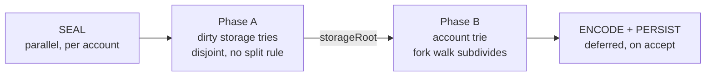

# Commitment v4 — trie and data layout

Design, 2026-09-21. Worktree `wt/pc-drop-main`, branch `awskii/commitment-drop-dead-surface`.

Supersedes `20260921-commitment-v4-architecture.md` and `20260918-commitment-v4-trie-encoding.md`
entirely. Their measurements stand where this document repeats them; their shape, sizing and record
composition do not.

Converged from four sources: the erigon-2 trie (`execution/commitment/trie`), the parallel
commitment on main, commitment v3, and Nethermind's commitment layer
(`~/org/mode/e/research/nethermind-commitment-recon.org`). Cross-checked against reth `8db774c86c`
and Nethermind `fe11e1c`.

---

## 1. Ground truth

Measured, mainnet step 9,443 (`~/org/wrk/state-scan/ethereum-state-report.md`):

| | |
|---|---:|
| accounts | 406,456,481 |
| storage slots | 1,620,960,991 |
| contracts holding storage | 27,538,973 |
| of those, holding exactly one slot | **14,929,487 — 54.2%** |
| holding fewer than 16 slots | 94.6%, carrying 4.6% of all slots |
| all state on disk | 110.10 GiB |
| **commitment domain** | **256.48 GiB — 2.33× all state** |

Slot values are small: 22.8% are one byte, 32.9% fit in two, 13.6% are exactly 20 (an address),
11.3% are the full 32. Mean ≈ 9 B. 95.53% of slot keys are keccak images, so nothing about them
clusters or compresses.

The commitment domain is `Compression: seg.CompressKeys` (`state_schema.go:273`) — **values are
stored raw**, so every value figure below is the on-disk figure. `Accessors: AccessorHashMap`, so
there is no ordered access into it; every lookup is an exact key.

## 2. Where the 256 GiB is

Every node but the root has exactly one parent. Summed over branch records, leaf edges = L and
branch edges = B − 1. So **leaf children per branch record = f − 1 exactly, branch children ≈ 1, at
any fan-out**, and total leaf-cell bytes = `L × c_leaf` — *independent of fan-out*.

Today's leaf cell (`commitment.go:142-149,524-585`) is
`fieldBits + uvarint+plainKey + uvarint+stateHash(32)` = **87 B storage, 55 B account**.
`fieldHash` is *not* part of it: it is set only when `cell.hashLen > 0` (`commitment.go:550`),
`reset()` zeroes `hashLen` (`hex_patricia_hashed.go:410`), and a storage leaf hashed through the
normal path fills `cell.stateHash` and returns without ever setting `cell.hash` (`:1242-1244`).
An account cell that also carries a storage root is a compound case and is larger; it is unmodelled.

Keys today are **already `HexToCompact`** — `hex_patricia_hashed.go:1461` on the read path,
`:2116` on the fold path, `warmuper.go:148` on the prefetch — so a storage record key is
`0x00 ‖ 32 B packed account hash ‖ packed storage path`, ~34-36 B, not one byte per nibble.

A random 16-ary trie has `N/ln 16` internal nodes, so `f ≈ 3.8` and `B ≈ 732 M`:

| term | bytes |
|---|---:|
| 2.027 B leaf cells × 87/55 B | **176 GB — 64%** |
| branch records: 732 M × (~35 B key + 4 + 34) | 53 GB |
| model total | 230 GB |
| measured | **275.4 GB** (256.48 GiB) |
| **unexplained** | **~45 GB — 16%** |

**The model does not close.** The residual is most likely compound account-with-storage cells and
extensions, neither of which is modelled here, but that is a guess. An earlier revision of this
document back-solved `B` and `f` from the residual on a wrong `c_leaf` of 114 B; with the corrected
87/55 that back-solve gives `f ≈ 2.3`, which is not a credible fan-out for a hex trie, so the method
itself is unsound. **`c_leaf`, `B` and the residual must be measured together — M1 is no longer
optional.**

Two consequences:

- **The per-leaf-child cost is the primary lever, and it is fan-out independent.** `L × c_leaf` is
  176 GB of 275 — 64%, the majority term — and `L` is measured while `f` is not. The identity itself
  is arithmetic and survives the sizing error. For a forest of `R` roots it is `L/B = f − 1 + R/B`;
  with `R` = 27.5 M and `B` ~ 700 M the correction is 4%.
- **The touched-set composition is a different population from the stored one.** The 1,546 records
  and 11.1 cells measured on the `whale1M` corpus describe a root-to-leaf *spine*, which is
  branch-child-heavy. The stored population is leaf-child-heavy by the identity above. The previous
  draft sized the domain from the spine sample; that is where its 457 B record and its "at high
  fan-out the record is mostly sibling hashes" both came from, and both are wrong.

## 3. The target case

**Chain tip, one block at a time.** Bulk execution (~300 K keys per batch) is rare and must not
break, but it does not set priorities.

That reweighting demotes the touch phase. Its 69% share (415 ms of 599 ms) is the bulk 1 M-key arm,
and `parallel_streaming_bench_test.go:64-77` wraps the `Updates` build in `b.StopTimer()`, so no
published fold number includes it. At the tip, ~5 K unique changed keys is ~5 K keccaks ≈ 1.5 ms.
Real, not the headline.

What pays at the tip:

| lever | effect |
|---|---|
| domain 275 → ~150 GB | ~1.8× more of the trie resident in a fixed page-cache budget — this is the cold-read frequency, i.e. what makes a round 80 ms instead of 20 ms |
| record 556 → 386 B on the spine | ~13 K records read per block: 7.2 → 5.0 MB, and the same 30% off every write and every merge-level rewrite |
| two phases + a node graph | the parallelism, against today's 12.5% efficiency 1→18 workers |
| the leaf keccak (§5) | **−9.7 ms/block single-threaded**, ~0.5 ms only under perfect 18× scaling — the price, and it is not small |

## 4. Decisions

### D1 — one record per node

commitment v3 measured one record per *edge* on hoodi at equal `domain_commitment_keys` = 1.15e7:

| | v2 | v3 per-edge | ratio |
|---|---:|---:|---:|
| records written | 6.37e6 | 1.93e7 | 3.03× |
| commitment compute | 11.88 s | 23.86 s | **2.01× slower** |
| .kv on disk | 605 MB | 637 MB | 1.05× |
| .bt / .kvei index | 3.68 / 3.54 MB | 12.5 / 14.1 MB | 3.4× / 4.0× |
| chaindata | 7.38 GB | 11.5 GB | 1.56× |

Twice the compute for 5% of file size. Dead.

One v3 finding survives and applies to any packed path key: **no packed encoding puts the file in
fold order**, and `LSeek` cannot find the nearest ancestor, because an odd-length node's terminator
sorts relative to its own subtree's packed bytes and at `n=0` would need `term < 0x00`. Unfold is
therefore an exact `Seek` per touched node, never a cursor walk. Extensions must be persisted;
recovering a child's path with an ordered `FirstBranch(prefix)` seek is unavailable on two
independent grounds.

That finding is about **fold order only**. It says nothing about locality — see D8.

### D2 — the leaf cell is a packed hashed suffix plus the value

No plain key. No stored hash.

```
leaf entry = [packed hashed suffix][valLen u8][value]
```

Suffix length is `64 − depth − 1` nibbles, constant within a record, so it carries no length byte.
Storage ≈ 41 B, account ≈ 46 B, against 114 B today.

**Why not the plain key** (today): it costs 52 B for storage, and it forces a state-domain read to
get the value.

**Why not a stored hash** (option A, suffix + 32 B hash): larger — 63 B storage, 61 B account — and
it cannot survive a split. A leaf's hash has exactly two inputs, its remaining path and its value.
When a new key collides with an existing leaf, that leaf moves deeper: new compact key, new hash,
and its value is not in the update stream because it did not change. At f ≈ 3.8 the frontier branch
holds ~3.8 of 16 slots, so a new key lands in an empty slot ~76% of the time and on an existing leaf
~18% — **roughly one in five or six new keys splits**. Each of those would need a value fetch, and
with no plain key that means a hashed-state mirror.

**Why not a 32 B reference plus a mirror** (option D, what reth does): the mirror is ~140 GiB and it
duplicates keys *and* values in full. Total lands well above v4's ~150 GB.

**Why not a (file, offset) reference** (commitment v3): measured 2× slower — a random read per key.

The duplicate this accepts is the value only, ~23 GB of ~123. Account values are already elided by
`accounts.DeserialiseV3` — 50.4% carry a zero balance and 79% the empty code hash, each a flag bit —
so a typical EOA leaf value is 6–10 B. The suffix, 62 GB and 2.7× the value term, duplicates
nothing: the *hashed* key exists nowhere else in the database.

#### What D2 gives up, priced

The `stateHash` memo. On a hit the fold returns the reference with no hashing and no read:

```
hex_patricia_hashed.go:1209   storage leaf   return append(append(buf[:0], byte(160)), cell.stateHash[:cell.stateHashLen]...)
hex_patricia_hashed.go:1284   account leaf   identical
```

`byte(160)` is `0xa0`. On a miss, `prepareBranchCells` drops the memo (`:1920`, `hadToReset.Add(1)`)
and `loadStateIfNeeded` runs — and its whole body is gated on `cell.stateHashLen == 0`, so the
state-domain read happens *only* on a memo miss. That read goes through
`accountFromCacheOrDB` / `storageFromCacheOrDB`, so at the tip it is usually a cache probe, not a
disk read.

Per untouched leaf child of a folded record:

| | today | D2 |
|---|---:|---:|
| memo hit ~80% | memcpy, ~5 ns | — |
| memo miss ~20%, mostly a cache probe | ~200 ns + rare cold read | — |
| always | — | build ~40 B RLP + keccak, ~300 ns |
| expected | **44 ns** (0.8×5 + 0.2×200) | ~300 ns |
| per block (≈38 K leaf refs), 1 thread | ~1.7 ms | ~11.4 ms |
| delta, 1 thread | — | **+9.7 ms** |
| delta under perfect 18× scaling | — | +0.54 ms |

**D2 costs ~9.7 ms of single-threaded work per block**, and reaching 0.5 ms of wall needs scaling this
design has not demonstrated — `fork_walk.go:32` sets a minimum grain of 128, so a sparse block does
not automatically spread across 18 workers. An earlier revision of this document quoted +0.3 ms by
assuming both a 145 ns baseline the stated inputs do not give and perfect scaling. Measured tip
latency is a prerequisite for D2, not a consequence of it.

Three properties make it better than that headline:

- The cost is pure CPU and embarrassingly parallel, landing in the phase being parallelised. The
  reads it replaces are what serialises on IO.
- It self-cancels at both ends. It is proportional to *untouched* leaf children of folded records: a
  dense batch touches almost every leaf child, which must be hashed anyway; a sparse block has 2–4
  per record but few records.
- It removes a staleness class. A memo can be stale — that is what `resetRatio` exists to catch, and
  invariant 8 is a real wrong-root bug of that shape. A value derived from the bytes beside it
  cannot go stale.

**Exit if it ever profiles, with no format change:** `BranchCache` already caches record bytes, so
hang a derived-leaf-hash side array off the cached entry, filled lazily on first fold. That is
option A's memcpy for hot records at option A's memory cost for hot records only. The trunk and
pinned tiers are exactly the re-folded records.

### D3 — no hashed accounts/storage mirror

Its two purposes were to keep plain keys out of leaf cells and to stop re-hashing a key that was
already hashed once. D2 achieves both: the record carries the hashed suffix, so the fold's
`hashKey(keccak, cell.accountAddr, ...)` call sites (`hex_patricia_hashed.go:400,404`) disappear.
Nothing else in the client requires hashed-ordered state. A full mirror is ~140 GiB.

### D4 — two phases, two tries



Every storage trie is a disjoint subtree rooted at an exactly known key, so the top-level parallel
decomposition costs nothing to compute. The fork walk subdivides only *inside* a whale and inside
the account trie — the case it was built for.

Order-legal: an account leaf's value carries `storageRoot`, so storage-first-then-accounts visits
the same nodes as today's single hashed-key-order walk, grouped differently. Invariant 1 holds
within each trie.

Both tries are now **≤64 nibbles**. That deletes:

| surface | why it existed |
|---|---|
| the depth-64 plane boundary (invariant 7), `cell.hashedExtension [128]byte` | one welded trie |
| `unfoldStorageBase`, `foldFreshStorage`, `storageRootFromSingleChild` | the storage-only seam |
| invariant 6's "delete all storage ≠ delete account at depth 64" exception | the boundary |
| whale detach, nested errgroups, the 1000 threshold (invariant 13) | split points that do not know about accounts |

Phase A must be independent of phase B, which forces D10.

### D5 — `Updates` keeps its three modes

`ModeUpdate` probes `treeIdx` before hashing (`:1481-1496`). `ModeDirect` probes `t.keys` before
hashing and spills through `etl.Collector` under `directMemLimit` (`:1484-1487`) — it is the bulk
path and must stay. In `ModeParallel`, `TouchPlainKey` also probes first (`:1489-1497`); only
**`TouchPlainKeyDirect` hashes before the probe** (`:1548-1558`), and it cannot be fixed by
probe-and-return because `parallel.Insert` must see every re-touch to bump `gen` (invariant 12). The
fix is to memoize the hash beside the interned plain key.

The two paths have different callers: `SharedDomains.TouchKey` → `TouchPlainKey`
(`commitment_context.go:306-313`); `WriteSet.TouchUpdates` → `TouchPlainKeyDirect`
(`versionedio.go:1871-1934`), and that caller walks five maps over the same address space, so one
EOA is touched ~5× per block before `Updates` sees it.

Fixes, all mode-independent: merge the caller's five loops; memoize in ModeParallel; add a
process-wide content-addressed keccak cache (Nethermind F27 — 512 K entries / 64 MB, no
invalidation, keccak is immutable) for cross-block repeats. Parallel keccak is available only where
the structure is built at seal — ModeDirect's ETL load and ModeParallel's shard merge — not in
ModeUpdate's incremental btree.

**D4 needs no change to `Updates`.** A stream sorted by hashedKey is already grouped by account,
because a storage hashed key is `keccak(addr)‖keccak(slot)`. Phase A cuts at 64-nibble prefix
boundaries; phase B takes the exactly-64-nibble entries.

**ModeDirect cannot simply carry the value in its ETL spill.** It collects only the *first* touch of
a key and ignores the `val` argument entirely (`commitment.go:1484`; `TouchPlainKeyDirect` the same at
`:1543`). A slot written 1 then 2 then 3 in one block would spill the value 2 and commit it, and ETL's
last-wins on sort cannot recover a retouch that was never emitted. There are also legitimate key-only
touches — `domain_shared.go:2075` passes nil for changed historical keys — so a nil payload must mean
"discover this key", not "this leaf is empty", or existing leaves get deleted.

Two ways out, both needing specification before D2's read-free claim extends to bulk: emit every
touch and let ETL last-wins select (spill grows by the retouch factor, dedup map goes away), or keep
key-only spilling and materialise final values at seal. Today the fold resolves a missing update
value from state (`hex_patricia_hashed.go:2393`). **Until this is settled, v4's bulk arm reads the
changed value exactly as today does**, and only the *unchanged*-state reads go to zero.

### D6 — the extension is per child, in a trailer; the slot holds the pre-extension hash

A branch's children sit at different depths, so a node cannot have one extension. Putting each
node's *own incoming* extension in its own record and keying at `P‖n` — the scheme an earlier draft
of this design used — produces a **wrong root on collapse**:

> Parent at `P`, child `0` an extension `E=[1,2]` to branch hash `H`, child `1` a leaf. Delete child
> `1`. The canonical result is extension `[0,1,2] → H`. With only `hash(extension(E,H))` in the
> parent slot, the parent can build `[0] → hash(ext(E,H))` — an adjacent-extension chain with a
> different root.

Collapse *concatenates* extensions, so the parent needs `E`. `fillFromLowerCell`
(`hex_patricia_hashed.go:588-609`, from `foldPropagate` `:1950-1983`) does exactly that prepend
today, and invariant 6 already says collapses must go through the ordinary fold.

The answer is not today's variable-length slot. Extensions go in a trailer, like leaves, and the
fixed slot holds the child node's **own** hash, before its extension:

- fold: `ref = slot`; if the child's `extMask` bit is set, `ref = keccak(rlp([compact(E), slot]))`
- collapse to sole survivor `n`: new extension `[n]‖E(n)` onto the stored pre-extension hash — **no
  read**
- child record key: `P‖n‖E(n)`, which the parent has

Measured extension volume is 106 B across 1,546 corpus records, so `extMask` is absent from nearly
every record.

**A trie root has no parent, so its own extension needs a home in its own record.** A storage trie
whose two slots share their leading nibbles has an *extension as its root node*; under the rule above
that extension would live in a parent trailer that does not exist, and the fold would have no way to
wrap the root branch hash into the root hash. Same for the account trie root at `00 00`. So a root
record carries `selfExt` inline behind its own header bit, distinct from `hasChildExt` — the two
cannot share a bit, because they mean opposite directions.

Keying stays fixed at the root position (`41‖keccak(addr)‖00`, `40 00`) even when the node it holds
sits deeper, so the record never moves when `selfExt` changes and finding it needs no prior knowledge
of the extension. Cost is ~0: two random slot hashes share a first nibble 1 time in 16, so `selfExt`
is absent from nearly every root record.

**A root record holds exactly one of three node forms**, matching what an MPT root can be:

```
leafRoot       isLeafRoot set, body = [packed 64-nibble hashed key][valLen u8][value]
extensionRoot  selfExt set, childMask has exactly ONE bit, body = that child's 32 B hash
branchRoot     selfExt empty, childMask has >= 2 bits, ordinary body
```

`extensionRoot` is what makes the root cheap to maintain. Without it, a root "branch with selfExt"
has to **relocate its body** when an insert diverges inside `selfExt` — the old branch stops being at
the root position and needs its own record — and has to **promote an untouched child's body** into
the root record on collapse, which is a fold-path read. With the explicit extension form neither
happens: the extension's child keeps its own record at its own true path, an insert only rewrites the
root record and adds one, and a collapse only rewrites the root record. `isLeafRoot` and `selfExt` are
mutually exclusive; a leaf root's key is its full 64 nibbles, carried in the body.

### D7 — 32 B branch slots, no `refLen`, no `embeddedMask` for leaves

Only a leaf can be embedded (RLP < 32 B), and under D2 leaves are not in the fixed array. Embedding
is recomputed at hash time from the suffix and value: build the leaf RLP, inline it if under 32 B,
keccak it otherwise. No mask, no flag, and the "embedded nodes appearing and disappearing" hazard is
gone by construction.

The 33rd byte of the erigon-2 stride is not a length — it is the RLP prefix (`hashbuilder.go:36`,
`0xa0` for a hash, `0x80+n` / `0xc0+n` for embedded). Today's code re-prepends the constant `0xa0`
at all four use sites (`:1035`, `:1127`, `:1209`, `:1284`), so storing it buys nothing.

A **branch** child can be embedded, contrary to an earlier claim in this design. Derivation: a branch
RLP is a 17-item list, and with exactly two children the payload is `14 + 1 + len(ref_i) + len(ref_j)`;
for the whole node to fall under 32 B each ref must be ≤7 B, and a leaf ref is `⌊s/2⌋+4` B for `s`
remaining nibbles, so `s ≤ 7` and the branch sits at **depth ≥56**. Concretely: two leaves with
1-byte values under a depth-56 branch give `14×0x80 + 3 + 3 + 0x80 + header = 22 B`.

Reaching that needs two hashed keys agreeing on 56 nibbles — 224 bits. Over the 1.62 B existing slots
the probability is 2⁶⁰ × 2⁻²²⁴ = 2⁻¹⁶⁴; adversarially, with slot indices and addresses both grindable,
it is **2¹¹² work**. It becomes reachable only if keccak's collision resistance degrades below that.

**Reserve the bit; assert instead of implementing.** `embMask` and the `emb` trailer are part of the
format and cost 0 bytes on every real record, but the encoder does not implement the path: it panics
if it ever meets an inlinable branch child. The reasoning is that this would be consensus code no
test can exercise — only a hand-built fixture — and an untested branch in the hashing path is a worse
risk than a panic that cannot fire. A client that halts is recoverable; a client that is silently
wrong, in a way every implementation shares because none of them could test it, is how the network
diverges from its own specification without noticing.

The upgrade path costs no format change: the bit and the trailer are already specified above, so
implementing them later is an encoder change, not a migration. The same bound and the same assert
cover the account plane, where the grindable input is the address rather than the slot index.

The assert also covers **embedded extensions**, which would otherwise be a second case: an extension
whose child is an embedded branch can itself fall under 32 B and would then need inlining rather than
the unconditional `keccak(rlp([compact(E), slot]))` of D6. Given a hashed child the extension RLP is
`1 + (1 + ⌊|E|/2⌋ + 1) + 33 ≥ 37 B`, always above the threshold — so with inlinable branches asserted
away, an extension is always hashed and D6's rule is exact. Note that the erigon-2 primitives cannot
be reused for the embedded cases anyway: `hashbuilder.go:424` assumes a 33-byte extension child
reference and `:568` always hashes the completed branch.

### D8 — key: tag, packed path, length byte last, 32 B account-hash prefix

**Erigon already uses `HexToCompact` here** (`hex_patricia_hashed.go:1461`, `:2116`,
`warmuper.go:148`), and that is the defect. Its first byte is
`flag<<4 | (odd ? firstNibble : 0)`, so the file partitions by *parity* before it partitions by path:
`P` and `P‖x` land in different regions. The repo already pays for it — `ContractTrunkKeyRanges`
(`preload_ranges.go:16-26`) issues **two range scans per contract**, with the comment "Splits by
parity: even path length ⟷ odd (see HexToCompact for the split)", and `BranchCache.trunkSlot`
indexes on `prefix[0]&0x10`, the compact odd flag.

An earlier draft of this design proposed *keeping* `HexToCompact` on the belief that today's keys were
raw nibbles and that packing was a saving. Both were wrong: the keys are already packed, so packing
saves nothing, and the parity split is the status quo rather than a risk to be avoided.

What the other clients do:

- **reth `8db774c86c`.** Legacy `StoredNibbles` is one byte per nibble (`nibbles.rs:30,48-55`), same
  as erigon. The new "storage v2" `PackedStoredNibbles` (`:140-205`) packs two nibbles per byte,
  zero-pads right to a fixed 32 B, and puts the nibble count in the **last** byte. No parity flag in
  either. Zero-padding plus fixed width plus a trailing length gives **exact depth-first order under
  plain memcmp** — zero is the minimum nibble, and the length byte sits at a constant offset so it
  only breaks ties between identical packed bytes. Asserted by `test_packed_sort_order_preserved`
  (`:386-414`). The storage trie is DUPSORT keyed on the account hash (`tables/mod.rs:499-502`), so
  32 B is stored once per account, not once per node.
- **Nethermind `fe11e1c`.** `EncodeWith4Byte` / `EncodeWith8Byte` (`TreePath.cs:424-444`) copy the
  packed path to a fixed width then overwrite the **low nibble of the last byte** with
  `length & 0x0f` — the length rides in the padding, free. Constraint recorded in-tree:
  `ShortenedPathThreshold = 15; // Must be odd` (`BaseTriePersistence.cs:69`), because
  `ToBytesExtra` (`:74-84`) only pads an odd-length path with a zero *low* nibble. **Fixed width is
  load-bearing.** Fixed width forces tiers, and tiers break adjacency totally: tags `0xFB` fallback
  < `0xFC` compact < `0xFD` top (`PersistedSnapshotKey.cs:41-43`) are disjoint blocks, so a
  length-7 node and its length-8 child never sort near each other; the other scheme puts them in
  separate RocksDB column families (`FlatDbColumns.cs:11-14`). Storage keys are
  `0xFA ‖ addrHash[0..20] ‖ subTag ‖ path` — 20 B truncated.

| scheme | bytes | subtree contiguous | parent adjacent | tier break |
|---|---|---|---|---|
| **erigon today: `HexToCompact`** | ⌊n/2⌋+1 | **no — parity partition** | no | — |
| reth packed, zero-pad 32 + len | 33 fixed | yes | yes, exact | — |
| Nethermind, len in the padding nibble | 4/8/34 + tag | yes, in tier | yes, in tier | **total** |
| v3, pack + terminator | ⌊n/2⌋+1 | yes | no, for odd | — |
| **chosen: pack + len byte, variable** | ⌈n/2⌉+1 | yes | yes, ~15/16 | — |

Exact depth-first order at *variable* width is impossible: a shorter key must be distinguished from
a longer one whose extra nibbles are all zero, and whatever byte does that sits where the longer key
has real data — `[a]` = `a0 01` against `[a,0,0]` = `a0 00 03`, and the descendant wins. An ancestor
can therefore sit *between* two of its own descendants: `a00` = `40 a0 00 03`, `a` = `40 a0 01`,
`a02` = `40 a0 20 03`. The *subtree* range stays contiguous — nothing foreign falls inside it — but a
range must not be treated as containing descendants only, and the fraction of descendants preceding
their ancestor is `nibbleCount/256`, which grows with depth rather than staying at 1/16. Nethermind's fixed-width requirement is the same
fact from the other side.

**This change buys locality, not bytes.** Today's key is `⌊n/2⌋+1`; the proposed
`tag ‖ pack ‖ len` is `⌈n/2⌉+2` — **+1 B on even paths, +2 B on odd**, about **+0.9 GB** in total.
What it buys is one contiguous key space instead of two parity halves: every record of one account's
storage trie lands in one 32-byte-prefix block regardless of path parity, which is a single page for
the 94.6% of contracts holding fewer than 16 slots, and `ContractTrunkKeyRanges` collapses from two
range scans to one.

Keep the full 32 B of account hash. Nethermind truncates to 20 B, which is a 2⁸⁰ grind against a
consensus structure; reth avoids the repetition with DUPSORT, which erigon's `.kv` files do not have.
`CompressKeys` already absorbs most of the repetition across consecutive sibling records.

No tiering: paths are short, the account plane is only ~85 M records ≈ 425 MB of keys, and a
boundary break costs more than the byte it saves.

### D9 — two masks, not three

reth carries `hash_mask` because a `state_mask`-only child is a leaf with no stored hash, which must
then be re-read from the hashed tables (`reth-codecs .../alloy/trie.rs:54-111`). Under D2 every
branch child has a stored hash and every leaf child has suffix and value, so `hash_mask == tree_mask`
identically. `childMask` plus `leafMask` is sufficient; `extMask` and `embMask` are optional and
usually absent.

### D10 — every non-empty storage trie has a root record

An earlier draft kept a one-slot storage trie inside the account leaf, following invariant 5. That
**breaks phase A**:

> Account A holds exactly one slot S1. The next block writes only S2. The update stream carries only
> changed slots (`versionedio.go:1917-1934`), so phase A sees S2 alone; S1 lives in the account
> leaf, in the *account* trie. Hashing S2 alone gives a wrong `storageRoot`, and reading the account
> leaf first destroys the phase-A independence D4 is built on.

So the storage trie gets a record at `01 ‖ keccak(addr) ‖ 00` whenever it is non-empty:

- **two slots or more** — an ordinary branch record
- **exactly one slot** — a *leaf-root* record, header flag `isLeafRoot`, body
  `[packed 64-nibble slot hash][valLen u8][value]`

The account leaf's storage field drops to `none | root(32 B)`. Cost: 14.93 M × ~77 B = **1.15 GB**.
This deliberately breaks invariant 5 for the storage-trie root only, and it turns the 1↔2 transition
from a cross-plane move into a record replacement at one key. The account trie's root uses the same
leaf-root form for the degenerate single-account case.

## 5. The record

### Key

```
account node    40 || pack(P) || nibbleCount u8                        ceil(d/2)+2   ~5 B typical
storage node    41 || keccak(addr)(32 B) || pack(S) || nibbleCount u8  34..66 B      ~36 B typical
state           42
account root    40 00
storage root    41 || keccak(addr) || 00

Tags are >= 0x40 deliberately. `HexToCompact`'s first byte is `terminator<<5 | oddFlag<<4 | firstNibble`,
so every legacy commitment key starts in 0x00-0x3f; `00 00` — the obvious account-root key — is exactly
today's `HexToCompact([0,0])`. Tags at 0x40/0x41/0x42 make the v4 namespace disjoint from the legacy
one by construction, which is what lets both live in one domain during shadow mode.
```

`pack` puts an odd trailing nibble in the high half of the last byte and zeroes the low half. The
tag byte separates the two shapes by construction; without it they collide at exactly 33 B (a
depth-63 account node against a storage root record) — 2⁻²⁵², but 1 B × ~420 M records ≈ 420 MB raw
buys it away.

### Value

```
off  size    field
0    1       hdr:  format | hasSelfExt | hasChildExt | hasEmb | isLeafRoot
[ ]  1+      selfExt: [extLen u8][packed nibbles]   if hasSelfExt — ROOT RECORDS ONLY
1    2       childMask u16 BE
3    2       leafMask  u16 BE      subset of childMask
[ ]  2       extMask   u16 BE      if hasChildExt — subset of childMask &^ leafMask
[ ]  2       embMask   u16 BE      if hasEmb       — subset of childMask &^ leafMask
     32*N    branch slots, ascending nibble
             N = popcount(childMask &^ leafMask &^ embMask)
             32 B = the child node's OWN hash, before its extension
     ...     ext  trailer, ascending nibble, per extMask bit:   [extLen u8][packed nibbles]
     ...     emb  trailer, ascending nibble, per embMask bit:   [rlpLen u8][rlp]
     ...     leaf trailer, ascending nibble, per leafMask bit:  [packed suffix][valLen u8][value]

depth   = the key's nibbleCount            (non-root: the key IS the node's full path P||n||E)
        = len(selfExt)                     (root: the key is pinned at the root position)
suffix  = 64 - depth - 1 nibbles, constant within a record, no length byte
```

`isLeafRoot` replaces the whole body with `[packed 64-nibble hashed key][valLen u8][value]`.

`childMask` and `childMask &^ leafMask` are erigon-2's `groups` and `hasTree`
(`gen_struct_step.go:110-142`) and Nethermind's `stateMask` and `treeMask`, renamed. All four inputs
land on the same two masks; that is the convergence, not a coincidence.

Child *k*'s branch slot is at a computed offset — `hdr + 32 × rank(childMask &^ leafMask &^ embMask, k)`
— so there is no decode, no allocation, no varint and no per-child length byte, and an untouched run
of children is one `copy` (Nethermind F19). The leaf trailer splices in runs too.

Tombstone: a zero-length value, as today.

### Account leaf value

```
flags u8 | nonce | balance | codeHash? | storage
storage:  none -> EmptyRoot
          root -> 32 B
```

~12 B for an EOA, ~74 B for a contract, ~25 B weighted.

`storageRoot` must be in the value: phase B rewrites the leaf of any account whose storage changed,
and re-reading the storage root record would be a fold-path read. This also dissolves the earlier
draft's `resetRatio` patch — an account whose storage moved but whose fields did not takes its
fields from the record, so there is nothing to reset.

### Sizing

Per-record comparison at `f ≈ 3.8`, which is the only honest form while §2's residual is unexplained:

| per branch record | today | v4 |
|---|---:|---:|
| key | ~35 B | ~36 B |
| header / masks | 4 B | 5 B |
| one branch child | 1 + 1 + 32 = 34 B | 32 B |
| 2.8 leaf children | 2.8 × 87 = 244 B | 2.8 × 41 = 115 B |
| **record + key** | **~317 B** | **~188 B — 59%** |

Scaling the measured 275.4 GB by that ratio gives **~150 GB, about 1.8×**, on the assumption that
§2's unexplained 45 GB scales with the record population rather than sitting in a term v4 removes or
keeps whole. That assumption is untested. The 14.93 M leaf-root records add ~1.2 GB and are excluded
from `L` in the identity, being leaves with no branch parent.

**Do not treat ~150 GB as established.** It rests on `f ≈ 3.8` from trie theory rather than
measurement, and on a residual nobody has attributed. M1 replaces this whole section.

## 6. Reads on the fold path

| | unchanged state | changed state |
|---|---|---|
| today | read on ~20% memo miss | from the stream, or a read in ModeDirect |
| v4, ModeUpdate / ModeParallel | **zero** | from the stream |
| v4, ModeDirect (bulk) | **zero** | from the ETL spill (D5) |

"Zero reads" means zero **state-domain** reads. The fold obviously reads commitment records; that is
the walk.

## 7. Algorithm

```
0  SEAL           parallel   dedupe in plain space, keccak unique keys through the process-wide
                             cache, bucket-sort by hash nibble (O(n) — hashes are uniform),
                             cut the stream at 64-nibble prefixes
1  SHAPE + HASH   fork walk  phase A storage tries (disjoint), then phase B account trie.
                             Each task streams: read record -> link -> fold, bounded by its subtree.
                             NOTHING WRITTEN. The root is final here.
2  ENCODE         in-fold    each task encodes its own records as it folds them, into a compact
                             immutable delta (record bytes + prevData). NOT deferred.
3  PERSIST        deferred   on accept only. ApplyDeferredBranchUpdates(deferred, numWorkers, putBranch)
```

**Shape and hash stay fused.** Separating them (Nethermind F16) looks strictly better — the account
trie's shape does not depend on storage roots, only its leaf *values* do, so the whole IO phase
could run across both planes at once. It is wrong for bulk:

| at 300 K keys | peak transient memory |
|---|---:|
| separate SHAPE, whole graph materialised | ~650 K nodes × ~550 B = **360 MB** |
| fused, bounded by workers | 18 × 64 × 16 × 456 B = **8.4 MB** |

43× apart, and the first scales with batch size while the second does not. R5 is met by deferring the
**write**, which is the contract that already exists (`commitment.go:355`) — not by separating shape
from hash, and not by deferring the encode. Deferring the encode was an unforced change and it breaks
the same memory bound: a folded subtree's masks, leaf values and `prevData` would have to survive
until acceptance, making peak memory O(changed records) rather than O(workers), and
`TrieContext.Branch` reuses its buffer on the next read (`commitment_context.go:1029`) so the original
bytes do not survive on their own. Today's path encodes during the fold and retains compact copies
(`commitment.go:505`, `:218`); that was right. Phase B still starts per subtree as its storage roots land; the barrier is per
account, not global.

**One shared semaphore across phase A and phase B.** Phase A is thousands of tasks plus whale
subdivision. Invariant 13 measured what happens otherwise — nested per-whale errgroups oversubscribe
— and Nethermind reaches the same answer independently: `BlockCommitter._concurrency =
ProcessorCount`, one quota shared across the state tree and every storage tree (F18).

**Schedule longest-first.** 94.6% of storage tries are one record, 5.4% hold 95.4% of the slots.
Sort phase-A tasks by touched-slot count descending or the tail dominates. Prior work on
`awskii/fold-dispatch-lpt`.

**The fork/join seam is two functions over a node graph** — `fork(prefix) *node`,
`join(parent *node, nib int, ref []byte)` — against nine over the grid (`split_point.go`'s seven
plus `mountTo` and `foldMounted`). A worker gets a pointer, not a copied grid row; there is no mount
wall because there is no row to fold past.

**The warmuper goes.** `warmuper.go:150` exists to prefetch branch records ahead of the fold. When
each fork-walk task owns a disjoint subtree and reads its own records, the walk *is* the prefetch.

## 8. Persistence

`PutBranch(prefix, data, prevData)` forwards to `DomainPut` (`commitment_context.go:1046-1057`) and
`DomainPutCommitmentDiff` records the explicit diff (`domain_shared.go:728-746`); deferred updates
flush into the correct block changeset (`:512-602`). The commitment domain has `HistoryDisabled` and
`SnapshotsDisabled` (`state_schema.go:271-289`), so those diffs *are* the recovery path — crash
recovery asserts commitment branches exist alongside the saved root
(`engine_api_crash_recovery_test.go:282-290`).

So v4's ENCODE/PERSIST must emit a **complete delta set**, and it must be specified rather than
assumed:

- every changed record, with correct `prevData`
- every removed record as a zero-length value: collapse survivors, wiped storage subtrees, deleted
  accounts, the 2→1 storage-root replacement's orphaned children
- `KeyCommitmentState`, carrying a **variant marker** — `EncodeCurrentState` / `SetState` today
  support only the two HPH types (`commitment_context.go:927-945`) and the encoding has a standing
  TODO for versioning (`:1132-1136`)

## 9. Compatibility surface

`commitment.Trie` (`commitment.go:87`), `PatriciaContext` (`:109`), `Updates` and every public touch
method, `DeferredBranchUpdate`, `ApplyDeferredBranchUpdates`, `commitmentdb.TrieContext`,
`SharedDomainsCommitmentContext` and `BranchCache`'s public API are unchanged. v4 is a third
`TrieVariant` beside the two at `:121`, selected in `InitializeTrieAndUpdates` (`:125`).

These read the old layout and each needs a variant-aware implementation before a mixed datadir can
exist:

| site | what it assumes |
|---|---|
| `commitment_context.go:328-335` | `witnessCapture` type-asserts `*HexPatriciaHashed` |
| `commitment_context.go:927-945`, `:1132-1136` | state encode/restore switches on the two HPH types; no variant marker |
| `commitment_context.go:532`, `:615` | the driver switches concretely on both HPH types |
| `warmuper.go:144-208` | walks old compact prefixes, parses old field bits — deleted by §7 |
| `branch_cache.go:276-363` | decodes old compact account/storage routes |
| `bal_commitment_warmup.go:33-58` | builds merged 128-nibble keys via `KeyToHexNibbleHash` — D4 removes that space |
| `commitment.go:676-764` → `commitment_integrity.go:2294-2303` | resolves plain keys through `ReplacePlainKeys`, then verifies branch hashes |
| `commitment_context.go:411` | `SetCollapseTracer` silently handles only HPH |
| `commitment_context.go:421` | `BranchChildCount` uses `HexToCompact`, reads persisted and domain-memory branches, and **rejects pending deferred updates** |
| `commitment.go:965`, `commitment_context.go:433` | decode or construct legacy compact keys |
| `branch_cache.go:351`, `:369` | `ContractHashFromPrefix` / `storageNibbles` assume the compact layout |
| `commitment_integrity.go:163`, `:215`, `:1524` | extracts HPH state roots, selects the sequential trie, and describes reverse correspondence via plain-key references |

**Witness generation needs more than a variant-aware `witnessCapture`.** `debug_executionWitness`
calls `BranchChildCount` *after* the post-state is computed (`debug_execution_witness.go:1262`). With
a zero-write root computation, a two-child branch reduced to one survivor still reports a count of
two, so canonical filtering can discard the collapse sibling the witness needs; exposing the pending
update instead returns an error, because `:421` rejects pending deferred updates. v4 needs a
transient post-compute branch view, and `TouchHashedKey`'s intermediate-prefix contract
(`commitment_context.go:319`) has to survive the split into two planes. Witness preimages themselves
are collected from execution access (`:1113`), so they are not an argument for keeping plain keys in
nodes.

`Account(plainKey)` and `Storage(plainKey)` stay on `PatriciaContext` for the old variants. v4 never
calls them from the fold.

## 10. Correctness cases

Each needs a named test, red before the fix.

- leaf split at every depth, in both planes
- branch collapse where the sole survivor is itself an extension — the D6 case
- branch collapse where the sole survivor is a leaf
- storage transitions 0→1, 1→2, 2→1, 1→0, and a storage-only update with no account-field change
- an account deleted with a non-empty storage subtree
- storage wipe followed by re-insert in the same block
- an embedded leaf appearing and disappearing
- an extension at a trie root — `selfExt` present, absent, appearing and disappearing, in both planes
- delete-then-write on one account within a block — the seal must resolve the `wiped` set against
  later writes before phase A sees the task
- the inlinable-branch assert fires on a hand-built fixture at depth ≥56 and on nothing else
- a `WriteSet` carrying only a self-destruct — `versionedio.go:1909` emits an account `DeleteUpdate`
  and its storage loop emits nothing (`:1917`), so phase A must receive a cleanup job derived from
  the *account* update, not only from storage-prefix partitions. Otherwise a deleted account leaves
  its fixed storage-root key available for a later recreation, and `TouchAccount` clears
  `DeleteUpdate` on recreation (`commitment.go:1595`), so a final account update cannot carry the
  signal by itself
- a repeated write, a write-delete-write, and a key-only historical touch, against whatever D5's
  final-value rule turns out to be
- canonical and legacy witnesses taken after a genuine collapse and after a transient one
- unwind and re-execute
- the empty trie and the single-leaf trie, in both planes
- **stored-branch byte parity** against the sequential trie over N ≥ 3 incremental batches — root
  parity alone is a weak oracle (invariant 14); batch-2 branch damage only surfaces at batch 3

On the wipe: masks enumerate the **commitment records** to tombstone, with no hashing and no plain
keys. Plain-state deletion is unchanged — `DomainDelPrefix` (`domain_shared.go:1950`) scans the
storage domain by address prefix and deletes each slot. Today that path keccaks every slot of the
account and folds every one; under D4 it becomes R ≈ N/4.8 record tombstones and no hashing.

## 11. What each input contributed

| source | taken | rejected |
|---|---|---|
| erigon-2 trie | `GenStructStep` — a pure streaming builder needing only three `[]uint16` mask stacks, already reused standalone by `execution/types/hashing.go:40,47,56,75`; `HashBuilder`'s pure RLP/keccak primitives (`completeLeafHash` `:150`, `extensionHash` `:388`, `branchHash` `:503`); the hasState/hasTree mask pair | the resident pointer graph — 229 B retained per key, hundreds of GB at mainnet |
| parallel commitment | the fork walk: `prefixTrie`, the split rule (`fork_walk.go:146`), `forkGrainFor` (`:39`), the lease pool and work-stealing fan-out (`:49,202`) | the 128×16 grid, the plain key in every cell, the partial record that needs merge-on-write |
| commitment v3 | the measurement that killed per-edge records; the two packed-key order findings | referencing — a byte saved that costs a read |
| Nethermind | three passes with the root before IO (F16); the byte-run splice (F19); plain-space touch dedupe and the global keccak cache (F27); the stateMask/treeMask pair | the 512 MiB decoded-node tier (F11) — v4 records need no heap decode; the NodeRef/blob-arena split (F4/F24), deferred — the payload is opaque fixed-stride bytes, so it stays open at the storage layer |

Write volume: a domain is key → value, so a whole record per changed branch is already what happens
today — `HexPatriciaHashed`'s fold emits a record covering only `afterMap` and `mergeDeferredUpdate`
merges it with the stored one (`commitment.go:325`) before `putBranch` (`:333`). v4's in-memory node
holds all its children, so encode emits a complete record directly and `MergeHexBranches`,
`BranchMerger` and `mergeDeferredUpdate` go. The no-op skip at `commitment.go:321-323` survives and
fires *more* often, because it compares complete against complete.

## 12. Open

| id | question | note |
|---|---|---|
| M1 | mainnet record shape — **mandatory, not optional** | `DecodeBranchAndCollectStat` (`commitment.go:1188`), wired at `cmd/integration/commands/commitment.go:1425`. It is the only way to get `c_leaf`, `B` and §2's unexplained 45 GB together. Measure field combinations and actual encoded bytes, including compound account-with-storage cells, extensions and singleton placement. Every size figure in this document is provisional on it. |
| M7 | measured chain-tip latency and scaling | one-worker and physical-core-count end-to-end runs on sparse blocks, with task distribution against `fork_walk.go:32`'s minimum grain of 128. D2 and the warmuper removal are both provisional on it; perfect scaling must not be assumed to establish a requirement to improve scaling. |
| M2 | `resetRatio` / `skipRatio` on an exec-from-0 arm | the ~80% figure is mainnet-incremental; under ModeDirect the trie is built along unseen paths, so the hit rate should be *lower* and D2's margin larger. Counters exist behind `KV_READ_METRICS=1`, global and never reset — sample deltas. |
| M3 | split and collapse rate per block | confirms the D6 and D10 transition paths are rare. |
| M4 | merge write volume per hierarchy level | D2 cuts records to ~40%, so amplification falls proportionally; whether that is enough is unmeasured. |
| M5 | the touch share on an incremental block | the 69% is the bulk arm. |
| M6 | `BranchCache` cross-block hit rate | counters exist (`branch_cache.go:69-73`). Sizes the D2 exit hatch and the keccak cache. |

Derived, not measured: **f ≈ 3.8 and B ≈ 732 M come from random-trie theory (`N/ln 16`), not from
this database**, and §2's model leaves 45 GB of the measured 275.4 GB unattributed, so every size
figure here is provisional on M1; the ~9 B
mean slot value and ~16 B weighted account leaf value (from the state report's width histogram); ~5 K
unique changed keys and ~13 K folded records per block; the ~300 ns leaf keccak.

## 13. Order

1. **Measure the tip baseline** — M5, M2, M6, plus unique changed keys and folded records per block.
   Every counter exists. Everything below is sized by these.
2. **The new trie behind a third `TrieVariant`, shadow mode** — shape and hash, no writes, root
   compared against HPH every block. Gate on `TestLegacyVsHexRoot` and `TestIncrementalRootsAgree`,
   promoted out of the `zz_` scratch harness first; they are the only things in the repo that catch
   a root divergence.
3. **Deferred encode and persist**, including the complete delta protocol of §8. v4 becomes
   selectable.
4. **The variant-aware compatibility surface** of §9.
5. **Default**, after end-to-end tip wall-clock parity or better at one worker and at physical-core
   count.
6. **Delete** HPH, the grid, the mount wall, the merge path, the warmuper.

The touch-phase fixes of D5 are an independent track: they ship against the current trie, change no
format, and are a bulk win rather than a tip win. Red test first — duplicate `TouchPlainKeyDirect`
calls invoke an injected hasher once and merge flags correctly.

## 14. Retracted

Claims made and withdrawn during this design. Recorded so they are not re-derived.

- **"Commitment keys are raw nibbles today, one byte per nibble"** — false, carried forward from the
  previous session's draft without checking. They are already `HexToCompact`
  (`hex_patricia_hashed.go:1461`, `:2116`). Three claims fell with it: that packing the account-hash
  prefix saves ~11 GB (it is already packed, it saves 0), that today's key has good locality (it has
  the parity split, and `preload_ranges.go:16-26` pays two range scans for it), and that the new key
  is smaller (it is +1 B even / +2 B odd, ~+0.9 GB). See D8.
- **`f ≈ 5.8`, `B ≈ 419 M`, domain ~114 GB**, and its successor **`f ≈ 4-6`, `B ≈ 450-630 M`,
  ~118-128 GB** — both followed from a wrong baseline leaf cell. See below.
- **`c_leaf ≈ 114 B` and the whole back-solve method** — `fieldHash` is set only when
  `cell.hashLen > 0` (`commitment.go:550`), and a leaf hashed through the normal path fills
  `stateHash` and returns without setting `cell.hash` (`hex_patricia_hashed.go:1242-1244`), so a leaf
  cell is 87/55 B, not 120/88. With the corrected value the back-solve yields `f ≈ 2.3`, which is not
  a credible hex-trie fan-out — so the method is unsound, not merely mis-parameterised, and §2 now
  carries a 45 GB residual it cannot attribute. Domain estimate corrected to ~150 GB / ~1.8×, itself
  provisional. See §2 and §5.
- **"D2 costs +0.3 ms per block"** — the stated inputs give a 44 ns baseline, not 145 ns, and the
  0.3 ms assumed perfect 18× scaling against a design whose scaling is the thing being proven.
  Corrected to ~9.7 ms single-threaded. See D2.
- **"Extensions in the child's record, keyed at `P‖n`, and depth = key + the parent's extension"** —
  the second half survived the move to X′ by accident and double-counts `E`, producing a leaf suffix
  two nibbles short and a decoder that reads a suffix byte as `valLen`. See §5.
- **"ModeDirect's ETL record becomes (hashedKey, value)"** — ModeDirect collects only the first touch
  and ignores `val` (`commitment.go:1484`), so this would commit a stale value. See D5.
- **"`00 00` is a safe account-root key"** — it is exactly `HexToCompact([0,0])`. Tags moved to
  `0x40/0x41/0x42`. See §5.
- **"ENCODE is deferred to acceptance"** — that makes peak memory O(changed records) and loses
  `prevData` to buffer reuse. Encode on fold; defer only the write. See §7.
- **"Contiguity never breaks"** — the subtree range is contiguous, but an ancestor can sort between
  two of its own descendants, at a rate of `nibbleCount/256`. See D8.
- **One extension per record** — a branch's children sit at different depths.
- **Extension in the child's own record, keyed at `P‖n`** — wrong root on collapse. See D6.
- **A one-slot storage trie lives in the account leaf** — breaks phase A. See D10.
- **A branch child is never embeddable** — it is, above depth 56; infeasible to reach, but the
  format should not depend on that. See D7.
- **"~80% skipRatio means dropping the leaf hash costs four in five a read"** — `skipRatio` is about
  fetching a *value* by plain key, not about the leaf hash. Under D2 the value is in the record.
- **"D2 is cheaper than today on the fold path"** — only when the memo miss goes cold. At the tip it
  is a cache probe, and D2 costs ~9.7 ms of single-threaded work per block. See D2.
- **"A wipe can be enumerated from masks alone"** — masks enumerate the *commitment records*; plain
  state deletion still needs the plain-key prefix scan. See §10.
- **The record shape derived from the `whale1M` corpus** — 504 B, 11.1 cells, 2.2 leaf children,
  85.5% memo hit, 91% of read bytes at depth 33-36, 23.7% plain keys. All of it describes a spine
  sample of one synthetic corpus, none of it is mainnet, and the "2.2 leaf children" is
  `LeafHashCount` — cells carrying a memo — not leaf children.
