Database Walkthrough
====================

This document attempts to explain how Turbo-Geth organises its persistent data in its database,
how this organisation is different from go-ethereum, the project from which it is derived.
We start from a very simple genesis block, and then apply 7 blocks, each containing either
ETH transfers, or interactions with smart contracts, or both. For each step, we use visualisation
produced by the code available in turbo-geth, and the code which currently resides on a fork
of go-ethereum, but there is an intention to feed it upstream, if there is interest.

Genesis in Turbo-Geth
---------------------
For the genesis block, we generate 3 different private keys and construct Ethereum addresses from them.
Then, we endow one of the accounts with 9 ETH, and two others with 0.2 and 0.3 ETH, respectively.
This is how the initial state trie looks like:


In this, and other illustrations, the colored boxes correspond to hexadecimal digits (a.k.a nibbles), with values 0..F.
Here is the palette:

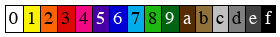

First thing to note about the illustration of the state trie is that the leaves correspond to our accounts
with their ETH endowments. Account nonces, in our case all 0s, are also shown. If you count number of coloured
boxes you can to go through top to bottom to each any of the account leaves, you will get 64. If each nibble occupies
half of a byte, that makes each "key" in the state trie 32 bytes long. But account addresses are only 20 bytes long.
The reason why we get 32 and not 20 is that all the keys (in our case account addresses) are processed by `Keccak256`
hash function (which has 32 byte output) before they are inserted into the trie.
If we wanted to see what the corresponding account addresses were, we will have to look into the database. Here is
what turbo-geth would persist after generating such a genesis block:

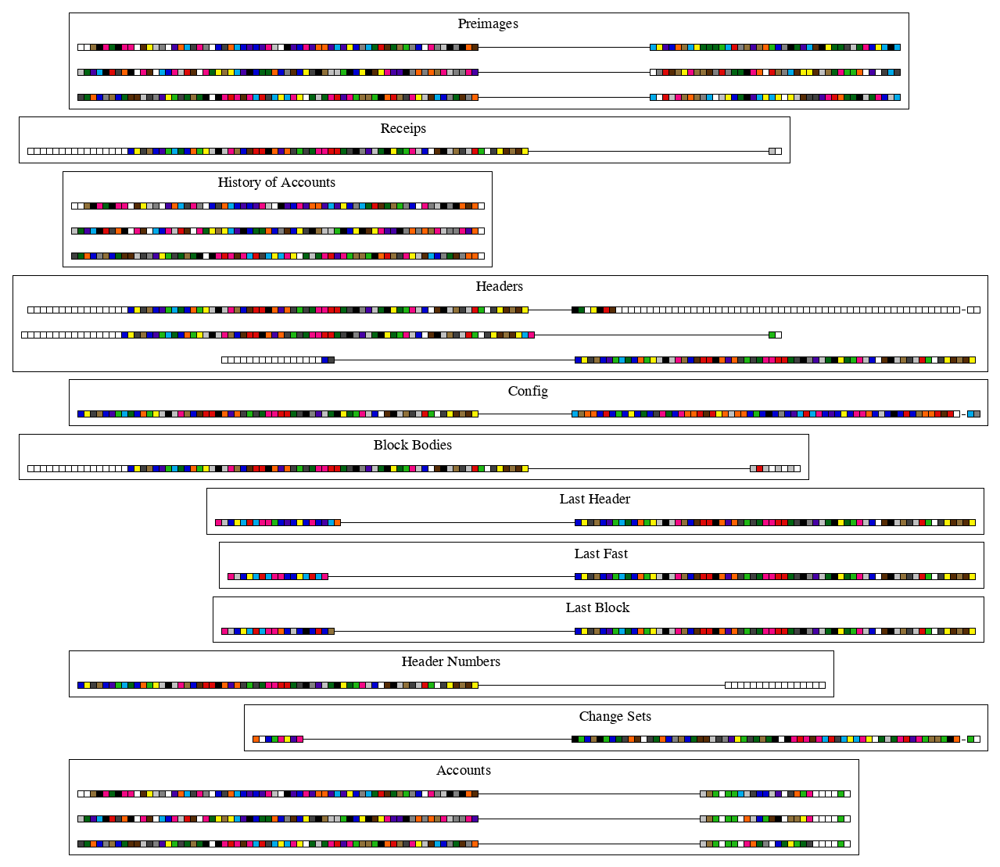

The database is organised in buckets (or some of you may be more used to the term "tables"). 

Bucket "Receipts"
-----------------

Records the list of transaction receipts for each block:

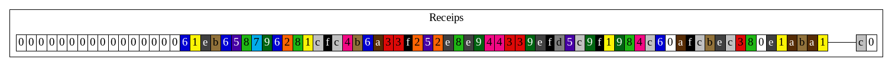

The first 8 bytes of the key (or 16 nibbles, equaling to 0s here) encode the block number, which is 0 for the Genesis block.
The remaining 32 bytes of the key encode the block hash. The value is the RLP-encoded list of receipts. In our case, there were
no transactions in the Genesis block, therefore, we have RLP encoding of an empty list, `0xC0`.

Bucket "History Of Accounts"
----------------------------


The three keys here are almost the same as the keys in the "Preimages" bucket, and the same as
the keys in the state trie. There is a suffix `0x20` added to all of them. It encodes the block
number 0, in a turbo-geth-specific encoding. Three most significant bits (`001` here) encode the
total length (in bytes) of the encoding. The rest of the bits encode the number.
The absense of values in the illustrations signifies that the values are empty strings.
The history of accounts records how the accounts changed at each block. But, instead of recording,
at each change, the value that the accounts had AFTER the change, it records what value the accounts
had BEFORE the change. That explains the empty values here - it records the fact that these
three accounts in questions did not exist prior to the block 0.

**WARNING** The layout of this bucket might change very soon, and it will only contain the
timeseries of block numbers in which particular account has changed.

Bucket "Headers"
----------------

it records information about block headers from various angles.

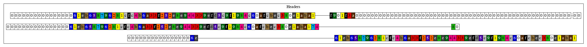

The keys for the first two records start with 8-byte encoding of the block number (0), followed by
the block hash (or header hash, which is the same thing). The second record also has a suffix `0x74`,
which is ASCII code for `t`. The records of the first type store the actual headers in their values.
The records of the second type store total mining difficulty (TD) of  the chain ending in that specific header.
In our case it is `0x80`, which is RLP encoding of 0.
The records of the third type have their keys composed of 8-byte encoding of the block number (0 here), and
suffix `0x6E`, which is ASCII code for `n`. These records allow for the lookup of a header/block hash, given its block
number. They are also called "canonical header" records, because there might be multiple headers for given
block number, and only one of them is deemed "canonical" at a time.

Bucket "Block Bodies"
---------------------

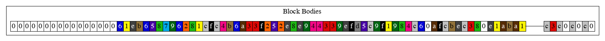

The keys in this bucket are concatenations of 8-byte encoding of the block number and 32-byte block hash.
The values are RLP-encoded list of 3 structures:

1. List of transactions
2. List transaction sender addresses, one for each transaction in the first list
3. List of ommers (a.k.a uncles)

In the case of the genesis block, all of these lists are empty (RLP encodings `0xC0`), and the prefix `0xC3` means
in RLP "some number of sub-structures with the total length of 3 bytes".

The reason turbo-geth keeps the list of transaction sender addresses for each transaction has to do with the fact that
transactions themselves do not contain this information directly. Sender's address can be "recovered" from the digital
signature, but this recovery can be computationally intensive, therefore we "memoise" it.

Next three buckets, "Last Header", "Last Fast", and "Last Block", always contain just one record each, and their
keys are always the same, the ASCII-encodings of the strings `LastHeader`, `LastFast`, and `LastBlock`, respectively.
The values record the block/header hash of the last header, receipt or block chains that the node has managed to sync
from its peers in the network. The value in "Last Fast" bucket is not really used at the moment, because turbo-geth
does not support Fast Sync.

Bucket "Header Numbers"
-----------------------

Is a mapping of 32-byte header/block hashes to the corresponding block numbers (encoded
in 8 bytes):


Bucket "Change Sets"
--------------------
 
Records the history of changes in accounts and contract storage. But, unlike in "History of Accounts"
and "History of Storage" (this bucket will appear later), where keys are derived from accounts' addresses
(key = address hash + block number), in the "Change Sets" bucket, keys are derived from the block numbers:

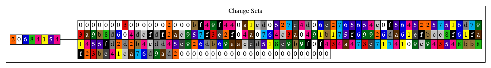

In the cases of our genesis block, the key is composed from the encoding of the block number (`0x20`), and the
ASCII-code of `hAT` (meaning **h**istory of **A**counts **T**rie).
The "Change Set" bucket records changes that happen to accounts and contract storage slots at every block.
It is important to note that the values recorded in the "Changes Set" bucket are not the values the accounts
(or storage slots) had AFTER the change, it records what value the accounts (or storage slots)
had BEFORE the change. That explains the empty values here - it records the fact that these
three accounts in question did not exist prior to the block 0.
The encoding of the values in the records is tailored for fast access and binary search. It has 5 parts:
1. Number of keys-value pairs, encoded as a 4-byte (32-bit) number. In this example, it is `0x00000003`, which means
there are 3 key-value pairs
2. Size of each key, also encoded as a 32-bit number. All keys are the same size, which makes it possible to
access them without deserialisation. In this example, it is `0x00000020`, which 32, meaning that all keys are
32 bytes long.
3. Keys themselves. In our examples, these are the coloured boxes before the streak of white 0s. Keys are sorted
lexicographically. This, together with the keys being the same size, allows binary search without deserialisation,
as well as linear-time merge of multiple changesets.
4. Value offsets. These offsets mark the beginning of the next, 5th part as offset 0. First value has offset 0.
In our example, all values are empty strings, therefore we see 3 zero offsets (24 white boxes with zeros in them).
5. Values themselves. In our example, they are empty, so this 5th part is not present.

Bucket "Accounts"
-----------------

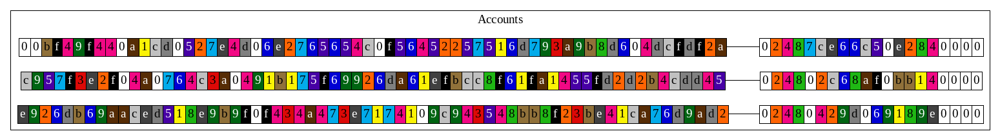

The keys of the records in this bucket are the same as in the bucket "Preimage", and they are also the same as
the keys in the state trie. The values are the current state of each account. the accounts are encoded so that the first byte of a field is its length and bytes afterward the field itself. 
They all start with a fieldset of `0x02`, for each bit set into the fieldSet a field is present. in this case `0x02` in binary is `10` meaning that only the second field is set (the balance).
the order in the fieldset is the following:
* 1st bit: Nonce
* 2nd bit: Balance
* 3rd bit: Incarnation
* 4th bit: Root
* 5th bit: Code Hash
* 6th bit: Storage Size

**WARNING**: The Storage Size bit will be removed soon.

Therefore, immediately after the fieldset we have the length in byte of the balance: `0x08` (`8` bytes). the following 8 bytes (aka. 16 nibbles) contains the hexadecimal value of the balance that in the first record would be: `0x7ce66c50e2840000`.
````
$ python
Python 2.7.15
Type "help", "copyright", "credits" or "license" for more information.
>>> 0x7ce66c50e2840000
9000000000000000000
````
Which is 9 followed by 18 zeros, which is 9 ETH (1 ETH = 10^18 wei).

the third bit of the field set represent the Incarnation. The Incarnation is a turbo-geth specific attribute, which is
used to make removal and revival of contract accounts (now possible with `CREATE2` since Constantinopole) efficient
with turbo-geth's database layout. For now it will suffice to say that all non-contract accounts will have 
incarnation 0 (not set), and all contract accounts will start their existence with incarnation 1.

Contract accounts may also contract code hash and storage root, and these two pieces of information would make the record
in the "Accounts" bucket contain 5 instead of 3 fields.

Genesis in go-ethereum
------------------------------

Now we will create the same Genesis state and block in go-ethereum (in archive mode to make sure we compare like for like).
Here is how the database looks like. Since go-ethereum uses LevelDB, and LevelDB does not have a concept of "Buckets" (or
"Tables"), go-ethereum emulates them by adding table-specific prefixes to all the keys, with the exception of the keys that
describe the state trie (bucket "Hashes" in our example). In the illustration, these prefixes are mostly removed for better
comparison with turbo-geth. They were not removed only for the buckets "LastBlock", "LastHeader" and "LastFast", because
othewise they key would be empty.

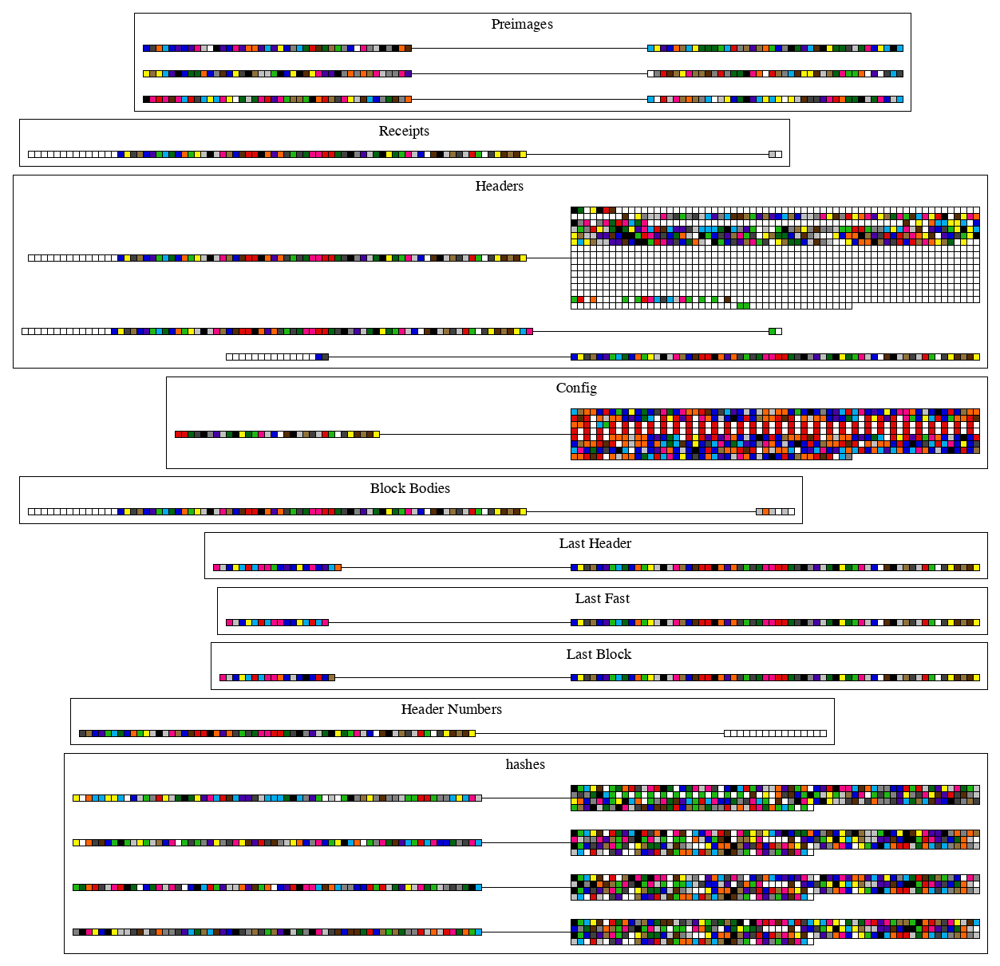

The buckets "Preimages", "Receipts", "Headers", "Config", "Last Header", "Last Fast", "Last Block", all look identical
to those in the turbo-geth database. We will walk through the ones that are different.

In the bucket "Block Bodies", the value is slightly different:


The difference is that the block body has 2 elements instead of 3 in turbo-geth. The missing element is the list
of the sender addresses that go-ethereum does not store, but recomputes after loading or caches in memory.

The buckets "Accounts", "History Of Accounts", and "Change Sets" are missing, because go-ethereum uses a very
different mechanism for storing the state and its history:


In the illustration showing the state trie, one can find 4 parts of the diagram that consist of the coloured boxes
(that excludes the leaves that contain account balances and nonces). These parts are usually called "trie nodes",
and in the diagram above we see 2 types of trie nodes:
1. Branch node. This is the horizontal line of 3 coloured boxes on the top. It branches the traversal of the state
trie from top to bottom 3-ways.
2. Leaf node. These are 3 vertical lines of 63 coloured boxes.

Each type of trie nodes can be serialised (using RLP encoding), to convert it to a string of bytes. What we see in
the values of the records in the "Hashes" bucket just above are the RLP-encodings of these 4 trie nodes.
What we see in the keys of these records are the results of `Keccak256` function applied to the values. In a way,
this is similar to the "Preimages" bucket, with the different type of values.

If you look closely, you may notice that the keys of the last 3 records are actually contained inside the value
of the first record. This is because the first value correponds to that 3-way branch node, and the hashes of the
leaf nodes are used like "pointers" to thoese nodes. Continuing the "pointer" analogy, you can say that
"dereferencing" these pointers mean fetching the corresponding records from this "Hashes" bucket. Using such
"derederencing" process, one can traverse the state trie from the top to any leaf at the bottom. Each step in
such traversal requires finding the corresponding record in the "Hashes" bucket.

Block with 1 Ethereum transaction in Turbo-Geth
------------------------------
The first block contains transaction that transfers 0.001 ETH from the account holding 9ETH to a new account with the address `0x0100000000000000000000000000000000000000` (this is what one gets specifying `common.Address{1}` in the code).
This is how the state trie after Block 1 is inserted looks like:

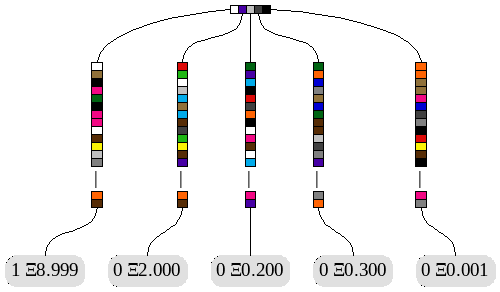

First thing to note about the illustration of the state trie is that the nonce of the first account is now 1 since a transaction from that address has been executed and the amount of ETH of that account is now 8.999 since the transaction had a value of 0.001 ETH. Usually, the transaction fee would also
be paid, but in our simplified example, we set gas price to 0, therefore no fees are deducted. A new account has been added to the state trie, the recipient of the transaction. In fact, it has 0.001 ETH (the value of the transaction) and its nonce is set to 0.
What follows are excerpts from the turbo-geth database after block 1 has been inserted. These excerpts only show the records that have changed, and
omit the records that are the same as before the insertion of the block.

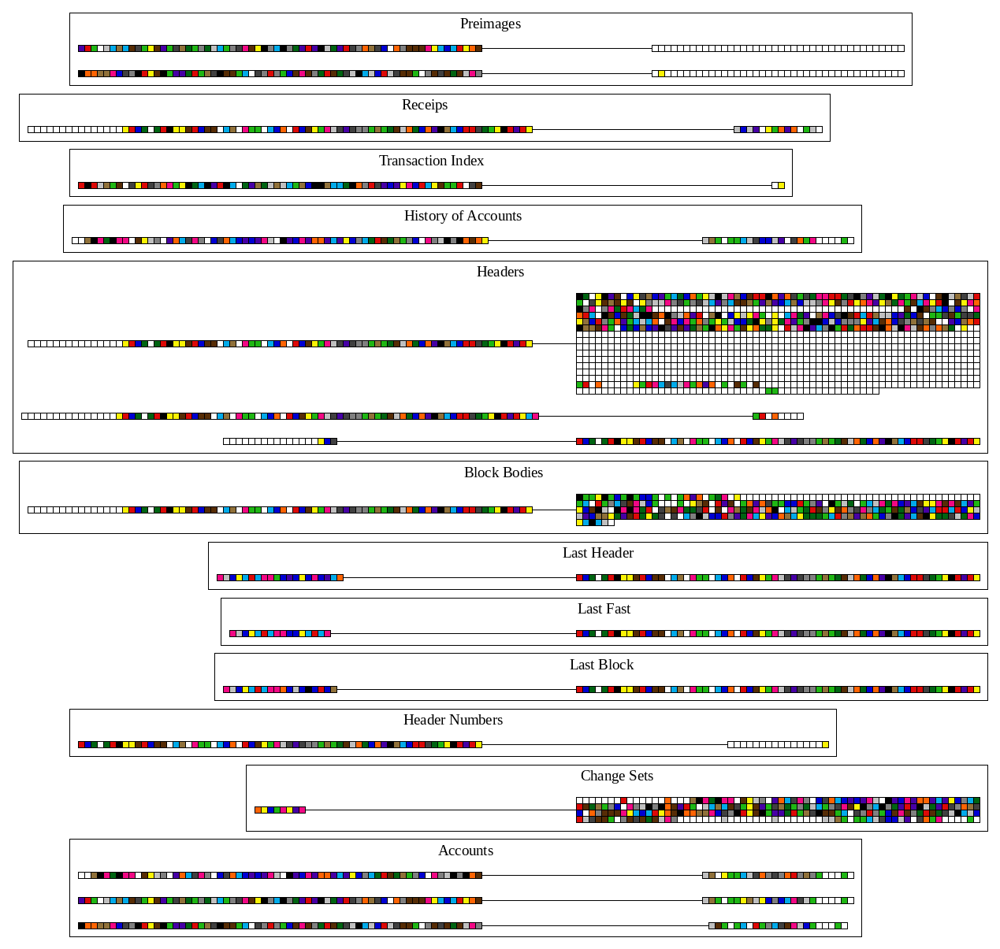

We have got now two more preimages:

* the preimage of the recipient of the transaction (account `0x0100000000000000000000000000000000000000`)
* the preimage of the miner (account `0x0000000000000000000000000000000000000000`)

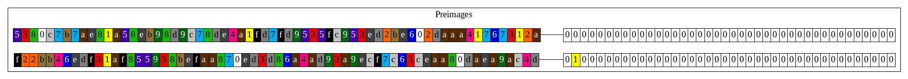

Bucket "Receipts" now has some non-empty information for the block 1, because we had 1 transaction:

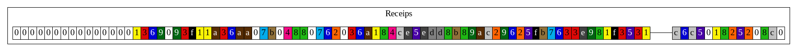

The first 8 bytes of the key (or 16 nibbles, 15 zeroes followed by `1`) encode the block number, which is 1.
The remaining 32 bytes of the key encode the block hash. The value is the RLP-encoded list of receipts. In our case, there a transaction was sent and as a matter of fact, instead of having `0xC0` (that represent an empty list) we have `0xc6c501825208c0` that his the receipt for the 0.001 ETH transaction.
First prefix, `c6` means that the following 6 bytes is a sequence of RLP-encoded sub-structures. In our case, there is only one sub-structure, and its
prefix `c5` means that the following 5 bytes is a sequence of RLP-encoded sub-structures. There are 3 of them: `01`, `825208`, and `c0`. The first encodes
number 1, which means the "Success" status of the transaction (0 would mean failure). Next, we have a byte array of length 2 (prefix `82`), `5208`, which is
21000 in hexadecimal, the cumulative gas used by all transactions so far. And the last structure, `c0` is RLP encoding of an empty list. Usually, the log (events) emitted by the transaction, would be here. But since our transaction did not emit anything, the list is empty.

Next bucket is "History Of Accounts":

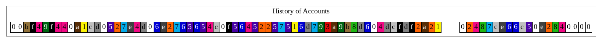

The first entry has a non-empty value. This is the sender of 0.001ETH. As history bucket records the value of this account BEFORE the change, we should
expect the same value here as this account had at the geneis. The other two records contain empty values, which means these account were non-existent previously. These are the account of the recepient of 0.001 ETH (`0x0100000000000000000000000000000000000000`), and the miner account `0x0000000000000000000000000000000000000000`.
The keys of all three records have the common suffix of `0x21` instead of `0x20`, which is simply encoding of the block number 1 instead of block number 0.

**WARNING** We are planning a change, called `THIN_HISTORY`, after which the bucket "History of Accounts" will not store the values of the accounts,
but only the block numbers when those accounts changed.

Next bucket is "Headers"

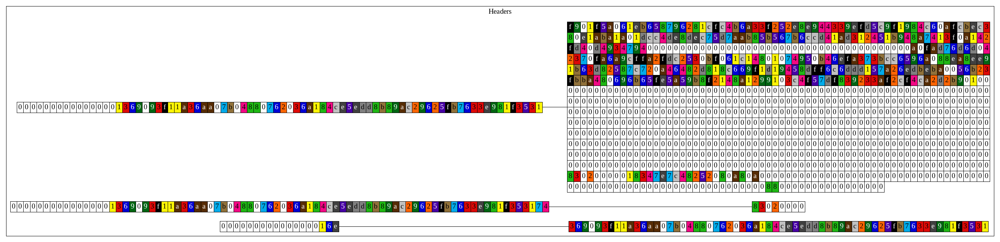

A new header has been generated since a new block has been mined.
As a matter of fact, the keys for the first two records start with a block number of 1 followed by
the block hash (or header hash, which is the same thing) that is different than the Genesis Block. Additionally, these two records for the new block that respectively represent the values in the headers and the mining difficulty differs from the Genesis Block.

Next bucket is "Block Bodies":

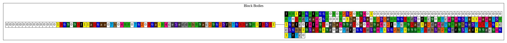

The keys in this bucket are concatenations of 8-byte encoding of the block number and 32-byte block hash.
The new record is the representation of block 1.

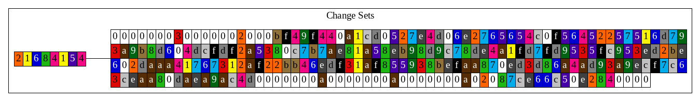

Bucket "Change Sets" recorded the change in account that occurred BEFORE the 0.001 ETH transaction. you can notice that unlike the genesis block, this time the key has a prefix of `0x21` since now the blockchain is 1 block apart from the Genesis block.
Like in the ChangeSet in the genesis block, there are 3 new records. But unlike the ChangeSet in the genesis block, one of the records (the last one) has
a non-empty value. This is the same value that we see in the corresponding record in the "History of Accounts" bucket.

**WARNING** We are planning a change, called `THIN_HISTORY`, after which the bucket "History of Accounts" will not store the values of the accounts,
but only the block numbers when those accounts changed.

The next bucket is "Accounts":

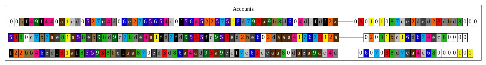

The values are the current state of each account. 
* The first record has a field set of `0x3` (`11`) meaning that this time the accound has a nonce as well. the nonce legth is `0x01`. therefore the nonce is stored in the byte immediately after the length of the field: `0x01`. the balance is now changed to `0x7ce2ded23dbd8000`.
The value `0x7ce2ded23dbd8000` is the hexadecimal value for:
````
$ python
Python 2.7.15
Type "help", "copyright", "credits" or "license" for more information.
>>> 0x7ce2ded23dbd8000
8999000000000000000
````
Which is 9 ETH - 0.001 ETH, this means that this account is the sender.
* in the second value the field set is `0x02` meaning that only the balance is set. 
The value `0x1bc16d674ec80000` (balance) is the hexadecimal value for:
````
$ python
Python 2.7.15
Type "help", "copyright", "credits" or "license" for more information.
>>> 0x1bc16d674ec80000
2000000000000000000
````
Which is 2 ETH that probably represent the mining reward.

* in the third value we have prefix `0x06` (`110`), meaning that only balance and incarnation are set. the balance is now `0x038d7ea4c68000` .Start python and do this:
````
$ python
Python 2.7.15
Type "help", "copyright", "credits" or "license" for more information.
>>> 0x038d7ea4c68000
1000000000000000
````
Which is 0.001 ETH that is exactly how much has been sent to the recipient address, meaning that this account represent the recipient of the transaction.

Block 1 in go-ethereum
----------------------

Now we will create the same Transaction for go-ethereum.

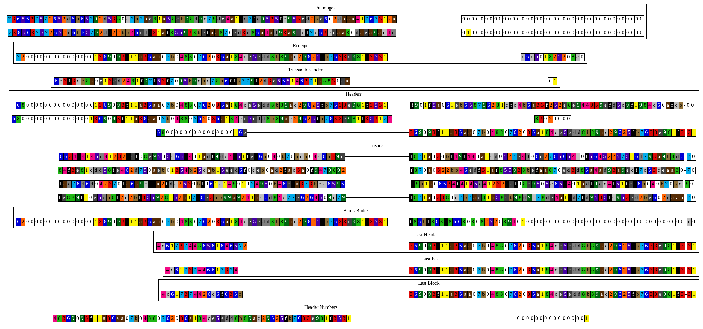

The buckets "Receipts", "Headers", "Config", "Last Header", "Last Fast", "Last Block", all look identical
to those in the turbo-geth database. We will walk through the ones that are different.

In the bucket "Block Bodies", the value is slightly different:

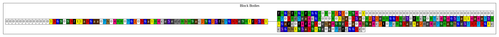

The difference is that the block body is missing the sender address since the send in go-ethereum is computed and in turbo-geth is stored. For the rest in this case the same changes occurs in terms of block number and block hash.

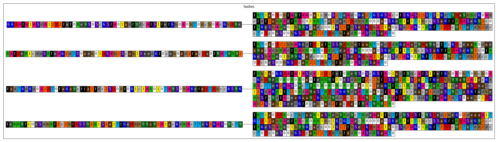

First of all a new branch node has been generated for the block. That's the first record because it contains in its value the key of the other key records. The three leaf nodes contains the `Keccak256` of the change in states of the account of the recipient, sender and miner of the block.
