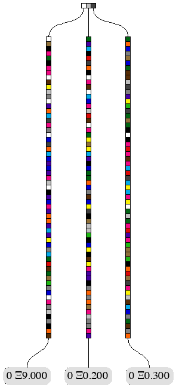
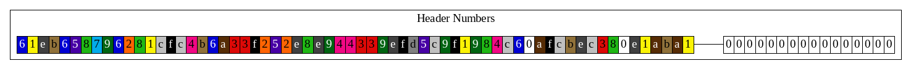
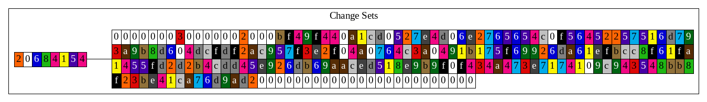
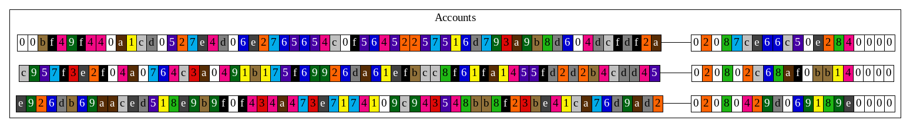
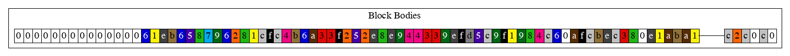
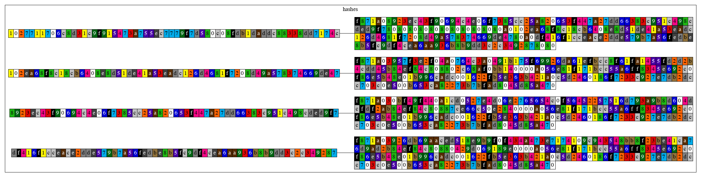

Database Walkthrough
==============================

This document attempts to explain how Turbo-Geth organises its persistent data in its database,
how this organisation is different from go-ethereum, the project from which it is derived.
We start from a very simple genesis block, and then apply 7 blocks, each containing either
ETH transfers, or interactions with smart contracts, or both. For each step, we use visualisation
produced by the code available in turbo-geth, and the code which currently resides on a fork
of go-ethereum, but there is an intention to feed it upstream, if there is interest.

Genesis in Turbo-Geth
------------------------------
For the genesis block, we generate 3 different private keys and construct Ethereum addresses from them.
Then, we endow one of the accounts with 9 ETH, and two others with 0.2 and 0.3 ETH, respectively.
This is how the initial state trie looks like:



In this, and other illustrations, the colored boxes correspond to hexadecimal digits (a.k.a nibbles), with values 0..F.
Here is the palette:


First thing to note about the illustration of the state trie is that the leaves correspond to our accounts
with their ETH endowments. Account nonces, in our case all 0s, are also shown. If you count number of coloured
boxes you can to go through top to bottom to each any of the account leaves, you will get 64. If each nibble occupies
half of a byte, that makes each "key" in the state trie 32 bytes long. But account addresses are only 20 bytes long.
The reason why we get 32 and not 20 is that all the keys (in our case account addresses) are processed by `Keccak256`
hash function (which has 32 byte output) before they are inserted into the trie.
If we wanted to see what the corresponding account addresses were, we will have to look into the database. Here is
what turbo-geth would persist after generating such a genesis block:


The database is organised in buckets (or some of you may be more used to the term "tables"). The first bucket
contains "Preimages". By preimage here we mean the reverse of the `Keccak256` function. Lets zoom into it


If you now look closely at the
keys stored in this bucket (the strings of coloured boxes with digits in them, on the left of the connecting lines),
and compare them with the paths you have to walk top to bottom to our accounts in the genesis state, you will see that they
match. And the corresponding values (the strings of coloured boxes on the right of the connecting lines) are the
account addresses - they are 40 nibbles, or 20 bytes long.

The next bucket, "Receipts", records the list of transaction receipts for each block:


The first 8 bytes of the key (or 16 nobbles, equaling to 0s here) encode the block number, which is 0 for the Genesis block.
The remaining 32 bytes of the key encode the block hash. The value is the RLP-encoded list of receipts. In our case, there were
no transactions in the Genesis block, therefore, we have RLP encoding of an empty list, `0xC0`.

Next bucket is "History Of Accounts":


The three keys here are almost the same as the keys in the "Preimages" bucket, and the same as
the keys in the state trie. There is a suffix `0x20` added to all of them. It encodes the block
number 0, in a turbo-geth-specific encoding. Three most significant bits (`001` here) encode the
total length (in bytes) of the encoding. The rest of the bits encode the number.
The absense of values in the illustrations signifies that the values are empty strings.
The history of accounts records how the accounts changed at each block. But, instead of recording,
at each change, the value that the accounts had AFTER the change, it records what value the accounts
had BEFORE the change. That explains the empty values here - it records the fact that these
three accounts in questions did not exist prior to the block 0.

**WARNING** The layout of this bucket might change very soon, and it will only contain the
timeseries of block numbers in which particular account has changed.

Next bucket is "Headers", it records information about block headers from various angles.


The keys for the first two records start with 8-byte encoding of the block number (0), followed by
the block hash (or header hash, which is the same thing). The second record also has a suffix `0x74`,
which is ASCII code for `t`. The records of the first type store the actual headers in their values.
The records of the second type store total mining difficulty (TD) of  the chain ending in that specific header.
In our case it is `0x80`, which is RLP encoding of 0.
The records of the third type have their keys composed of 8-byte encoding of the block number (0 here), and
suffix `0x6E`, which is ASCII code for `n`. These records allow lookuping up header/block hash given block
number. They are also called "canonical header" records, because there might be multiple headers for given
block number, and only one of them is deemed "canonical" at a time.

Next bucket is "Config", contains serialised chain parameters, like chain ID, block numbers for various
forks etc. The key is the concatenation of the ASCII-ecoding of `ethereum-config-` and the hash of the
genesis block.

Next bucket is "Block Bodies":


The keys in this bucket are concatenations of 8-byte encoding of the block number and 32-byte block hash.
The values are RLP-encoded list of 3 structures:
1. List of transactions
2. List transaction sender addresses, one for each transaction in the first list
3. List of ommers (a.k.a uncles)
In the case of the genesis block, all of these lists are empty (RLP encodings `0xC0`), and the prefix `0xC3` means
in RLP "some number of sub-structures with the total length of 3 bytes".

The reason turbo-geth keeps the list of transaction sender addresses for each transaction has to do with the fact that
transactions themselves do not contain this information directly. Sender's address can be "recovered" from the digital
signature, but this recovery can be computationally intensive, therefore we "memoise" it.

Next three buckets, "Last Header", "Last Fast", and "Last Block", always contain just one record each, and their
keys are always the same, the ASCII-encodings of the strings `LastHeader`, `LastFast`, and `LastBlock`, respectively.
The values record the block/header hash of the last header, receipt or block chains that the node has managed to sync
from its peers in the network. The value in "Last Fast" bucket is not really used at the moment, because turbo-geth
does not support Fast Sync.

Next bucket, "Header Numbers", is a mapping of 32-byte header/block hashes to the corresponding block numbers (encoded
in 8 bytes):



Bucket "Change Sets" record the history of changes in accounts and contract storage. But, unlike in "History of Accounts"
and "History of Storage" (this bucket will appear later), where keys are derived from accounts' addresses
(key = address hash + block number), in the "Change Sets" bucket, keys are derived from the block numbers:



In the cases of our genesis block, the keys is composed from the encoding of the block number (`0x20`), and the
ASCII-code of `hAT` (meaning **h**istory of **A**counts **T**rie).
The "Change Set" bucket records changes that happen to accounts and contract storage slots at every block.
It is important to node that the values recorded in the "Changes Set" bucket are not the values the accounts
(or storage slots) had AFTER the change, it records what value the accounts (or storage slots)
had BEFORE the change. That explains the empty values here - it records the fact that these
three accounts in questions did not exist prior to the block 0.
The encoding of the values in the records is tailored for fast access and binary search. It has 5 parts:
1. Number of keys-value pairs, encoded as a 4-byte (32-bit) number. In this example, it is `0x00000003`, which means
there are 3 key-value pairs
2. Size of each key, also encoded as a 32-bit number. All keys are the same size, which makes it possible to
access them without deserialisation. In this example, it is `0x00000020`, which 32, meaning that all keys are
32 bytes long.
3. Keys themselves. In our examples, these are the coloured boxes before the streak of white 0s. Keys are sorted
lexicographically. This, together with the keys being the same size, allows binary search without desearialision,
as well as linear-time merge of multiple changesets.
4. Value offsets. These offsets mark the beginning of the next, 5th part as offset 0. First value has offset 0.
In our example, all values are empty strings, therefore we see 3 zero offsets (24 white boxes with zeros in them).
5. Values themselves. In our example, they are empty, so this 5th part is not present.

The next bucket is "Accounts":



The keys of the records in this bucket are the same as in the bucket "Preimage", and they are also the same as
the keys in the state trie. The values are the current state of each account. In this special case, all three
accounts are RLP-encoded as the list of 3 nested structures. Lets take the first value and analyse.
Prefix `0xCB` means that it is an RLP structure (list) of some number of nested structures with the total length
of 11 bytes (`B` is 11). Then, we can see 3 nested structures following: `0x80`, `0x887ce66c50e2840000`, and `0x80`.
The first one encodes nonce, which is 0, the second one encodes balance. Prefix `0x88` means "byte array 8 bytes long".
The value `0x7ce66c50e2840000` is the hexadecimal value for... .Start python and do this:
````
$ python
Python 2.7.15
Type "help", "copyright", "credits" or "license" for more information.
>>> 0x7ce66c50e2840000
9000000000000000000
````
Which is 9 followed by 18 zeros, which is 9 ETH (1 ETH = 10^18 wei).

The third `0x80` is the encoding of accounts' incarnation. Incarnation is a turbo-geth specific attribute, which is
used to make removal and revival of contract accounts (now possible with `CREATE2` since Constantinopole) efficient
with turbo-geth's database layout. For now it will suffice to say that all non-contract accounts will have 
incarnation 0, and all contract accounts will start their existence with incarnation 1.

Contract accounts may also contract code hash and storage root, and these two pieces of information would make the record
in the "Accounts" bucket contain 5 instead of 3 fields.

Genesis in go-ethereum
------------------------------

Now we will create the same Genesis state and block in go-ethereum (in archive mode to make sure we compare like for like).
Here is how the database looks like. Since go-ethereum uses LevelDB, and LevelDB does not have a concept of "Buckets" (or
"Tables"), go-ethereum emulates them by adding table-specific prefixes to all the keys, with the exception of the keys that
describe the state trie (bucket "Hashes" in our example). In the illustration, these prefixes are mostly removed for better
comparison with turbo-geth. They were not removed only for the buckets "LastBlock", "LastHeader" and "LastFast", because
othewise they key would be empty.


The buckets "Preimages", "Receipts", "Headers", "Config", "Last Header", "Last Fast", "Last Block", all look identical
to those in the turbo-geth database. We will walk through the ones that are different.

In the bucket "Block Bodies", the value is slightly different:



The difference is that the block body has 2 elements instead of 3 in turbo-geth. The missing element is the list
of the sender addresses that go-ethereum does not store, but recomputes after loading or caches in memory.

The buckets "Accounts", "History Of Accounts", and "Change Sets" are missing, because go-ethereum uses a very
different mechanism for storing the state and its history:



In the illustration showing the state trie, one can find 4 parts of the diagram that consist of the coloured boxes
(that excludes the leaves that contain account balances and nonces). These parts are usually called "trie nodes",
and in the diagram above we see 2 types of trie nodes:
1. Branch node. This is the horizontal line of 3 coloured boxes on the top. It branches the traversal of the state
trie from top to bottom 3-ways.
2. Leaf node. These are 3 vertical lines of 63 coloured boxes.

Each type of trie nodes can be serialised (using RLP encoding), to convert it to a string of bytes. What we see in
the values of the records in the "Hashes" bucket just above are the RLP-encodings of these 4 trie nodes.
What we see in the keys of these records are the results of `Keccak256` function applied to the values. In a way,
this is similar to the "Preimages" bucket, with the different type of values.

If you look closely, you may notice that the keys of the last 3 records are actually contained inside the value
of the first record. This is because the first value correponds to that 3-way branch node, and the hashes of the
leaf nodes are used like "pointers" to thoese nodes. Continuing the "pointer" analogy, you can say that
"dereferencing" these pointers mean fetching the corresponding records from this "Hashes" bucket. Using such
"derederencing" process, one can traverse the state trie from the top to any leaf at the bottom. Each step in
such traversal requires finding the corresponding record in the "Hashes" bucket.
