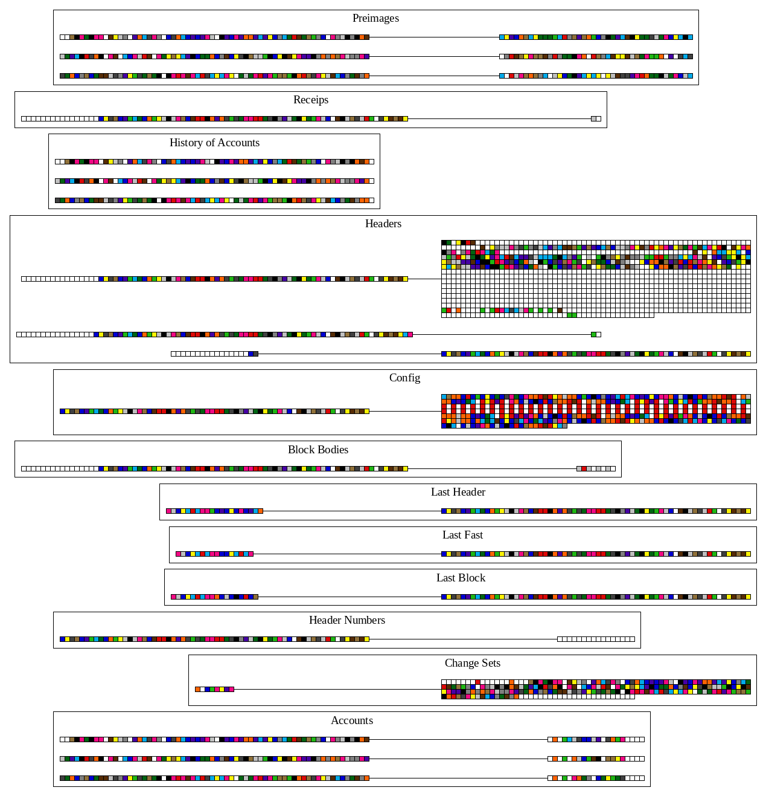

Database Walkthrough
==============================

This document attempts to explain how Turbo-Geth organises its persistent data in its database,
how this organisation is different from go-ethereum, the project from which it is derived.
We start from a very simple genesis block, and then apply 7 blocks, each containing either
ETH transfers, or interactions with smart contracts, or both. For each step, we use visualisation
produced by the code available in turbo-geth, and the code which currently resides on a fork
of go-ethereum, but there is an intention to feed it upstream, if there is interest.

Genesis
------------------------------
For the genesis block, we generate 3 different private keys and construct Ethereum addresses from them.
Then, we endow one of the accounts with 9 ETH, and two others with 0.2 and 0.3 ETH, respectively.
This is how the initial state trie looks like:

In this, and other illustrations, the colored boxes correspond to hexadecimal digits (a.k.a nibbles), with values 0..F.
Here is the palette:

First thing to note about the illustration of the state trie is that the leaves correspond to our accounts
with their ETH endowments. Account nonces, in our case all 0s, are also shown. If you count number of coloured
boxes you can to go through top to bottom to each any of the account leaves, you will get 64. If each nibble occupies
half of a byte, that makes each "key" in the state trie 32 bytes long. But account addresses are only 20 bytes long.
The reason why we get 32 and not 20 is that all the keys (in our case account addresses) are processed by `Keccak256`
hash function (which has 32 byte output) before they are inserted into the trie.
If we wanted to see what the corresponding account addresses were, we will have to look into the database. Here is
what turbo-geth would persist after generating such a genesis block:

The database is organised in buckets (or some of you may be more used to the term "tables"). The first bucket
contains "Preimages". By preimage here we mean the reverse of the `Keccak256` function. Lets zoom into it

If you now look closely at the
keys stored in this bucket (the strings of coloured boxes with digits in them, on the left of the connecting lines),
and compare them with the paths you have to walk top to bottom to our accounts in the genesis state, you will see that they
match. And the corresponding values (the strings of coloured boxes on the right of the connecting lines) are the
account addresses - they are 40 nibbles, or 20 bytes long.

The next bucket, "Receipts", records the list of transaction receipts for each block:

The first 8 bytes of the key (or 16 nobbles, equaling to 0s here) encode the block number, which is 0 for the Genesis block.
The remaining 32 bytes of the key encode the block hash. The value is the RLP-encoded list of receipts. In our case, there were
no transactions in the Genesis block, therefore, we have RLP encoding of an empty list, `0xC0`.
