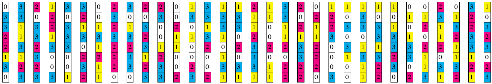
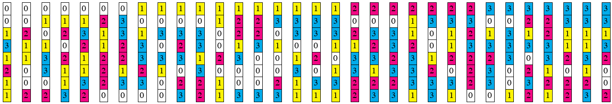
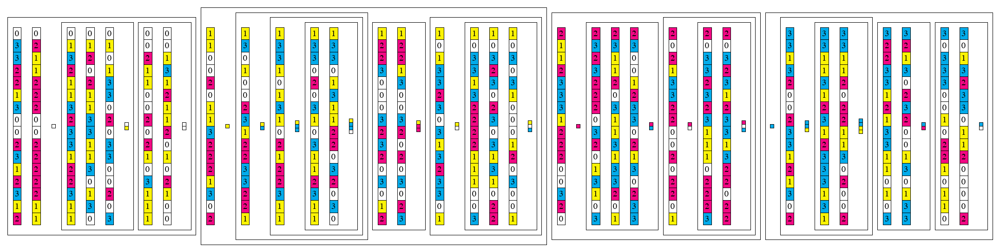
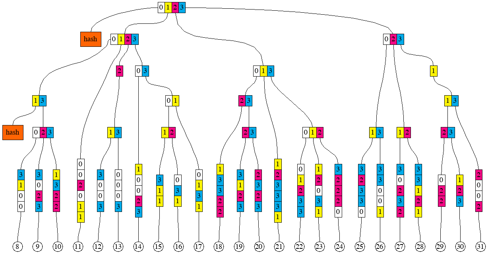
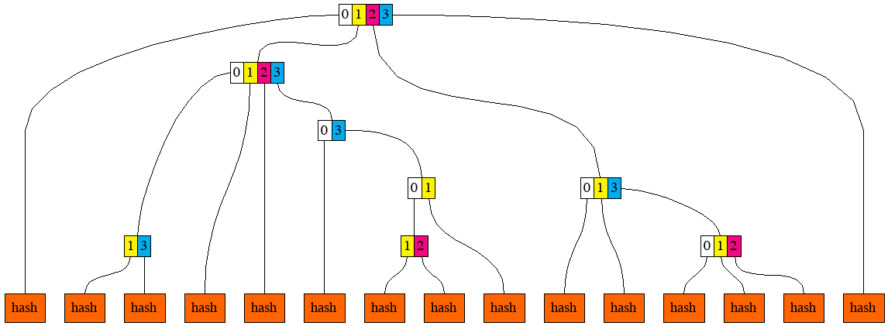

Turbo-Geth programmer's guide
==============================

Ethereum State
--------------
On the high level, Ethereum state is a collection of accounts. An account can be either a non-contract
(also known as "Externally Owned Account", or EOA), or a smart contract.

### Content of an account
Type `Account` [core/types/accounts/account.go](../../core/types/accounts/account.go) lists the main components
of an account's content (not identifier):

1. Nonce
2. Balance
3. Root
4. Code hash

#### Nonce
Number of the type `uint64`.

For non-contract accounts, nonce is important in two contexts. Firstly, all transactions signed by an account, have to
appear in the ledger in the order of strictly increasing nonces (without gaps). This check is performed by member function `preCheck` of
type `StateTransition` [core/state_transition.go](../../core/state_transition.go)
Secondly, if a transaction signed by an account is sent to no
particular address (with intention of creating a contract), and it ends up creating a new smart contract account, the address of such newly
created smart contract account is calculated based on the current nonce of the "creator" account.
For smart contract accounts, nonce is important when `CREATE` opcode is executed on behalf of such account. This computation is
performed in the member function `Create` of the type `EVM` [core/vm/evm.go](../../core/vm/evm.go). Note the difference between the
member function `Create2`, where the address of the newly created contract is independent of the nonce. For contract accounts,
the nonce is important in the context of creating new contracts via `CREATE` opcode.

#### Balance
Number of the type `*big.Int`. Since balance is denominated in wei, and there 10^18 wei in each Ether, maximum balance that needs to be
representable is 110'000'000 (roughly amount of mainnet Ether in existence, but can be more for testnets and private networks),
multiplied by 10^18, which exceeds the capacity of `uint64`.

#### Root
Binary 32-byte (256-bit) string.

By root here one means the Merkle root of the smart contract storage, organised into a tree. Non-contract accounts cannot have storage,
therefore root makes sense only for smart contract accounts. For non-contract accounts, the root field is assumed to be equal to the
Merkle root of empty tree, which is hard-coded in the variable `EmptyRoot` in
[trie/trie.go](../../trie/trie.go). For contract accounts, the root is computed using member function `Hash` of
type `Trie` [trie/trie.go](../../trie/trie.go), once the storage of the contract has been organised into the tree by calling member functions
`Update` and `Delete` on the same type.

#### Code hash
Binary 32-byte (256-bit) string.

Hash of the bytecode (deployed code) of a smart contract. The computation of the code hash is performed in the `SetCode` member function
of the type `IntraBlockState` [code/state/intra_block_state.go](../../core/state/intra_block_state.go). Since a non-contract account has no bytecode, code hash only
makes sense for smart contract accounts. For non-contract accounts, the code hash is assumed to be equal to the hash of `nil`, which is
hard-coded in the variable `emptyCode` in [code/state/intra_block_state.go](../../core/state/intra_block_state.go)

### Address - identifier of an account
Accounts are identified by their addresses. Address is a 20-byte binary string, which is derived differently for smart contract and
non-contract accounts.

For non-contract accounts, the address is derived from the public key, by hashing it and taking lowest 20 bytes of the 32-byte hash value,
as shown in the function `PubkeyToAddress` in the file [crypto/crypto.go](../../crypto/crypto.go)

For smart contract accounts created by a transaction without destination, or by `CREATE` opcode, the address is derived from the
address and the nonce of the creator , as shown in the function `CreateAddress` in the file [crypto/crypto.go](../../crypto/crypto.go)

For smart contract accounts created by `CREATE2` opcode, the address is derived from the creator's address, salt (256-bit argument
supplied to the `CREATE2` invocation), and the code hash of the initialisation code (code that is executed to output the actual,
deployed code of the new contract), as shown in the function `CreateAddress2` in the file [crypto/crypto.go](../../crypto/crypto.go)

In many places in the code, sets of accounts are represented by mappings from account addresses to the objects representing
the accounts themselves, for example, field `stateObjects` in the type `IntraBlockState` [core/state/intra_block_state.go](../../core/state/intra_block_state.go).
Member functions of the type `IntraBlockState` that are for querying and modifying one of the components of an accounts, are all accepting
address as their first argument, see functions `GetBalance`, `GetNonce`, `GetCode`, `GetCodeSize`, `GetCodeHash`, `GetState` (this
one queries an item in the contract storage), `GetCommittedState`, `AddBalance`, `SubBalance`, `SetBalance`, `SetNonce`,
`SetCode`, `SetState` (this one modifies an item in the contract storage) [core/state/intra_block_state.go](../../core/state/intra_block_state.go).

Organising Ethereum State into a Merkle Tree
--------------------------------------------
Ethereum network produces checkpoints of the Ethereum State after every block. These checkpoints come in a form of 32-byte binary
string, which is the root hash of the Merkle tree constructed out of the accounts in the state. This root hash is often
referred to as "State root". It is part of block header, and is contained in the field `Root` of the type
`Header` [core/types/block.go](../../core/types/block.go)

Prior to Byzantium release, the state root was also part of every transaction receipt, and was contained in the field `PostState`
of the type `Receipt` [core/types/receipt.go](../../core/types/receipt.go). Side note: that is why the member function
`ComputeTrieRoots` in the type `TrieDbState` [core/state/database.go](../../core/state/database.go) returns a slice of hashes,
rather than just a single hash. For pre-Byzantium blocks, this function computes state roots for each transaction receipt, and
another one for the block header. For post-Byzantium blocks, it always returns a singleton slice.

### Hexary radix "Patricia" tree
Ethereum uses hexary (radix == 16) radix tree to guide the algorithm of computing the state root. For the purposes of
illustrations, we will use tres trees with radix 4 (because radix 16 requires many more items for "interesting" features
to appear). We start from a set of randomly looking keys, 2 bytes (or 8 quaternary digits) each.


To regenerate this picture, run `go run cmd/pics/pics.go -pic prefix_groups_1`

Next, we sort them in lexicographic order.


To regenerate this picture, run `go run cmd/pics/pics.go -pic prefix_groups_2`

Next, we introduce the notion of a prefix group. Collection of adjacent keys form a prefix group if these keys share
the same prefix, and no other keys share this prefix. Here are the prefix groups for our example:


To regenerate this picture, run `go run cmd/pics/pics.go -pic prefix_groups_3`

The entire collection of keys form one implicit prefix group, with the empty prefix.

Merkle Patricia tree hashing rules first remove redundant parts of the each key within groups, making key-value
pairs so-called "leaf nodes". They correspond to `shortNode` type in the file [trie/node.go](../../trie/node.go).
To produce the hash of a leaf node, one applies the hash function to the two piece RLP (Recursive Length Prefix).
First piece is the representation of the non-redundant part of the key. And the second piece is the
representation of the leaf value corresponding to the key, as shown in the member function `hashChildren` of the
type `hasher` [trie/hasher.go](../../trie/hasher.go), under the `*shortNode` case.

Hashes of the elements within a prefix group are combined into so-called "branch nodes". They correspond to the
types `duoNode` (for prefix groups with exactly two elements) and `fullNode` in the file [trie/node.go](../../trie/node.go).
To produce the hash of a branch node, one represents it as an array of 17 elements (17-th element is for the attached leaf,
if exists).
The position in the array that do not have corresponding elements in the prefix group, are filled with empty strings. This is
shown in the member function `hashChildren` of the type `hasher` [trie/hasher.go](../../trie/hasher.go), under the `*duoNode` and
`*fullNode` cases.

Sometimes, nested prefix groups have longer prefixes than 1-digit extension of their encompassing prefix group, as it is the case
in the group of items `12, 13` or in the group of items `29, 30, 31`. Such cases give rise to so-called "extension nodes".
They correspond to `shortNode` type in [trie/node.go](../../trie/node.go), the same type as leaf nodes. However, the value
in an extension node is always the representation of a prefix group, rather than a leaf. To produce the hash of an extension node,
one applies the hash function to the two piece RLP. First piece is the representation of the non-redundant part of the key.
The second part is the hash of the branch node representing the prefix group. This shown in the member function `hashChildren` of the
type `hasher` [trie/hasher.go](../../trie/hasher.go), under the `*shortNode` case.

This is the illustration of resulting leaf nodes, branch nodes, and extension nodes for our example:


To regenerate this picture, run `go run cmd/pics/pics.go -pic prefix_groups_4`

### Separation of keys and the structure

Our goal here will be to construct an algorithm that can produce the hash of the Patricia Merkle Tree of a sorted
sequence of key-value pair, in one simple pass (i.e. without look-aheads and buffering, but with a stack).
Another goal (perhaps more important)
is to be able to split the sequence of key-value pairs into arbitrary chunks of consecutive keys, and reconstruct the
root hash from hashes of the individual chunks (note that a chunk might need to have more than one hash).

Let's say that we would like to split the ordered sequence of 32 key-value pairs into 4 chunks, 8 pairs in each. We would then
like to compute the hashes (there might be more than one hash per chunk) of each chunk separately. After that, we would like
to combine the hashes of the chunks into the root hash.

Our approach would be to generate some additional information, which we will call "structural information", for each chunk,
as well as for the composition of chunks. This structural information can be a sequence of these "opcodes":

1. `BRANCH digit`
2. `HASHER digit`
3. `LEAF length-of-key`
4. `EXTENSION key`
5. `ADD digit`

The description of semantics would require the introduction of a stack, which can contain hashes, leaf or extension
nodes, or branch nodes being assembled. The maximum number of items in the stack corresponds to the depth of the
tree.

`BRANCH` opcode pops an item from the stack, then pushes an new branch node onto the stack. The item popped from
the stack becomes a child node of the new branch node. Position of this child node is determined by the value
of the operand `digit`.

`HASHER` opcode pops an item from the stack, then pushes a Keccak-256 state onto the stack
(plus a counter of how many items have been fed to it). The item popped from the stack is getting hashed
and the resulting hash is fed into the Keccak-256 state. The value of the operand specified how many
empty strings are fed to the Keccak-256 state prior to the popped item's hash.

`LEAF` opcode consumes the next key-value pair, creates a new leaf node and pushes it onto the stack. The operand
`length-of-key` specifies how many digits of the key become part of the leaf node. For example, for the leaf `11`
in our example, it will be 6 digits, and for the leaf `12`, it will be 4 digits. Special case of `length-of-key`
being zero, pushes the value onto the stack and discards the key.

`EXTENSION` opcode has a key as its operand. This key is a sequence of digits, which, in our example, can only be
of length 1, but generally, it can be longer. The action of this opcode is to pop one item from the stack, create
an extension node with the key provided in the operand, and the value being the item popped from the stack, and
push this extension node onto the stack.

`ADD` opcode expects a node or a hash on top of the stack, which it pops. It then expects a pending branch node or
a Keccak state on top of the stack. Depending what it is, it either adds the popped node or hash as a child node,
or feeds the hash of the popped node or its serialisation (if it is less than 32 bytes long) to the Keccak state
sponge. The operand of this opcode, digit, is used as the index of the added child node within the pending branch
node, or is used to determine (using the counter of items) how many empty items to feed before the popped one.

These opcodes are implemented by the type `HashBuilder` (implements the interface `emitter`) in [trie/structural.go](../../trie/structural.go)

### Multiproofs

Encoding structural information separately from the sequences of key-value pairs and hashes allows
describing so-called "multiproofs". Suppose that we know the root hash of the sequence of key-value pairs for our
example, but we do not know any of the pairs themselves. And we ask someone to reveal keys and value for
the leafs `3`, `8`, `22` and `23`, and enough information to proof to us that the revealed keys and values
indeed belong to the sequence. Here is the picture that gives the idea of which hashes need to be provided
together with the selected key-value pairs.

To regenerate this picture, run `go run cmd/pics/pics.go -pic prefix_groups_8`

And here is the corresponding structural information:
```
HASH
BRANCH 0
HASH
BRANCH 0
LEAF 5
ADD 2
HASH
ADD 3
ADD 1
HASH
ADD 2
HASH
ADD 3
HASH
BRANCH 1
LEAF 4
BRANCH 0
HASH
ADD 2
HASH
ADD 3
ADD 3
BRANCH 0
HASH
ADD 1
HASH
ADD 2
HASH
ADD 3
ADD 1
HASH
BRANCH 0
HASH
ADD 1
LEAF 5
BRANCH 0
LEAF 5
ADD 1
HASH
ADD 2
ADD 3
ADD 2
HASH
ADD 3
```

We can think of a multiproof as the combination of 3 things:

1. Sequence of those 4 key-value pairs
2. Sequence of 15 hashes
3. Structural information that lets us compute the root hash out of the sequences (1) and (2)

### Generating the structural information from the sequence of keys

In order to devise an algorithm for generating the structural information, we return to this picture

To regenerate this picture, run `go run cmd/pics/pics.go -pic prefix_groups_3`

It can then be readily observed that the first item in any prefix group has this property that its common prefix
with the item immediately to the right (or empty string if the item is the very last) is longer than its common
prefix with the item immediately to the left (or empty string if the item is the very first).
Analogously, the last item in any prefix group has the property that its common prefix with the item
immediately to the left is longer than its common prefix with the item immediately to the right.

The algorithm proceeds in steps, one step for each key-value pair, in the lexicographic order of the keys. At each step,
it observes three keys (sequences of digits) - current, preceding, and succeeding. It also has access to the mutable
set of of prefix groups lengths (`lengths`), which starts off empty. This set is shared between steps.
Algorithm's step can also be invoked recursively from another step, with current and preceding keys specified by the
caller.

A step starts with computing the prefix of the smallest prefix group that the current key belongs to. It is either
the common prefix of current key and the preceding key or the common prefix of current key and the succeeding key,
whichever is longer (if they are the same length, then they are also equal, so no ambiguity there).
If the common prefix with the succeeding key is longer, then the new prefix group is being created. When the common
prefixes with the preceding key and the succeeding key are equal, the `lengths` set is used to check whether a prefix
group with such length has already been created. If not, it is being created and the `lengths` set is updated to
include the length of the prefix for this new group.

The digit of the current key immediately following the max common prefix is called "extra digit".
The sequence of digits of the current key following that extra digit is the remainder (which could be empty).
If this step of the algorithm was invoked on a key-value pair (non-recursively), then a `LEAF`
opcode is emitted, with the operand being the length of the remainder (zero if the remainder is empty).
If the step of the algorithm was invoked recursively, and the remainder is not empty, an `EXTENSION` opcode
is emitted instead, with the operand being the remainder.
For example, for leaf `12`, the lengths of common prefix with neighbours are 1 and 3. Therefore, this key will emit the opcode
`LEAF 4`, where 4 = 8 (original length) - 3 (max common prefix length) - 1 (one digit goes to the branch node for the prefix group).
Following the emitting of the `LEAF`, or `EXTENSION`, or no opcode, another opcode is emitted. If a new prefix group is being
created in this step, then `BRANCH` or `HASHER` opcode is emitted, with the operand being the the extra digit. Otherwise, `ADD`
opcode is emitted, with the operand being the extra digit. The choice between emitting `BRANCH` and emitting `HASHER` depends
on whether the structural information is used to produce the root hash or to build the trie.

The following, optional, part of the step only happens if the common prefix of the current key and the preceding key is longer or equal than
the common prefix of the current key and the succeeding key, in other words, if at least one prefix group needs to be "closed".
Closing a prefix group means removing its length from the `lengths` set, and invoking the step of the algorithm recursively
(unless the group that was closed was the one with the empty prefix, which encompasses all the keys). For that recursive invocation,
the prefix of the closed group is used as the current key, and the succeeding key simply passed on. Preceding key is found as the
prefix of the current key of the length equal of the longest item in the `length` set (or zero, if the set is empty).

We will walk through the steps of the algorithm for the leaf `30`, and then for the leaf `31`.
For `30`, the key is `33113123`. Its max common prefix with neighbours is `3311`. The common prefix with the preceding key
is longer than with the succeeding key, therefore the prefix group `3311` is being closed. The digit immediately
following this prefix is `3`. Since this is a non-recursive invocation, and the remainder `123` is 3 digits long,
opcode `LEAF 3` is emitted, followed by `ADD 3` (because no new prefix group is created).
Optional part of the step happens, the length `4` is removed from the `lengths` set, and the step gets invoked recursively
with current key being `3311`, and preceding key identified as `3` (there were no prefix group with prefix `33` or `331` yet,
this can be figured out by checking the `lengths` set, where the highest item is currently `1`).

In the recursive invocation of the step,
max common prefix is `331`. The common prefix with the succeeding key is longer than with the
preceding key, therefore a new prefix group `331` is created, and the set `lengths` is modified to include length `3`.
Emitting `HASHER 1` or `BRANCH 1`. No more recursion.

For leaf `31` (key `33132002`), max common prefix is `331`. The common prefix with the preceding key is longer than
with the succeeding key, therefore the prefix group `331` is being closed. The digit immediately following this
prefix is `3`. Since this is a non-recursive invocation, opcode `LEAF 4` is emitted
(4 is the length of the remainder `2002`), followed by `ADD 3`.
Optional part of the step happens, item `3` is removed from the `lengths` set, and the step gets invoked recursively
with current key being `331`, and preceding key identified as `3` (there were no prefix group with prefix `33`).

In the recursive step, max common prefix is `3`. The common prefix with the preceding key is longer than with the
succeeding key, therefore the prefix group `3` is being closed. The digit immediately following this prefix is `3`.
The remainder `1` is non-empty, and since this is a recursive invocation, opcode
`EXTENSION 1` is emitted, followed by `ADD 3`.
Optional part of the step happens, item `1` is removed from the `lengths` set, and the step gets invoked recursively
with current key being `3`, and preceding key empty (because the only item remaining in the `lengths` set is `0`).

In the deeper recursive step, max common prefix is empty. Since the common prefix with the preceding key equals to
the common prefix with the succeeding key (they are both empty), the `lengths` set is checked for the item `0`.
Opcode `ADD 3` is emitted. Optional part of the step happens, the item `0` is removed from the `lengths` set,
but no recursive invocation follows.

The step of this algorithm is implemented by the function `step` in [trie/structural.go](../../trie/structural.go).

### Converting sequence of keys and value into a multiproof

One of the biggest difference between Turbo-Geth and go-ethereum is in the way the Ethereum state is persisted in
the database. In go-ethereum, the model for persistence is Patricia Merkle tree. In Turbo-Geth, the model for
persistence is sequence of key-value pairs, where keys are either derived from account addresses, or from
storage indices. In this model, computing Patricia Merkle tree from part of data is a very commonly used operation.
This operation is called "Resolution", because it normally arises from a need to look up (resolve) some keys and corresponding
values, and later update them, thus requiring recomputation of the Patricia Merkle tree root.

We can use the concept of Multiproofs to define the resolution operation. If we have a set of key-value pairs, and we need
to "resolve" them, we effectively need to produce a multiproof for the given set of key-value pairs.
To produce such multiproof, we can use the algorithm for generating the structural information from the sequence of keys.
However, within the algorithm, choices need to be made between emitting `HASHER` and `BRANCH` opcodes. Such choices
are conceptually simple to make - if max common prefix is also a prefix of any of the keys we are trying to resolve,
`BRANCH` should be emitted, otherwise, `HASHER` should be emitted.
However, in order to make these choices efficiently, the set of keys being resolved will be converted into a sorted
list. Then, at each point when the algorithm processes a key, it maintains references to two consecutive keys from
that sorted list - one "LTE" (Less Than or Equal to the currently processed key), and another "GT" (Greater Than the
currently processed key). If max common prefix is also prefix of either LTE or GT, then `BRANCH` opcode is emitted,
otherwise, `HASHER` opcode is emitted. This is implemented by the type `ResolveSet` in [trie/structural.go](../../trie/structural.go)

### Separation of keys and the structure (variant 2)

Opcodes shown above form the structural information were designed for minimisation of the stack space required to
execute these opcodes. However, this design is not suitable for "chunking" the sequence of keys, and then
constructing the root from from the sub-roots of the chunks. An alternative scheme is more appropriate for such
use case.

1. `LEAF length-of-key`
2. `ENDBRANCH set-of-digits`
3. `EXTENSION key`

The description of semantics would require the introduction of a stack, which can contain hashes, or nodes of the tree.

`LEAF` opcode consumes the next key-value pair, creates a new leaf node and pushes it onto the stack. The operand
`length-of-key` specifies how many digits of the key become part of the leaf node. For example, for the leaf `11`
in our example, it will be 6 digits, and for the leaf `12`, it will be 4 digits. Special case of `length-of-key`
being zero, pushes the value onto the stack and discards the key.

`ENDBRANCH` opcode has a set of digits as its operand. This set can be encoded as a bitset, for example. The action of
this opcode is to pop the same
number of items from the stack as the number of digits in the operand's set, create a branch node, and push it
onto the stack. Sets of digits can be seen as the horizontal rectangles on the picture `prefix_groups_4`.
The correspondence between digits in the operand's set and the items popped from the stack is as follows.
If the special, 17th digit is not present in the set, then the top of the stack (item being popped off first)
corresponds to the highest digit, and the item being popped off last corresponds to the lowest digit in the set.
If the 17th digit is present (it is used to embed leaf values into branch nodes), then the corresponding
item is the one popped off the stack last (after the one corresponding to the lowest non-special digit).

`EXTENSION` opcode has a key as its operand. This key is a sequence of digits, which, in our example, can only be
of length 1, but generally, it can be longer. The action of this opcode is to pop one item from the stack, create
an extension node with the key provided in the operand, and the value being the item popped from the stack, and
push this extension node onto the stack.

This is the structural information for the chunk containing leafs from `0` to `7` (inclusive):
```
LEAF 5
LEAF 5
ENDBRANCH 12
LEAF 5
LEAF 5
LEAF 5
BRANCH 023
LEAF 6
LEAF 6
BRANCH 0123
LEAF 5
```
After executing these opcodes against the chunk, we will have 2 items on the stack, first representing the branch
node (or its hash) for the prefix group of leafs `0` to `6`, and the second representing one leaf node for the leaf
`7`. It can be observed that if we did not see what the next key after the leaf `7` is, we would not know the operand
for the last `LEAF` opcode. If the next key started with the prefix `101` instead of `103`, the last opcode could have
been `LEAF 4` (because leafs `7` and `8` would have formed a prefix group).

After hashing the first chunk, the tree would look as follows.

To regenerate this picture, run `go run cmd/pics/pics.go -pic prefix_groups_5`

If we apply the same produce to the next chunk of 8 leaves, we will get to the following picture.

To regenerate this picture, run `go run cmd/pics/pics.go -pic prefix_groups_6`

And, after hashing the two remaining chunks.

To regenerate this picture, run `go run cmd/pics/pics.go -pic prefix_groups_7`

Now, if we were given the sequence of these hashes, we need to combine them to produce the root hash.
This needs an introduction on an extra opcode, which takes specified number hash from the sequence (now we can have
two sequences, one with key-value pairs, and another - with hashes), and places them on the stack

4. `HASHES number_of_hashes`

```
HASH 3
BRANCH 13
HASH 5
BRANCH 12
HASH 1
BRANCH 01
BRANCH 03
BRANCH 0123
HASH 5
BRANCH 012
BRANCH 013
HASH 1
BRANCH 0123 
```
