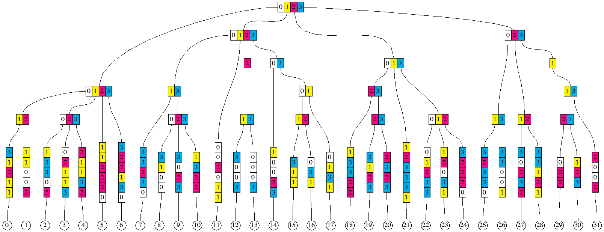
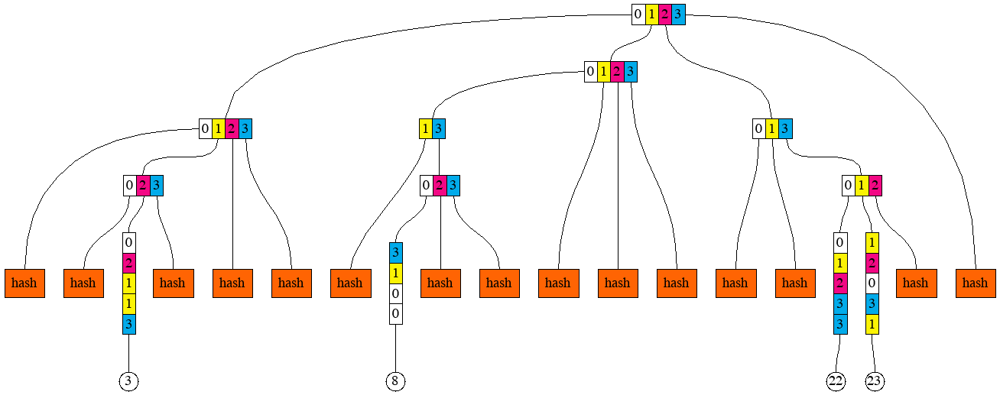

Erigon programmer's guide
==============================

Ethereum State
--------------
On a high level, Ethereum state is a collection of accounts. An account can be either a non-contract
(also known as "Externally Owned Account", or EOA), or a smart contract.

### Content of an account

Type `Account` [core/types/accounts/account.go](../../core/types/accounts/account.go) lists the main components of an
account's content (not identifier):

1. Nonce
2. Balance
3. Root
4. Code hash

#### Nonce

Number of the type `uint64`.

For non-contract accounts, nonce is important in two contexts. Firstly, all transactions signed by an account, have to
appear in the ledger in the order of strictly increasing nonces (without gaps). This check is performed by member
function `preCheck` of type `StateTransition` [core/state_transition.go](../../core/state_transition.go)
Secondly, if a transaction signed by an account is sent to no particular address (with intention of creating a contract)
, and it ends up creating a new smart contract account, the address of such newly created smart contract account is
calculated based on the current nonce of the "creator" account. For smart contract accounts, nonce is important
when `CREATE` opcode is executed on behalf of such account. This computation is performed in the member
function `Create` of the type `EVM` [core/vm/evm.go](../../core/vm/evm.go). Note the difference between the member
function `Create2`, where the address of the newly created contract is independent of the nonce. For contract accounts,
the nonce is important in the context of creating new contracts via `CREATE` opcode.

#### Balance

Number of the type `*big.Int`. Since balance is denominated in wei, and there 10^18 wei in each Ether, the maximum
balance that needs to be representable is 110'000'000 (roughly amount of mainnet Ether in existence, but can be more for
testnets and private networks), multiplied by 10^18, which exceeds the capacity of `uint64`.

#### Root

Binary 32-byte (256-bit) string.

By root here one means the Merkle root of the smart contract storage, organised into a tree. Non-contract accounts
cannot have storage, therefore root makes sense only for smart contract accounts. For non-contract accounts, the root
field is assumed to be equal to the Merkle root of an empty tree, which is hard-coded in the variable `EmptyRoot` in
[turbo/trie/trie.go](../../turbo/trie/trie.go). For contract accounts, the root is computed using member function `Hash`
of type `Trie` [turbo/trie/trie.go](../../turbo/trie/trie.go), once the storage of the contract has been organised into
the tree by calling member functions
`Update` and `Delete` on the same type.

#### Code hash

Binary 32-byte (256-bit) string.

Hash of the bytecode (deployed code) of a smart contract. The computation of the code hash is performed in the `SetCode`
member function of the type `IntraBlockState` [code/state/intra_block_state.go](../../core/state/intra_block_state.go).
Since a non-contract account has no bytecode, code hash only makes sense for smart contract accounts. For non-contract
accounts, the code hash is assumed to be equal to the hash of `nil`, which is hard-coded in the variable `emptyCode`
in [code/state/intra_block_state.go](../../core/state/intra_block_state.go)

### Address - identifier of an account

Accounts are identified by their addresses. Address is a 20-byte binary string, which is derived differently for smart
contract and non-contract accounts.

For non-contract accounts, the address is derived from the public key, by hashing it and taking lowest 20 bytes of the
32-byte hash value, as shown in the function `PubkeyToAddress` in the file [crypto/crypto.go](../../crypto/crypto.go)

For smart contract accounts created by a transaction without destination, or by `CREATE` opcode, the address is derived
from the address and the nonce of the creator, as shown in the function `CreateAddress` in the
file [crypto/crypto.go](../../crypto/crypto.go)

For smart contract accounts created by `CREATE2` opcode, the address is derived from the creator's address, salt (
256-bit argument supplied to the `CREATE2` invocation), and the code hash of the initialisation code (code that is
executed to output the actual, deployed code of the new contract), as shown in the function `CreateAddress2` in the
file [crypto/crypto.go](../../crypto/crypto.go)

In many places in the code, sets of accounts are represented by mappings from account addresses to the objects
representing the accounts themselves, for example, field `stateObjects` in the
type `IntraBlockState` [core/state/intra_block_state.go](../../core/state/intra_block_state.go). Member functions of the
type `IntraBlockState` that are for querying and modifying one of the components of an accounts, are all accepting
address as their first argument, see functions `GetBalance`, `GetNonce`, `GetCode`, `GetCodeSize`, `GetCodeHash`
, `GetState` (this one queries an item in the contract storage), `GetCommittedState`, `AddBalance`, `SubBalance`
, `SetBalance`, `SetNonce`,
`SetCode`, `SetState` (this one modifies an item in the contract
storage) [core/state/intra_block_state.go](../../core/state/intra_block_state.go).

Organising Ethereum State into a Merkle Tree
--------------------------------------------
Ethereum network produces checkpoints of the Ethereum State after every block. These checkpoints come in a form of
32-byte binary string, which is the root hash of the Merkle tree constructed out of the accounts in the state. This root
hash is often referred to as "State root". It is part of block header, and is contained in the field `Root` of the type
`Header` [core/types/block.go](../../core/types/block.go)

Prior to Byzantium release, the state root was also part of every transaction receipt, and was contained in the
field `PostState`
of the type `Receipt` [core/types/receipt.go](../../core/types/receipt.go).

To keep the Merkle Patricia trie of Ethereum state balanced, all the keys (either addresses of Ethereum accounts and
contracts, or storage positions within contract storage) are converted into their respective hashes using `Keccak256`
hash function.
`PlainStateBucket` stores state with keys before hashing, `CurrentStateBucket` store same data but keys are hashed.

### Hexary radix "Patricia" tree

Ethereum uses hexary (radix == 16) radix tree to guide the algorithm of computing the state root. For the purposes of
illustrations, we will use trees with radix 4 (because radix 16 requires many more items for "interesting" features to
appear). We start from a set of randomly looking keys, 2 bytes (or 8 quaternary digits) each.


To regenerate this picture, run `go run cmd/pics/pics.go -pic prefix_groups_1`

Next, we sort them in lexicographic order.


To regenerate this picture, run `go run cmd/pics/pics.go -pic prefix_groups_2`

Next, we introduce the notion of a prefix group. Collection of adjacent keys form a prefix group if these keys share the
same prefix, and no other keys share this prefix. Here are the prefix groups for our example:


To regenerate this picture, run `go run cmd/pics/pics.go -pic prefix_groups_3`

The entire collection of keys form one implicit prefix group, with the empty prefix.

Merkle Patricia tree hashing rules first remove redundant parts of each key within groups, making key-value pairs
so-called "leaf nodes". To produce the hash of a leaf node, one applies the hash function to the two-piece RLP (
Recursive Length Prefix). The first piece is the representation of the non-redundant part of the key. And the second
piece is the representation of the leaf value corresponding to the key, as shown in the member function `hashChildren`
of the type `hasher` [turbo/trie/hasher.go](../../turbo/trie/hasher.go), under the `*shortNode` case.

Hashes of the elements within a prefix group are combined into so-called "branch nodes". They correspond to the
types `duoNode` (for prefix groups with exactly two elements) and `fullNode` in the
file [turbo/trie/node.go](../../turbo/trie/node.go). To produce the hash of a branch node, one represents it as an array
of 17 elements (17-th element is for the attached leaf, if exists). The positions in the array that do not have
corresponding elements in the prefix group are filled with empty strings. This is shown in the member
function `hashChildren` of the type `hasher` [turbo/trie/hasher.go](../../turbo/trie/hasher.go), under the `*duoNode`
and
`*fullNode` cases.

Sometimes, nested prefix groups have longer prefixes than 1-digit extension of their encompassing prefix group, as it is
the case in the group of items `12, 13` or in the group of items `29, 30, 31`. Such cases give rise to so-called "
extension nodes". However, the value in an extension node is always the representation of a prefix group, rather than a
leaf. To produce the hash of an extension node, one applies the hash function to the two-piece RLP. The first piece is
the representation of the non-redundant part of the key. The second part is the hash of the branch node representing the
prefix group. This shown in the member function `hashChildren` of the
type `hasher` [turbo/trie/hasher.go](../../turbo/trie/hasher.go), under the `*shortNode` case.

This is the illustration of resulting leaf nodes, branch nodes, and extension nodes for our example:


To regenerate this picture, run `go run cmd/pics/pics.go -pic prefix_groups_4`

### Separation of keys and the structure

Our goal here will be to construct an algorithm that can produce the hash of the Merkle Patricia Tree of a sorted
sequence of key-value pair, in one simple pass (i.e. without look-aheads and buffering, but with a stack). Another
goal (perhaps more important)
is to be able to split the sequence of key-value pairs into arbitrary chunks of consecutive keys, and reconstruct the
root hash from hashes of the individual chunks (note that a chunk might need to have more than one hash).

Let's say that we would like to split the ordered sequence of 32 key-value pairs into 4 chunks, 8 pairs in each. We
would then like to compute the hashes (there might be more than one hash per chunk) of each chunk separately. After
that, we would like to combine the hashes of the chunks into the root hash.

Our approach would be to generate some additional information, which we will call "structural information", for each
chunk, as well as for the composition of chunks. This structural information can be a sequence of these "opcodes":

1. `LEAF length-of-key`
2. `LEAFHASH length-of-key`
3. `EXTENSION key`
4. `EXTENSIONHASH key`
5. `BRANCH set-of-digits`
6. `BRANCHHASH set-of-digits`
7. `HASH number-of-hashes`

The description of semantics will require the introduction of two stacks, which always have the same length. One of the
stacks (we call it "hash stack") contains hashes produced by opcodes. Another stack (we call it "node stack")
contains leaf nodes, branch nodes, or extension nodes of the trie being built. In some cases, where the presence of a
node is not required, the corresponding entry in the node stack is empty, or `nil`. As well as the stack, the
description requires the introduction of two input sequences (or "tapes"). The first tape contains key-value pairs, each
pair can be viewed as two opaque binary strings of arbitrary length, usually with the requirement that the whole
sequence is sorted by the lexicographic order of the keys, and all the keys are distinct. The second tape contains
hashes, each 32 bytes long.

N.B. Though there two stacks, we can sometimes just say "the stack", since they are always of the same size and are
operated upon in unison. For example, when we say that XXX pops something from the stack, we mean that XXX pops 1 item
from the hash stack and 1 item from the node stack, but then only one of those two items may be used later and the other
may be discarded by XXX.

`LEAF` opcode consumes the next key-value pair from the first tape, creates a new leaf node and pushes it onto the node
stack. It also pushes the hash of that node onto the hash stack. The operand
`length-of-key` specifies how many digits of the key become part of the leaf node. For example, for the leaf `11`
in our example, it will be 6 digits, and for the leaf `12`, it will be 4 digits. Special case of `length-of-key`
being zero, pushes the value onto the stack and discards the key.

`LEAFHASH` has almost the same semantics as `LEAF`, with the difference that it does not need to produce the leaf node,
but only its hash (which can be more efficient in terms of allocations). It places `nil` onto the node stack.

`EXTENSION` opcode has a key as its operand. This key is a sequence of digits, which, in our example, can only be of
length 1, but generally, it can be longer. The action of this opcode is to pop one item from the stack, create an
extension node with the key provided in the operand, and the value being the item popped from the stack, and push this
extension node onto the node stack (and push its hash onto the hash stack).

`EXTENSIONHASH` has almost the same semantics as `EXTENSION`, with the difference that it does not need to produce the
extension node, but only its hash (which can be more efficient in terms of allocations). It places `nil` onto the node
stack.

`BRANCH` opcode has a set of hex digits as its operand. This set can be encoded as a bitset, for example. The action of
this opcode is to pop the same number of items from the stack as the number of digits in the operand's set, create a
branch node, and push it onto the node stack (and push its hash onto the hash stack). Sets of digits can be seen as the
horizontal rectangles on the picture `prefix_groups_4`. The correspondence between digits in the operand's set and the
items popped from the stack is as follows. The top of the stack (the item being popped off first)
corresponds to the highest digit, and the item being popped off last corresponds to the lowest digit in the set.

`BRANCHHASH` opcode is similar to the `BRANCH` with the difference is that instead of constructing the branch node, it
only creates its 32-byte hash. It places hash of the node onto the hash stack, and `nil` onto the node stack.

`HASH` opcode takes specified number of hashes from the input sequence (tape) of hashes, and places them on the hash
stack. It also places the same number of `nil` entries onto the node stack. The first item consumed ends up the deepest
on the stack, the last item consumed ends up on the top of the stack.

This is the structural information for the chunk containing leaves from `0` to `7` (inclusive):

```
LEAF 5
LEAF 5
BRANCH 12
LEAF 5
LEAF 5
LEAF 5
BRANCH 023
LEAF 6
LEAF 6
BRANCH 0123
LEAF 5
```

After executing these opcodes against the chunk, we will have 2 items on the stack, first representing the branch node (
or its hash) for the prefix group of leaves `0` to `6`, and the second representing one leaf node for the leaf
`7`. It can be observed that if we did not see what the next key after the leaf `7` is, we would not know the operand
for the last `LEAF` opcode. If the next key started with the prefix `101` instead of `103`, the last opcode could have
been `LEAF 4` (because leaves `7` and `8` would have formed a prefix group).

After hashing the first chunk, the tree would look as follows.

To regenerate this picture, run `go run cmd/pics/pics.go -pic prefix_groups_5`

If we apply the same to produce the next chunk of 8 leaves, we will get to the following picture.

To regenerate this picture, run `go run cmd/pics/pics.go -pic prefix_groups_6`

And, after hashing the two remaining chunks.

To regenerate this picture, run `go run cmd/pics/pics.go -pic prefix_groups_7`

Now, if we were given the sequence of these hashes, we need to combine them to produce the root hash.

```
HASH 3
BRANCH 13
HASH 5
BRANCH 12
HASH 1
BRANCH 01
BRANCH 03
BRANCH 0123
HASH 5
BRANCH 012
BRANCH 013
HASH 1
BRANCH 0123
```

These opcodes are implemented by the type `HashBuilder` (implements the interface `structInfoReceiver`)
in [turbo/trie/hashbuilder.go](../../turbo/trie/hashbuilder.go)

### Multiproofs

Encoding structural information separately from the sequences of key-value pairs and hashes allows describing
so-called "multiproofs". Suppose that we know the root hash of the sequence of key-value pairs for our example, but we
do not know any of the pairs themselves. And we ask someone to reveal keys and value for the leaves `3`, `8`, `22`
and `23`, and enough information to prove to us that the revealed keys and values indeed belong to the sequence. Here is
the picture that gives the idea of which hashes need to be provided together with the selected key-value pairs.

To regenerate this picture, run `go run cmd/pics/pics.go -pic prefix_groups_8`

And here is the corresponding structural information:

```
HASH 2
LEAF 5
HASH 1
BRANCH 023
HASH 2
BRANCH 0123
HASH 1
LEAF 4
HASH 2
BRANCH 023
HASH 3
BRANCH 0123
HASH 2
LEAF 5
LEAF 5
BRANCH 012
BRANCH 013
BRANCH 0123
```

We can think of a multiproof as the combination of 3 things:

1. Sequence of those 4 key-value pairs
2. Sequence of 15 hashes
3. Structural information that lets us compute the root hash out of the sequences (1) and (2)

### Generating the structural information from the sequence of keys

In order to devise an algorithm for generating the structural information, we return to this picture

To regenerate this picture, run `go run cmd/pics/pics.go -pic prefix_groups_3`

It can then be readily observed that the first item in any prefix group has this property that its common prefix with
the item immediately to the right (or empty string if the item is the very last) is longer than its common prefix with
the item immediately to the left (or empty string if the item is the very first). Analogously, the last item in any
prefix group has the property that its common prefix with the item immediately to the left is longer than its common
prefix with the item immediately to the right.

The algorithm proceeds in steps, one step for each key-value pair, in the lexicographic order of the keys. At each step,
it observes two keys (sequences of digits) - current, and succeeding. Because the algorithm emits opcodes that
manipulate the stack (technically, two stacks, but because they are always of the same lengths, we can just say "stack")
, it keeps track of what is currently on the stack. Each prefix group which is currently being
"assembled" by the algorithm, has some number of items on the stack. This is being tracked by an item in the `groups`
slice. The index of the item in the slice is equal to the length of the prefix of the prefix group. And the `uint16`
value of the item is the bitmask, with one bit per digit (and also per item on the stack). Whenever the algorithm emits
an opcode that would push something on the stack, one of the items in the `groups` slice gains one extra bit to its
bitmask. When the algorithm emits an opcode that would pop one or more things from the stack, the corresponding item
gets removed from the `groups` slice. The slice `groups` is started off empty and it is shared between steps.
Algorithm's step can also be invoked recursively from another step, with current and preceding keys specified by the
caller.

A step starts with computing the prefix of the smallest prefix group that the current key belongs to. It is either the
common prefix of current key and the preceding key or the common prefix of current key and the succeeding key, whichever
is longer (if they are the same length, then they are also equal, so no ambiguity there). If the common prefix with the
succeeding key is longer, then the new prefix group is being created. If necessary, `groups` slice is expanded (by
adding 0 items) so that it has the same length as the common prefix.

The digit of the current key immediately following the max common prefix is called "extra digit". The sequence of digits
of the current key following that extra digit is the remainder (which could be empty). The item in the `groups` slice
corresponding to the common prefix (basically `groups[len(common prefix)]`) is modified to include an extra bit
corresponding to the "extra digit". If this step of the algorithm was invoked on a key-value pair (non-recursively),
then a `LEAF` (or `LEAFHASH`)
opcode is emitted, with the operand being the length of the remainder (zero if the remainder is empty). If the step of
the algorithm was invoked recursively, and the remainder is not empty, an `EXTENSION` (or `EXTENSIONHASH`) opcode is
emitted instead, with the operand being the remainder. For example, for leaf `12`, the lengths of the common prefix with
neighbours are 1 and 3. Therefore, this key will emit the opcode
`LEAF 4`, where 4 = 8 (original length) - 3 (max common prefix length) - 1 (one digit goes to the branch node for the
prefix group).

The following, optional, part of the step only happens if the common prefix of the current key and the preceding key is
longer or equal than the common prefix of the current key and the succeeding key, in other words, if at least one prefix
group needs to be "closed". Closing a prefix group means first emitting opcode `BRANCH` or `BRANCHHASH`. The value for
the operand is taken from the item in the `groups` slice, which corresponds to the length of the prefix for this group.
Once value is taken, `groups` slice is trimmed to remove the used item. Secondly, closing a prefix groups means invoking
the step of the algorithm recursively
(unless the group that was closed was the one with the empty prefix, which encompasses all the keys). For that recursive
invocation, the prefix of the closed group is used as the current key, and the succeeding key simply passed on.
Preceding key is found as the prefix of the current key of the length equal of the highest index of non-zero item in
the `groups` (in other words, the longest prefix of a prefix group which would have something on the stack). During the
recursive invocation, the slice `groups`
is trimmed to match the length of the preceding key that was found.

We will walk through the steps of the algorithm for the leaf `30`, and then for the leaf `31`. For `30`, the key
is `33113123`. Its max common prefix with neighbours is `3311`. The common prefix with the preceding key is longer than
with the succeeding key, therefore the prefix group `3311` is being closed. The digit immediately following this prefix
is `3`. Since this is a non-recursive invocation, and the remainder `123` is 3 digits long, opcode `LEAF 3` is emitted.
The optional part of the step happens, and he opcode `BRANCH 23` (closing the prefix group) is emitted. Slice `groups`
contained the bit for `2` in the item `groups[4]` already, and another bit for `3` has been added, therefore we
have `23` as the operand. Slice `groups` gets trimmed to contain only 4 items. After that, the step gets invoked
recursively with current key being `3311`, and preceding key identified as `3` (there were no prefix group with
prefix `33` or `331` yet, this can be figured out by checking the `groups` slice, where the highest index with non-zero
item is 1).

In the recursive invocation of the step, max common prefix is `331`. The common prefix with the succeeding key is longer
than with the preceding key, therefore a new prefix group `331` is created. Slice `groups` gets extended to 4 items, and
the fourth item
(`group[3]`) gets item containing one bit for digit `1`. No more recursion.

For leaf `31` (key `33132002`), max common prefix is `331`. The common prefix with the preceding key is longer than with
the succeeding key, therefore the prefix group `331` is being closed. This is the group that was created during the step
for leaf `30` described above. The digit immediately following this prefix is `3`. Corresponding bit is added to the
item `groups[3]`. Since this is a non-recursive invocation, opcode `LEAF 4` is emitted (4 is the length of the
remainder `2002`). The optional part of the step happens, opcode `BRANCH 13` is emitted, and slice `group` is trimmed to
3 items to remove the item `groups[3]`. The step gets invoked recursively with current key being `331`, and preceding
key identified as `3` (there were no prefix group with prefix `33`).

In the recursive step, max common prefix is `3`. The common prefix with the preceding key is longer than with the
succeeding key, therefore the prefix group `3` is being closed. The digit immediately following this prefix is `3`. The
remainder `1` is non-empty, and since this is a recursive invocation, opcode
`EXTENSION 1` is emitted. The optional part of the step happens, opcode `BRANCH 023` is emitted for the prefix group `3`
being closed. Slice `groups` is trimmed to just 1 item. The step gets invoked recursively again, with current key
being `3`, and preceding key empty.

In the deeper recursive step, max common prefix is empty. Since the common prefix with the preceding key equals to the
common prefix with the succeeding key (they are both empty). The optional part of the step happens, opcode `BRANCH 0123`
is emitted, and `groups` is trimmed to become empty. No recursive invocation follows.

The step of this algorithm is implemented by the function `GenStructStep`
in [turbo/trie/gen_struct_step.go](../../turbo/trie/gen_struct_step.go).

### Converting sequence of keys and value into a multiproof

One of the biggest difference between Erigon and go-ethereum is in the way the Ethereum state is persisted in the
database. In go-ethereum, the model for persistence is Merkle Patricia tree. In Erigon, the model for persistence is
sequence of key-value pairs, where keys are either derived from account addresses, or from storage indices. In this
model, computing Merkle Patricia tree from part of data is a very commonly used operation. This operation is called "
Resolution" because it normally arises from a need to look up (resolve) some keys and corresponding values, and later
update them, thus requiring recomputation of the Merkle Patricia tree root.

We can use the concept of Multiproofs to define the resolution operation. If we have a set of key-value pairs, and we
need to "resolve" them, we effectively need to produce a multiproof for the given set of key-value pairs. To produce
such multiproof, we can use the algorithm for generating the structural information from the sequence of keys. However,
within the algorithm, choices need to be made between emitting `BRANCHHASH` and `BRANCH` opcodes (or, similarly,
between `LEAF` and `LEAFHASH`, and between `EXTENSION` and `EXTENSIONHASH`). Such choices are conceptually simple to
make - if max common prefix is also a prefix of any of the keys we are trying to resolve,
`BRANCH` should be emitted, otherwise, `BRANCHHASH` should be emitted. However, in order to make these choices
efficiently, the set of keys being resolved will be converted into a sorted list. Then, at each point when the algorithm
processes a key, it maintains references to two consecutive keys from that sorted list - one "LTE" (Less Than or Equal
to the currently processed key), and another "GT" (Greater Than the currently processed key). If max common prefix is
also prefix of either LTE or GT, then `BRANCH` opcode is emitted, otherwise, `BRANCHHASH` opcode is emitted. This is
implemented by the type `ResolveSet` in [turbo/trie/resolve_set.go](../../turbo/trie/resolve_set.go)

### Extension of the structure to support contracts with contract storage

When it is required to construct tries containing accounts as well as contract storage, and contract code, the set of
opcodes making up the structural information need to be extended by four more. Apart from that, a new input sequence (
tape) is added, containing the bytecodes of contracts.

8. `CODE`
9. `CODEHASH`
10. `ACCOUNTLEAF length field-set`
11. `ACCOUNTLEAFHASH length field-set`
12. `EMPTYROOT`

`CODE` opcode consumes the next item in the bytecode sequence, creates a code node and pushes it onto the node stack. It
also pushes the hash of the byte code onto the hash stack.

`CODEHASH` opcode consumes the next hash from the hash sequence, pushes it onto the hash stack, and pushes `nil` into
the node stack.

`ACCOUNTLEAF` opcode is similar to `LEAF`. It consumes the next item from the key tape. The rest of the semantics
depends on the value of the `field-set`. Field set can be represented by a bitmask. In that case, bit 0 would
correspond to field 0, bit 1 (number 2) - to field 1, bit 2 (number 4) - to field 2. Currently, field 0 means account
nonce, field 1 means account balance, field 2 means contract storage, field 3 means contract code.

* If field 0 is present in the `field-set`, the opcode consumes one item from the nonce tape (tape 0), otherwise it
  assumes default nonce (zero). This becomes the nonce of the newly created account/contract node.
* If field 1 is present in the `field-set`, the opcode consumes one item from the balance tape (tape 1), otherwise it
  assumes default balance (zero). This becomes the balance of the newly created account/contract node.
* If field 2 is present in the `field-set`, the opcode pops a node from the node stack and a hash from the hash stack.
  This node or hash (in this order of preference) becomes the storage of the newly created contract node. Storage root
  can be empty (that would introduced by `EMPTYROOT` opcode).
* If field 3 is present in the `field-set`, the opcode pops a code node from the node stack and a hash from the hash
  stack. This node or hash (in the order of preference) becomes the code or code hash of the newly created contract
  node.

Out of all the information collected through the tapes and the stacks (as directed by the `field-set`), an account leaf
node is constructed and pushed onto the node stack. Its hash is pushed onto the hash stack. Field set is introduced to
make the specification of what is an account extensible in a backwards compatible way. If a new field is added to the
account in the future, it can be introduced without a need to re-encode the pre-existing structures.

`ACCOUNTLEAFHASH` opcode's difference from `ACCOUNTLEAF` is that it does not push the leaf node onto the node stack,
pushing `nil` instead. The hash of would-be account leaf node is pushed onto the hash stack.

`EMPTYROOT` is a way of placing a special value signifying an empty node onto the node stack. It also pushes the
corresponding hash onto the hash stack. This opcode is introduced because there is no way of achieving its semantics by
means of other opcodes.

### Merkle trie root calculation

**Theoretically:** "Merkle trie root calculation" starts from state, build from state keys - trie, on each level of trie
calculates intermediate hash of underlying data.

**Practically:** It can be implemented as "Preorder trie traversal" (Preorder - visit Root, visit Left, visit Right).
But, let's make couple observations to make traversal over huge state efficient.

**Observation 1:** `CurrentStateBucket` already stores state keys in sorted way. Iteration over this bucket will
retrieve keys in same order as "Preorder trie traversal".

**Observation 2:** each Eth block - changes not big part of state - it means most of Merkle trie intermediate hashes
will not change. It means we effectively can cache them. `IntermediateTrieHashBucket` stores "Intermediate hashes of all
Merkle trie levels". It also sorted and Iteration over `IntermediateTrieHashBucket` will retrieve keys in same order
as "Preorder trie traversal".

**Implementation:** by opening 1 Cursor on state and 1 more Cursor on intermediate hashes bucket - we will receive data
in order of "Preorder trie traversal". Cursors will only do "sequential reads" and "jumps forward" - been
hardware-friendly. 1 stack keeps all accumulated hashes, when sub-trie traverse ends - all hashes pulled from stack ->
hashed -> new hash puts on stack - it's hash of visited sub-trie (it emulates recursive nature of "Preorder trie
traversal" algo).

Imagine that account with key 0000....00 (64 zeroes, 32 bytes of zeroes) changed. Here is an example sequence which can
be seen by running 2 Cursors:

```
00   // key which came from cache, can't use it - because account with this prefix changed 
0000 // key which came from cache, can't use it - because account with this prefix changed
...
{30 zero bytes}00    // key which came from cache, can't use it - because account with this prefix changed
{30 zero bytes}0000  // Account which came from state, use it - calculate hash, jump to "next sub-trie"
{30 zero bytes}01    // key which came from cache, it is "next sub-trie", use it, jump to "next sub-trie" 
{30 zero bytes}02    // key which came from cache, it is "next sub-trie", use it, jump to "next sub-trie"
...
{30 zero bytes}ff    // key which came from cache, it is "next sub-trie", use it, jump to "next sub-trie"
{29 zero bytes}01    // key which came from cache, it is "next sub-trie" (1 byte shorter key), use it, jump to "next sub-trie"
{29 zero bytes}02    // key which came from cache, it is "next sub-trie" (1 byte shorter key), use it, jump to "next sub-trie"
...
ff                   // key which came from cache, it is "next sub-trie" (1 byte shorter key), use it, jump to "next sub-trie"
nil                  // db returned nil - means no more keys there, done   
```

On practice Trie is no full - it means after account key `{30 zero bytes}0000` may come `{5 zero bytes}01` and amount of
iterations will not be big.

### Attack - by delete account with huge state

It's possible to create Account with very big storage (increase storage size during many blocks). Then delete this
account (SELFDESTRUCT). Naive storage deletion may take several minutes - depends on Disk speed - means every Eth client
will not process any incoming block that time. To protect against this attack:
PlainState, HashedState and IntermediateTrieHash buckets have "incarnations". Account entity has field "Incarnation" -
just a digit which increasing each SELFDESTRUCT or CREATE2 opcodes. Storage key formed by:
`{account_key}{incarnation}{storage_hash}`. And [turbo/trie/trie_root.go](../../turbo/trie/trie_root.go) has logic -
every time when Account visited - we save it to `accAddrHashWithInc` variable and skip any Storage or
IntermediateTrieHashes with another incarnation.

Transaction processing
----------------------

The main function of Ethereum software is to continuously process blocks and generate some information as the result of
this processing. The diagram below shows schematically the main types of information being processed and generated.


For an ordinary (non-mining) node, block headers and block bodies are coming from the outside, via the peer-to-peer
network. While processing those, the node maintains the view of the current state of the Ethereum (bright yellow box),
as well as generates the timestamped history of the changes in the state
(this is optional). History of the state is shown as a series of dull yellow boxes. Some transactions also produce log
messages, and those are included into transaction receipts. Receipts are also optionally persisted and are shown as
green stacks of sheets. Erigon's default mode of operation does not persist the receipts, but recalculates them on
demand. It looks up the state at the point just before the transaction in question (for which we would like a receipt),
re-executes transaction, and re-generates the receipt. This can only work if the history of the state is available for
the period of time including the transaction.

[See more about blocks and transactions processing here](../../eth/stagedsync/README.md)


Dev Net with Geth nodes
-----------------------

- create somewhere file `erigon.dev` with content `26e86e45f6fc45ec6e2ecd128cec80fa1d1505e5507dcd2ae58c3130a7a97b48`
- run: `geth account import ./erigon.dev`
- add to geth flag `--miner.etherbase=67b1d87101671b127f5f8714789c7192f7ad340e`
- follow https://geth.ethereum.org/docs/interface/private-network
