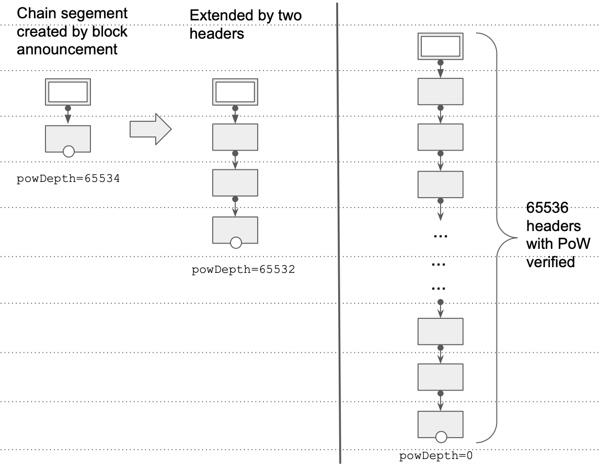
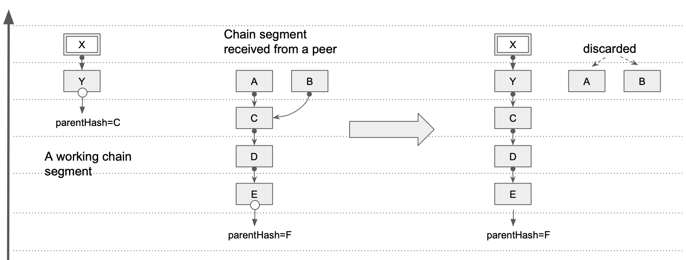
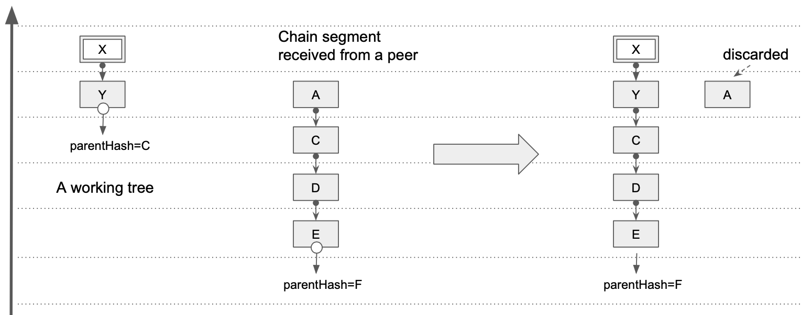

# Block header download process

This process is a collection of data structures and algorithms to perform the task of obtaining a consistent and verified header chain from peers over the network.

## Data structures

All data structures, except for the files, are kept in operating memory (RAM), and do not survive an interruption, a crash, or a powerdown. Therefore,
there is `RECOVER` algorithm described later, which initialises all transitent data structures from the files.

### The buffer

It is an append-only collection of headers, without any extra indices. The buffer is of a limited configurable size.
Apart from block headers, the buffer may contain another type of entries that we will call "tombstones". The tombstones mark certain block hashes as
undesirable (usually because they are part of of a fake chain produced for the purpose of frustrating the download process). Like ordinary header entries,
the tombstones contain block height information, so that they can be sorted together with the headers. As will be mentioned later, this sorting is performed
when the buffer is full and needs to be flushed into a file. Presence of tombstones allows skipping all the descendant headers of any tombstone, and not
persisting them into the files. This happens when an undesirable header is detected before its decendants were flushed into a file.
Otherwise, it is possible that some undesirable headers will get into the files, and they will need to be ignored when the files are getting processed and
entries committed to the database.

### The files

Once the buffer reaches its maximum size (such that adding anorher header would cause the buffer to exceed its size limit), the entries in the buffer are
sorted by the block height (and in the case of ties, by the block hash), in ascending order. Once sorted, the content of the buffer is flushed into a new
file, and the buffer is cleared. The files are supposed to persist in the event of an interruption, a crash, or a powerdown. The files are deleted once
the block headers have been successfully committed to the database, or they can be deleted manually in case of a corruption.

### Bad headers

Set of block hashes that are known to correspond to invalid or prohibited block headers. The bad headers set can be initialised with hard-coded values.
Not every invalid header needs to be added to the bad headers set. If the invalidity of a block header can be found just by examining at the header
itself (for example, malformed structure, excessive size, wrong Proof Of Work), such block header must not be added to the bad headers set. Only if
the evidence of the invalidity is not trivial to obtain, should a block header be added. For example, if a block header has valid Proof Of Work, but
it is a part of a header chain that leads to a wrong genesis block. Another example is a blocl header with correct Proof Of Work, but incorrect
State Root hash.
Newly found bad block headers need to be immediately written to the database, because the cost of discovering their invalidity again needs to be avoided.

### Tree (anchors)

At any point in time, the headers that have been downloaded and placed into the buffer or into one of the files, can be viewed as a collection of trees like this:

The reason why we may need to maintain multiple trees instead of just one, is this potential optimisation. If we have some hindsight knowledge
about the header chain that is being downloaded, we can hard-code the hashes of block headers at some intermediate block heights. For example, at every
height which is multiple of 4096. Assuming that the maximum height is on the order of tens of millions, we only need to hard-code around a thousand
32-byte values (block hash), together with total difficulty number (maximum 32 byte), which is trivial. Having these hard-coded anchors, we can
download different trees from different peers to better utilise the network connectivity. Each tree has exactly one anchor (root).
Every anchor maintains an integer attribute `powDepth`, meaning how "deep" after this anchor the ancestral block headers
need their Proof Of Work verified. Value `0` means that there is no need to verify Proof Of Work on any ancestral block headers. All hard-coded anchors come
with `powDepth=0`. Other anchors (created by announced blocks or block hashes), start with `powDepth` equal to some configured value (for example, `65536`,
which is equivalent to rought 16 days of block time), and every time the tree is extended by moving its anchor "down", the `powDepth` is also
decreased by the height of the extension.

Eventually, the growing tree can reach the configured depth, at which point the `powDepth` attribute of its anchor will drop to `0`, and no
further Proof Of Work verification on the ancestors will be performed. Another possibility is that the anchor will match with a tip of another tree,
the trees will merge, and the anchor simply disappears, superseeded by the anchor of another tree.
There is also a potential optimisation, whereby the extension of a tree from the tip shall also decrease the `powDepth` value of its anchor.
However, we currently leave this for future editions.
Another attribute of an anchor is `totalDifficulty`. Total difficulty is the sum of all difficulties of headers starting from this anchor, all the
way to the genesis, including the anchor itself. The total difficulty can only be obtained for the trees that in some ways originated from a
hard-coded anchor. The genesis is also considered a hard-coded anchor. The anchors created from block announcements or block hash
announcements, have their `totalDifficulty` equal to `0`, meaning that it is currently impossible to calculate the total difficulty given the available information.
Since any tree contains exactly one anchor, the anchor hash can be conveniently used as an identifier for the tree. Other important parts
of a tree are its tips. Therefore, an anchor has another attribute, `tips`, which is a collection of block hashes currently belonging to the
tree's tips. This collection allows efficiently iterating over the tips of a certain tree, for example, to update the total
difficulties of the tips when the anchor changes.
When a new header gets appended to an existing anchor, there are a few conditions that need to be met. Firstly, the `parentHash` of the anchor header
needs to match the hash of the attaching header. Secondly, the difficulty calculation formula for the anchor yields the anchor's difficulty. In Ethereum, difficulty of a child block header is calculated from various attributes of that child block header (`timestamp`) and the parent block header
(`timestamp`, `difficulty`, `blockHeight`, `uncleHash`). Therefore, anchors need to have two other attributes, `difficulty` and `timestamp`, so that the correctness of the calculating `difficulty` from its parent header can be verified. For the purpose of further verification (to make sure that
the parent and child block heights agree), anchors have `blockHeight` attribute.
To conclude, the anchors data structure is a mapping of anchor parentHashes (not hashes of
anchors themselves) to a collection of objects with attributes `powDepth`, `totalDifficulty`, `tips`, `difficulty`, `blockHeight`, `hash`, 
and `timestamp`. We are talking
about collection of objects rather than objects because there may be multiple anchor headers having the same value of Parent Hash.

### Tree (tips)

A tree can contain any number of headers, all connected to one another via the value of their `ParentHash` attribute, and, ultimately,
such tree of headers is connected to the anchor (root) of that tree. Some headers in a tree are selected as the tips of that tree.
Description of how the headers are selected to be the tips requires the definition of cumulative difficulty. Every tip (once selected)
has some attributes associated with it. Firstly, the `anchorParent` attribute, which is the `ParentHash` of the anchor that this tip is (transitively)
connected to (in other words, the tip is in the "progeny", or in the "decendants" of that anchor). The `anchorParent` attribute of a tip can be viewed
as the inverse of the anchor's `tips` attribute, and both need to be updated at the same time, when the anchor or one of the tips of a tree changes.
Secondly, the `cumulativeDifficulty` attribute of a tip stores the sum of difficulties of all headers starting from the tip all the way down
(and including) the anchor. The cumulative difficulty, combined with the anchor's `totalDifficulty` (minus the the `difficulty` of the anchor so
that it is not counted twice), provides a way of calculating the total difficulty of a tip.
A subset of headers in a tree is selected to be the tips of that segment. The necessary (bit not sufficient) requirement for a header
to be a tip is that it has cumulative difficulty no lower than cumulative difficulty of any non-tip in that tree. In other words, tips are
the headers with the largest cumulative difficulties in their trees.
To ensure resilience against potential resource exhaustion due to faults or deliberate attacks, we would like to limit the number of tips being
tracked at any given time, and, by extension, the number of tree being maintained. For this purpose, we place almost all currently
tracked tips from all trees into a sorted mapping, sorted by cumulative difficulty. The tips whose hashes coincide with any of the hard-coded
anchors, are exempt from the limiting, and therefore, are not placed into the sorted mapping.
This sorted mapping is used whenever the number of tracked tips is about to exceed the (configurable) limit. Entries with the lowest cumulative
difficulties are removed from the mapping, as well as from the tips data structure.
The trees that are created from the hard-coded anchors, are only allowed to be extended on the anchor's side, therefore their tips need
to be marked as non-prependable. This is the role of another boolean attribute of a tip, `noPrepend`.
To conclude, the tips data structure is a mapping of tip hashes to objects with the attributes
`anchorParent`, `cumulativeDifficulty`, `timestamp`, `difficulty`, `blockHeight`, `uncleHash`,  `noPrepend`.
We will call the sorted mapping of cumulative difficulties to tip hashes "the tip limited data structure.

### Working trees
The anchors, the tips, and the tip limiter describe a collection of trees. We will this collection "working trees" for the
future reference in the description of the algorithms.

### Chain segment
Chain segment, like a tree, is also a collection of headers, connected to one another. However, it is a simpler collection than a tree,
without any branching. A tree can be divided into segments like this:

When such decomposition is performed, the resulting segments are usually ordered in a specific (partial) order. If any segment is referenced
by another segment, then the former needs to come before the latter in the ordering, as shown in the illustration.
We will use chain segments instead of trees as much as possible, to simplify the algorithms.

## Principles and invariants

### When a new anchor can be created

A new tree can only be introduced in the following 3 ways and according to specified conditions:
1. Hard-coded anchors
2. Anchors recovered from the files during the restart after an interruption, a crash, or a powerdown
3. Block announced by a peer, or a block header received from a peer, if the Proof Of Work is valid, and if the timestamp of such block or
block header is withing a configured range from the current time measured locally. In other words, with a timestamp not too far in the past
and not too far in the future.

The condition on the block header timestamp in the point (3) is required to prevent a potential malicious peer from being able to reuse the
same pre-generated fake chain segements again and again over a long period of time. The tips of such pre-generated fake trees would
need large cumulative difficulty to be able to force genuine tips from the tip limiter. But even if they are generated at a cost of significant
work (to pass Proof Of Work verification), they will only be useful for a limited period of time. According to the limitation in the point (3),
we will refuse to create a new anchor and therefore ignore any of its ancestral headers (see the next principle below).

### When a chain segment can be processed

A chain segment constructed from a message received from a peer, can be appended to an existing anchor of some working tree.
In other words, it is appending new ancestral chain segements to existing children (or "progeny").
Part of the chain segment that ends up "above" the attachment point is discarded, as shown on the diagram below. If there is no anchor
to which any header in the new segment can be appended, the entire new segment is discarded.

Note that this restriction is applied even before any Proof Of Work verification is performed on the received headers. The anchor to which the
received chain segment is getting appended, determines whether, and for how many headers in the segment the Proof Of Work verificatin needs to
be done (`powDepth` attribute). As mentioned previously, the new anchor's attribute `powDepth` is calculated from the existing anchor's
`powDepth` and the length of the part of the new chain segment that had been appended.

### Invariants (TODO)

## Algorithms
Currently, the algorithms are just listed without much explanation. Detailed explanation will be added after Proof Of Concept.

### Handle BlockHeadersMsg
**Input**: BlockHeadersMsg + peer handle. **Output**: collection of chain segments, or penalty for the peer handle
Collection of block headers in the a `BlockHeadersMsg` message can be viewed as a specific reprentation of a "rooted forest". In this
representation each header specifies a vertex and a potential outgoing edge (via `ParentHash` attribute, it if points to another header
in the message). Vertices without outgoing edges (because `ParentHash` points to a header which is not contained in the message) are roots,
and they give rise to rooted trees. So rooted forest is a collection of rooted trees. This algorithm needs to transform this
representation into another one, more useful, which groups all headers from the same rooted tree together, and in each group, the
root is clearly identified.
This algorithm also checks that no headers in the message is contained in the bad header set, any child header pointing to its parent header
within the message agree on their numbering and difficulty calculation. It also does not allow a header appearing twice in the message.
If any of these checks fail, the algorithm returns penalty object, which includes peer handle (the same as the one passed as an input),
and type of fault (`BadHeader`, `DuplicateHeader`, etc.). The logic of deciding which fault results in which penalty is outside of this
algorithm.
**Invariant**: headers in the output chain segment must be topologically sorted, with the root being the first 

### Handle NewBlockMsg
**Input**: NewBlockMsg + peer handle. **Output**: chain segment or penalty for the peer handle
The message `NewBlockMsg` contains a block (with header and body), as well as its total difficulty. Since this correctness of this
total difficulty cannot be verified just by looking at the block itself, the only use of it is to potentially penalise the peer
if we find that the total difficulty reported was wrong. But this is of a very marginal use, if we do not trust this number anyway.
Therefore, we will only be looking at the block header part of the message. This algorithm is a degenerate version of the algorithm
"Handle BlockHeadersMsg", because it only creates one chain segment and there is only one header in that segment.

### FindAnchors
**Input**: chain segment, **Output**: index in the chain segment where the header attaching to an anchor is found, possibly tombstones.
Side-effects are the removal of the trees if their anchors are found to be incompatible with the chain segment (in that case tombsones
are the hashes of such anchors)

### FindTip

### Prepend
**Input**: chain segment + peer handle. **Output**: updated structures (modified working chain segments) or "no prepend point found", or penalty for the handle (tombstone creation)
We do not allow prepending to the hard-coded tips (therefore tips need an extra boolean attribute `noPrepend`)
Proof Of Work verification happens only if other conditions have been satisfied.

### Append
**Input**: chain segment. **Output**: updated structures (modified working chain segments) or "no append point found", or tombstones.
There is an important difference between `Prepend` and `Append` algorithms with regards to error handling. Algorithm `Prepend` attaches
"children" block headers to the existing "parent" block headers. Since "bad child" does not invalidate the parent, any verification errors during
the `Prepend` algorithm does not cause the existing tips to disappear, only the peer who sent the new bad chain segment gets penalised.
On the other hand, algorithm `Append` attaches "parent" block headers to the existng "children" block headers. Since "bad parent" DOES invalidate
the children, any verification errors during `Append` algorithm cause the entire working chain segment to be discarded, as long as the hash chain
points from the bad parents to the existing children.

**TODO** Added two extra attributes to anchors: `hash` (to be able to return tombstones) and `blockHeight` (to be able to verify the
anchor-parent relationship)

### Create anchor
**Input**: chain segment + peer handle. **Output**: updated structures (new working chain segment) or one of the penalties: "anchor too far in the future" or "anchor too far in the past"

### Recover from files
**Input**: the files. **Output**: working chain segments

### Request more headers
**Input**: working chain segments. **Output**: GetBlockHeadersMsg requests
For this algorithm we will require an extra data structure, which is a priority queue containing achor parent hashes, prioritising by latest request time.
This is to ensure we can easily handle time outs and grow all chain segements evenly (in round-robin fashion).

### Handle NewBlockHashMsg
**Input**: NewBlockHashMsg + peer handle. **Output**: GetBlockHeadersMsg request.

### Flush the buffer
**Input**: The buffer. **Output**: the files

### Initiate staged sync
Detect when to start the staged sync. Whenever a new tip is added, we check that its attribute `anchorParent` is equal to pre-configured value `0x00..00` for sync from genesis, or the hash of the last block header we have processed in the stage 1 of the staged sync. If this condition is satisfied, we take
the attribute `cumulativeDifficulty` of the tip and compare it to a variable `highestTotalDifficulty` (initialised to zero in the beginning). If the tip's
`cumulativeDifficulty` is higher than `highestTotalDifficulty`, then we set `highestTotalDifficulty` to the new value, and initiate the staged sync from
the tip's anchor to the tip
