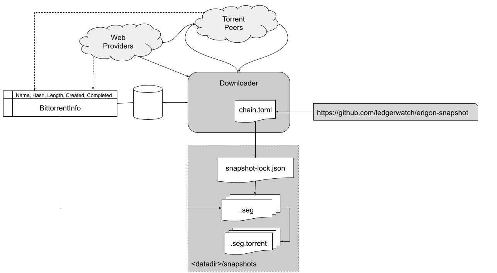

# Downloader Components

The diagram below shows the components used to manage downloads between torrents and WebSeeds.



# Operations

By default, the Downloader will try to use the underlying BitTorrent library to download files from peers and web peers.  

However, this can result in slow or stalled downloads if the selected snapshot becomes unavailable. Use `erigon snapshot reset` or restart the downloader to sync to a different snapshot in this event. Pass `--local=false` keep files that aren't in the latest snapshot. This means only incomplete files that don't match the latest snapshot will be removed.

# Configuration/Control Files

The sections below describe the roles of the various control structures shown in the diagram above.  They combine to perform the following management and control functions:

* Definition of verified well know hashes for segment files - which identifies a known trusted universe of files (**$CHAIN.toml**)

* Management of the completion state of the local download process (**BittorrentInfo**)

* Definition of the accepted local hash set which are used to ensure that the local snapshots retain a consistent specified view as other definitions in the environment changes.  i.e. chain.toml gets re-versioned or BittorentInfo gets reset (**preverified.toml**).

* Ability to override downloaded files with locally defined alternatives, for development or to fix errors and omissions (**preverified.toml**)

## preverified snapshot hashes

These are distributed in toml files in the following format. They can be hosted on a central server, embedded in the erigon binary or stored locally by a client (`preverified.toml`).

```toml
'v1.0-000000-000100-beaconblocks.seg' = 'eaee23c3db187c8be69e332b4ff50aa73380d0ef'
'v1.0-000000-000500-bodies.seg' = 'e9b5c5d1885ee3c6ab6005919e511e1e04c7e34e'
'v1.0-000000-000500-headers.seg' = 'df09957d8a28af3bc5137478885a8003677ca878'
'v1.0-000000-000500-transactions.seg' = '92bb09068baa8eab9d5ad5e69c1eecd404a82258'
```

## $CHAIN.toml

There is an embedded toml file in [erigon seg repository](https://github.com/erigontech/erigon-snapshot) during the erigon build process. It contains 
the `well known` hash for a particular segment file in the following format. 

