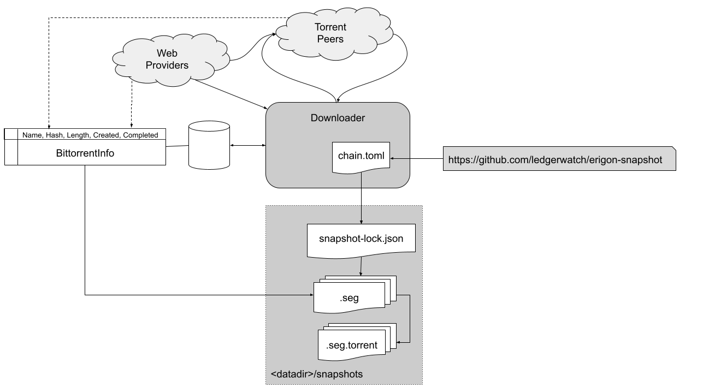

# Downloader Components

The diagram below shows the components used to manage downloads between torrents and webpeers.



# Operations

By default the downloader will try to use the underlying bittorrent library to download files from peers and web peers.  

However this can result in slow or stalled downloads.  When this happens [rclone](https://rclone.org/) can be used as an auxiliary process to aid the download process.  When it is availible the download library will pass downloads to rclone under the following circumstances:

* There are no torrent peers available for a file
* There is not torrent info available for a file, but a torrent file with a matching info hash can be found on the webseeds

To enable [rclone](https://rclone.org/) should be installed on the local machine and its executable added to the `PATH` in the environment so that it can be launched by erigon.

For web downloading no additional configuration is necessary as the downlowder will auto configure rclone to use the webseeds which are discovered via the torrent library.

# Configuration/Control Files

The sections below describe the roles of the various control structures shown in the diagram above.  They combine to perform the following managemet and control functions:

* Definition of verified well know hashes for segment files - which identifies a known trusted universe of files (**chain.toml**)

* Management of the competion state of the local download process (**BittorrentInfo**)

* Definition of the accepted local hash set which are used to ensure that the local snapshots retain a consistent specified view as other defenitions in the evironment changes.  i.e. chain.toml gets re-versioned or BittorentInfo gets reset (**snapshot-lock.json**).  

* Ability to override downloaded files with locally defined alternatives, for development or to fix errors and omissions (**snapshot-lock.json**)

## chain.toml

This is an embedded file which gets its contents from the [erigon snapshots repository](!https://github.com/ledgerwatch/erigon-snapshot) during the erigon build process. It contains 
the `well know` hash for a particular segment file in the following format. 

```toml
'v1-000000-000100-beaconblocks.seg' = 'eaee23c3db187c8be69e332b4ff50aa73380d0ef'
'v1-000000-000500-bodies.seg' = 'e9b5c5d1885ee3c6ab6005919e511e1e04c7e34e'
'v1-000000-000500-headers.seg' = 'df09957d8a28af3bc5137478885a8003677ca878'
'v1-000000-000500-transactions.seg' = '92bb09068baa8eab9d5ad5e69c1eecd404a82258'
```

Where multiple version of files exists there may be several likes per segment and the code in the released Erigon version will select the version that it is interesting.

As this file ise versioned as part of the Erigon release process the file to hash mapping can potentially change between releases.  This can potentially cause an issue for running Erigon node which expect the downloads in the snapshots directory to remain constant, which is why a seperate file is used to record the hases used by the process when it originally downloaded its files.

## snapshot-lock.json

This is a file which resides in the <data-dir>/snapshots directory for an Erigon node.  It is created when the node performs its initial download.  It contains the list of downloaded files and their respective hashes.

When a `snapshot-lock` file exists it is used reather than the chain.toml file to determine which files should be downloaded.  This means that the directory contents can be maintained event if Erigon is re-versioned and the chain.toml contents change.

### Deleting snapshot-lock.json

If the snapshot-lock file is deleted it will be reacreated from the `chain.toml` file embeded in the Erigon process.  If the hashes change then the associated files will be re-downloaded.

### How to override downloads

As the `snapshot-lock` is used as the master hash list by the executing process the `.seg` file used by the process can be changes by changing its associated hash.  there are two models of operation here:

* If the associated `.seg.` file is deleted and the hash changes and new file will be deleted.

* If a replacement file is incerted into the directory and the hash changes to the hash of that file, the file will be used - with no download.
    * If no other method to determing the file hash exists, the hash of the new file will be printed by the process on start-up if it does not match the `snapshot-lock` entry and this can be used to insert the hash into the ``snapshot-lock`

## BittorrentInfo (in the downloader db)

This is an internal db table used for managing the state of the download from either the torrent or its associated web host.  It has been created to manage the fact that the internal torrent library does not necessarily manage the overall download state of the file assocaited with a has completely consistently.

It contains the following entries

|||
|----|------|
| Name | The unqualified name of the file being downloaded.  e.g. `v1-000000-000500-transactions.seg`.  This field is treated as the primary key for the table, there can only be one download per file. |
| Hash | The hash of the file being downloaded.  This value can change if the external hash received either from `chain.toml` or `snapshot-lock.json` changes.  If the hash changes the entry is treated as a new download and the `Length` and `Completed` fields are reset. 
| Length | The length of the file downloaded.  This may be avilible from the torrent info - but in general is only completed once the file has been downloaded. |
| Created | The date and time that this record was created, or that the `Hash` field changed, effectively making this an new download. |
| Completed | This is the date and time that the download was completed.  The presence of a completion date is also used as an indication of completion.  If the field is nil then the download is treated as incomplete |

