# Commitment Backtester

## Background

The commitment backtester aims to provide ways to:

* easily re-execute commitment computations only (in isolation, without block re-execution) for past blocks
* do correctness tests between different commitment computation algorithms (i.e. sequential vs parallel)
* do performance comparisons between different commitment computation algorithms (i.e. sequential vs parallel)
* easily gather commitment-related metrics and perform analysis based on historical data

## Usage

To use the commitment backtester we have to sync an Erigon node for any chain with commitment history enabled.
Once that node has synced it can be stopped and can be used for running backtests.

There are two main ways a backtest can be started:

* using `--from 1000000 --to 2000000` to specify a block number range

```
erigon backtest-commitment --from 1000000 --to 2000000 --datadir <datadir> --output-dir <output-dir>
```

* using `--tMinusN 1000000` to specify the number of blocks prior to the current tip:

```
erigon backtest-commitment --tMinusN 1000000 --datadir <datadir> --output-dir <output-dir>
```

To explore other available flags run:

```
erigon backtest-commitment --help
```

## Artefacts

Every backtest run produces result artefacts which are stored in the `--output-dir`. The convention is to create a new
directory for each run which follows the `{fromBlockNum}_{toBlockNum}_{runStartTimestamp}` naming.

The results directory can be found at the end of the backtest logs:

```
[INFO] [12-17|18:55:52.808] finished commitment backtest             blocks=33 in=29.974303041s results=/output-dir/1752715_1752747_1765958122
[INFO] [12-17|18:55:52.808] metrics                                  at=file:///output-dir/1752715_1752747_1765958122/overview.html
```

The following can be found inside the results' directory:

```
...
block_1752746
block_1752747
charts_1752715_1752747.html
overview.html
```

With the per-block result directories each containing:

- a pprof cpu profile
- a fgprof profile
- commitment .csv metric files

```
commitment_metrics_accounts.csv
commitment_metrics_process.csv
cpu.fgprof
cpu.prof
```

The csv metric files are used to produce charts which are covered more in the next section.

## Charts

There are two main types of chart pages that get generated:

* the `overview.html` which provides top N slowest blocks in the backtest alonsige other overview metrics of interest
* the `charts_{fromBlockNum}_{toBlockNum}.html` pages which provide more detailed per-block timeseries charts with data
  zoom support

NOTE: the `overview.html` page provides an easy way to jump into the timeseries pages by either clicking on the overview
charts themselves (e.g. clicking the bar for the slowest block will take you to its corresponding detailed timeseries
charts page) or by clicking on the catalogue of all available timeseries pages which is located at the bottom of the
overview page.

Below are some screenshot examples at the time of writing. The chart pages are a work-in-progress, so expect more to
come soon and potentially some of the ones listed below to change/get removed. Treat these as just examples of what can
be extracted.

### Overview page

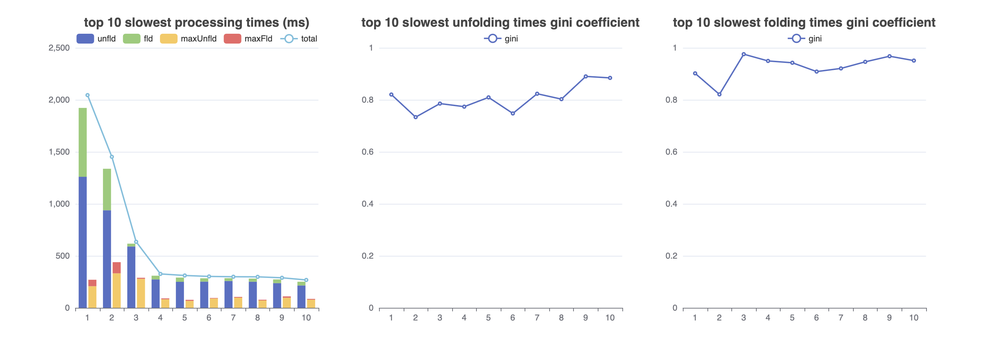
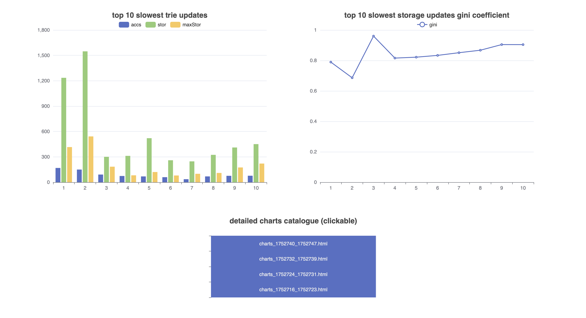
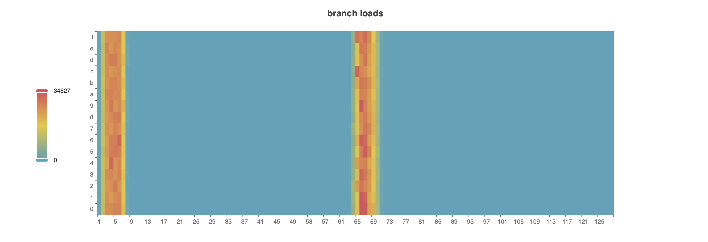
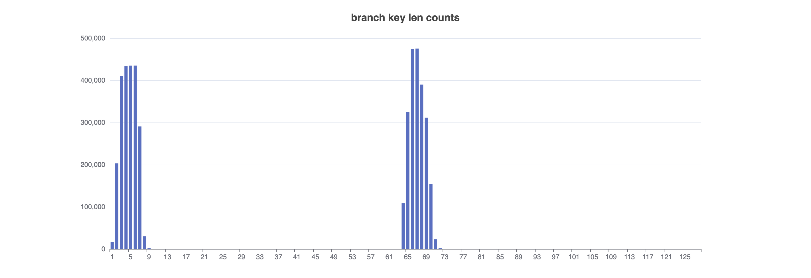

### Detailed timeseries page

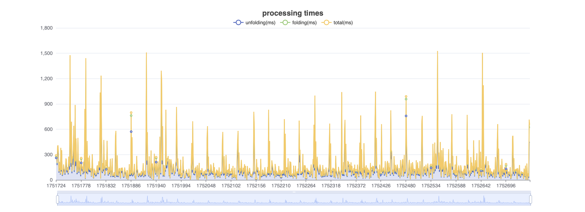
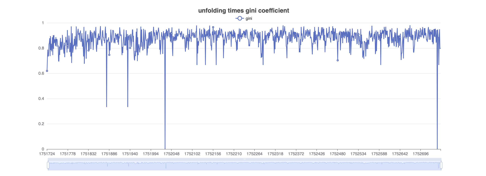
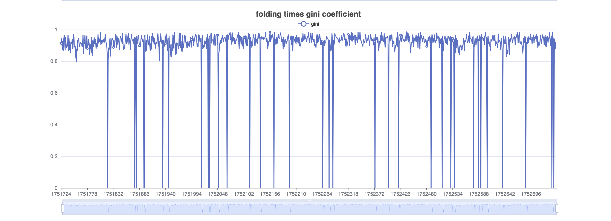
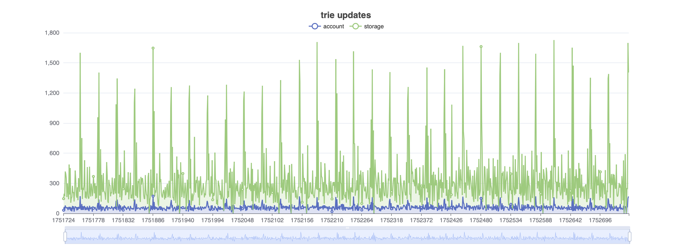
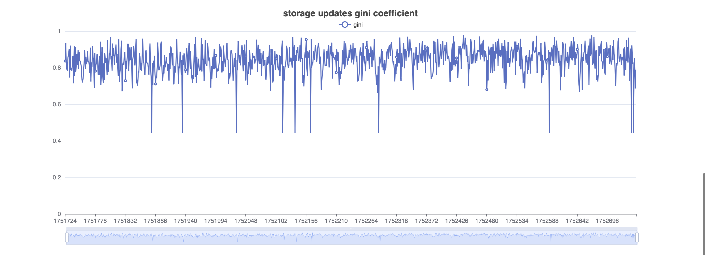
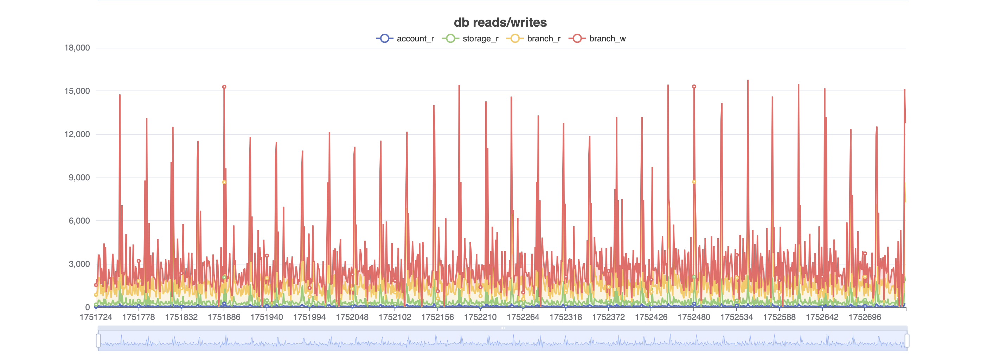

## Comparing runs

To compare the results of several backtest runs we can use the backtester comparison command:

```
backtest-commitment compare-runs \
--run-output-dirs \
/results/hph_nowarm_1752740_1752747_1768799062,\
/results/hph_warm_1752740_1752747_1768799942,\
/results/para_nowarm_1752740_1752747_1768799778 \
--output-dir /results/comparison-results \
--log.console.verbosity=debug
```

The output will be a single HTML page with charts comparing the results of all the provided runs that looks like this:
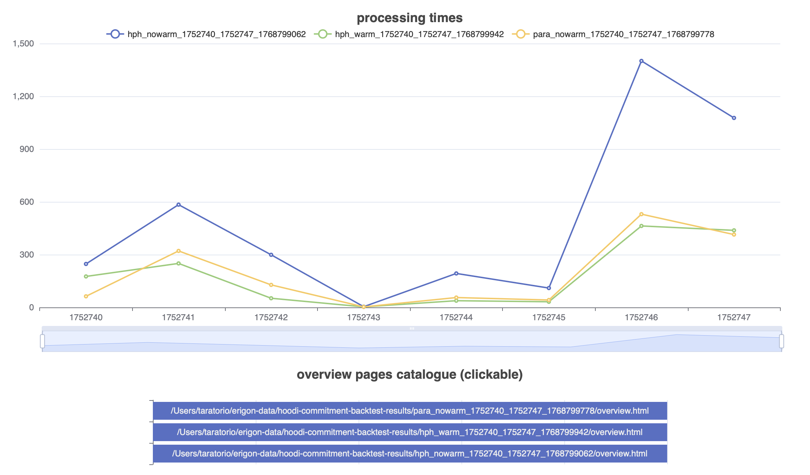

You can navigate to the more detailed overview pages of each run by clicking on the line chart points itself or using
the overview pages catalogue at the bottom.
