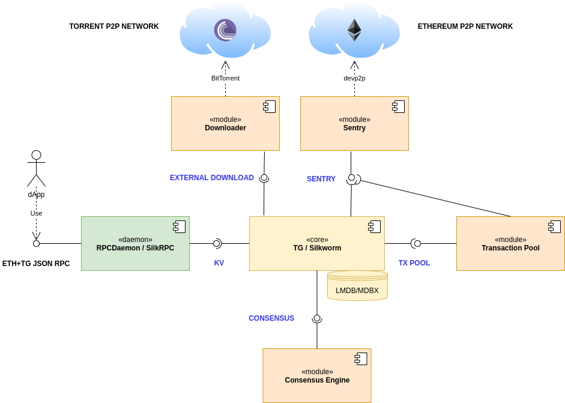

# Interfaces
Interfaces for turbo-geth components. Currently it is a collection of `.proto` files describing gRPC interfaces between components, but later documentation about each interface, its components, as well as required version of gRPC will be added



See more info on the component and descriptions in [Components](./_docs/README.md)


# What's in this repo
- Protobuf definitions
- Wrappers:
  - Rust crate with autogenerated client and server based on [Tonic](https://github.com/hyperium/tonic)

NOTE: You are free to ignore provided wrappers and use the .proto files directly

# Suggested integration into other repositories
```
git subtree add --prefix interfaces --squash https://github.com/ledgerwatch/interfaces master
```

When you need to update the subtree to a specific commit or tag, you can use these commands:

```
git rm -rf interfaces
git commit -m"Remove interfaces for replacement"
git subtree add --prefix interfaces --squash https://github.com/ledgerwatch/interfaces <tag_or_commit>
```

Unfortunately `git subtree pull` does not work if we use Squash-Merge for pull requests in this repository
and also automatically delete merged branches.

# Style guide 

[https://developers.google.com/protocol-buffers/docs/style](https://developers.google.com/protocol-buffers/docs/style)
